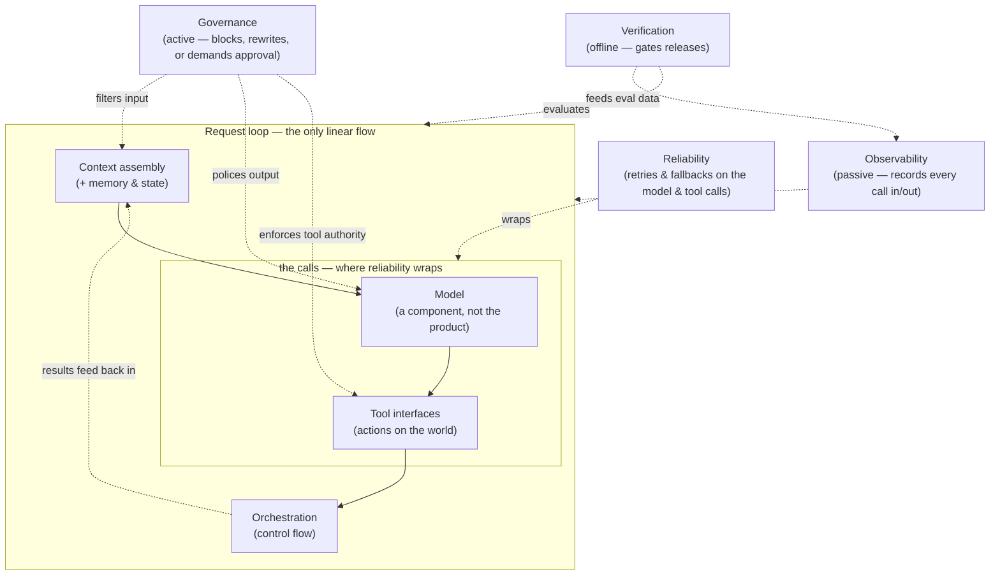

# M1 · What Is a Harness?

> **Module question:** What exactly is the engineering artifact we're designing?
> **Cross-cutting threads:** Failure modes · Tradeoff ledger · (ADK arrives in M3)
> **Domain spine:** a survey across support, coding, and research products

---

## Opening scene — the demo that worked

The room was quiet at the end, which is not what the demo team wanted.

They had just shown an agent that could triage support tickets, look up order history, and draft refund recommendations. It was genuinely impressive — the model reasoning over live data, calling APIs, handling a messy edge case mid-demo without breaking stride. The VP nodded. Then she asked the question no demo ever prepares for:

> *"OK. What happens when it's wrong?"*

And the honest answer — *"we'll write a better prompt"* — hung in the air long enough to become a smell. The VP didn't need a better model. She needed to know who decides what the agent may do, how it knows what's true, how it gets stopped, how it gets audited, and how anyone would ever notice it went wrong.

That silence is the entire subject of this course. The demo was the *model*. The question was about the **harness** — and the harness was the only thing nobody in that room had designed.

---

## The thesis: the model is not the product — the harness is

An LLM is a capability engine. Given a context, it produces the most plausible continuation — with astonishing breadth, language skill, and the ability to call tools. But a capability is not a system. A system has inputs you control, boundaries you enforce, states you can inspect, and outcomes you can verify.

Here is the uncomfortable arithmetic: as frontier models commoditize, the *difference* between a good agent product and a bad one stops coming from the model. It comes from everything the model is wrapped in:

- **What goes into its context** — and in what form, at what cost
- **What it is allowed to touch** — which tools, with which authority
- **How its loop is governed** — when it acts, when it asks, when it stops
- **What it remembers** — across a turn, a session, a month
- **How we know it worked** — and how we find out when it didn't
- **How it is contained** — when it tries to do something it must not
- **How we can see it** — when a run goes wrong, can we reconstruct it?

That entire envelope — every designed system around the model that elicits, constrains, and verifies its behavior — is the **harness**.

The model is a component. The harness is the product. This course is about engineering the harness the way you already engineer distributed systems: with named layers, explicit failure modes, and recorded tradeoffs.

*A horse is a powerful engine; the harness is what turns that raw power into controlled, useful work — the straps that attach the load, the reins that steer, the points where force is redirected and measured. An agent's model is the horse; the harness is every designed system around it. The analogy is exact, not decorative: a horse without a harness pulls nothing useful, and a model without a harness ships nothing safe.*

That diagram is the map of the entire course. The **request loop** is the only linear flow — context in, model, tool out, results back in. Everything else is **cross-cutting**: governance gates the boundaries (active), reliability wraps each call, verification gates releases (offline), and observability spans it all (passive). Each box is a module (or two); the loop's edges are the seams where agents actually break.

---

## A short history: how we got here

The field moved fast, and each era relocated where the value lives:

**Era 1 — The Oracle (2020–2022).** The model as a text generator you prompt. The entire product was the prompt. Failure modes were prompt failures. The harness barely existed: an API key and a temperature setting.

**Era 2 — The Retriever (2023).** RAG arrives: the model gains access to your data. Suddenly the product includes a retrieval system — embeddings, chunking, ranking. Value moved *behind* the model, into the context pipeline. Failure modes moved with it: bad chunks, stale indexes, citations that don't exist.

**Era 3 — The Actor (2024).** Tool calling goes mainstream: the model can act on the world — send email, write code, trigger payments. Now the product includes *authority*, and with it the first real governance questions. Failure modes became expensive: the tool was called with a hallucinated argument; the loop ran 40 times; the agent did something irreversible.

**Era 4 — The Component (2025→).** The model is one component in a designed system, and the industry stops pretending otherwise. Frameworks (ADK, LangGraph, etc.) productize the harness. The term *harness engineering* emerges as a discipline with its own vocabulary — and its own failure taxonomy. Value now lives almost entirely outside the model: in the context system, the tool surface, the eval suite, the guardrails.

The through-line: **every era moved the interesting engineering further from the model itself.** Harness engineering is what you call the discipline once you stop being surprised by that.

> **Failure mode (historical):** teams that build for the era they *remember*. The 2023 mindset ("better prompt") applied to a 2025 agent is how you get demos that work and products that refund the wrong customers.

---

## Vocabulary: workflow vs. agent vs. harness vs. platform

The words are used loosely, and the sloppiness causes real design errors. A working set of definitions:

| Term | Definition | Failure mode of blurring them |
|---|---|---|
| **Workflow** | A deterministic, pre-written code path — the same steps every run, no model autonomy | Calling it an "agent" hides that there is no autonomy to govern |
| **Agent** | A model-driven loop: the model decides actions, observes results, repeats — within harness constraints | Calling it a "workflow" hides that behavior is sampled, not specified |
| **Harness** | Everything designed around the model to elicit, constrain, and verify its behavior (the diagram above) | Treating the harness as "scaffolding glue" instead of the product |
| **Platform** | A productized harness: a reusable runtime (ADK, etc.) that bundles the layers so you don't rebuild them | Assuming the platform *is* the harness — every platform ships defaults, and defaults are decisions you didn't make |

The fourth row deserves emphasis now and will return all course long: **a framework gives you the boxes, not the design.** ADK will be our box supplier starting in M3. But a harness is a set of *decisions*, and a platform's defaults are just decisions someone else made for you — often optimized for demos, not for production.

---

## The failure taxonomy — the spine of the course

Before designing anything, we need a map of *how agents fail*. We'll use six families, following the framing popularized by Rasa's [why-agents-fail](https://github.com/RasaHQ/why-agents-fail) work. Every subsequent module in this course maps back to one of these:

1. **Bad instructions** — the agent doesn't know the policy. It wasn't told what it may or may not do, or was told it in a way that decays. *(→ M6 Instruction Layer)*
2. **Bad context** — the agent has the wrong information, or none. Retrieved garbage, stale facts, missing grounding. *(→ M4, M5 Context Engineering)*
3. **Bad tools** — the tool surface is mis-specified, unsafe, or broken. Hallucinated arguments, over-broad authority, silent failures. *(→ M8, M9 Tool Interfaces)*
4. **Bad orchestration** — the wrong control flow. An agentic loop where a pipeline would do; unbounded loops; no stop conditions. *(→ M10, M11 Orchestration)*
5. **Bad verification** — no way to know it worked. No evals, no gates, no regression signal; every change is a gamble. *(→ M12 Evaluation)*
6. **Bad containment** — no guardrails, budgets, or audit. The agent *can* do damage, and nobody would know until it did. *(→ M14, M15 Security & Governance)*

Each family gets a module (or two). Notice what's missing from this list: *"the model was dumb"* isn't a family. Model capability failures are real — M2 covers them — but they are *input* to harness design, not a diagnosis. A production failure that ends with "the model hallucinated" is a failed postmortem: the question is always which harness layer let the hallucination reach a user with consequences. (The full fault-barrier analysis — evals vs. guardrails vs. grounding vs. risk-acceptance — is in [Discussion 01](../../discussions/01-failure-attribution-to-derivation.md).)

> **Failure mode (the whole course in one line):** diagnosing agent failures as "the model was wrong" instead of "the harness let wrongness through" — and consequently re-prompting instead of re-designing.

---

## Dissecting real products: where value and risk live

Let's take the taxonomy to three real product archetypes and ask, for each: *what is the harness, where is the value, where is the risk?* This is the analysis pattern you'll apply in the design exercise.

### 1. The support agent (context + governance)
- **The harness:** CRM/order lookup tools, retrieval over the knowledge base, a refund policy in the instructions, an eval set of resolved tickets, a human-approval step for refunds above a threshold, a trace log.
- **Value lives in:** context quality and tool wiring — resolving tickets without escalating.
- **Risk lives in:** governance. A support agent with refund authority is a financial instrument. The [Air Canada case (2024)](https://www.cbc.ca/news/business/air-canada-chatbot-refund-tribunal-1.7121082) is the canonical warning: the chatbot mis-stated bereavement policy, the airline tried to disclaim responsibility ("the chatbot is a separate legal entity" — its actual argument), and the tribunal ruled the airline liable for its agent's output. The model didn't fail; the *containment* failed — there was no verification that policy statements were correct before they reached a customer, and no governance structure that forced the company to own the bot's actions.
- **Failure family at highest risk:** bad containment (6) — with bad context (2) close behind.

### 2. The coding agent (tools + verification)
- **The harness:** repo-scoped tools (read, edit, run tests), sandboxed execution, an eval of "does the diff pass tests and match the request," rate limits, a review handoff.
- **Value lives in:** the tool surface — the agent is only as good as its access to context (the repo) and feedback (the tests).
- **Risk lives in:** verification. The *test suite is the eval harness*; a coding agent without a verification loop is a code generator with no way to be wrong safely. The second-order risk is authority: what the agent can touch (push to main? merge? deploy?).
- **Failure family at highest risk:** bad verification (5) — with bad tools (3) close behind.

### 3. The research agent (context + verification)
- **The harness:** retrieval pipelines, citation discipline, answerability rules ("say you don't know"), a fact-checking eval, and — in production — a human review step for anything that will be published or acted on.
- **Value lives in:** context engineering — turning a sea of documents into a defensible answer.
- **Risk lives in:** verification of *grounding*. A research agent that cannot distinguish "in the source" from "plausible" is a confabulation engine with a bibliography. The failure is silent: the answer is fluent, formatted, and wrong in a way that reads as right.
- **Failure family at highest risk:** bad context (2) — with bad verification (5) close behind.

**The pattern to internalize:** in every archetype, the value concentrates in one or two harness layers, and the risk concentrates in a *different* one or two. Products die when those two sets diverge and nobody notices — the demo optimizes the value layers while the risk layers stay thin.

> **Tradeoff (first entries in the ledger):**
> - **Depth of design vs. velocity of iteration** — every harness layer you build slows you down before it saves you. The discipline is choosing which layers to invest in *per product*, by failure likelihood and blast radius — not building all layers everywhere.
> - **Autonomy vs. control** — every step of autonomy you grant buys capability and sells predictability. The correct amount is a function of reversibility: irreversible actions (refunds, sends, deletes) demand control; reversible ones (drafts, searches) can afford autonomy.
> - **Context richness vs. cost** — more context makes the agent better and every call more expensive and slower. Context is a budget, not a luxury (M4 does the math).

---

## What a harness is *not*

Three corrections, because the term is already getting muddy:

1. **It is not "everything that isn't the model."** Futurice's [harness-engineering essay](https://www.futurice.com/blog/harness-engineering) makes the point sharply: a pile of undesigned scaffolding around a model is not a harness. A harness is the set of components you *deliberately designed* with a purpose. Undesigned is not engineering — it's just... the other stuff. Intent is the difference.
2. **It is not a framework or tool.** ADK, LangGraph, the "harness" layer of some LLM SDKs — these are box suppliers. The harness is the design you make *with* the boxes: which layers exist, how they're wired, what the defaults are set to.
3. **It is not an afterthought.** A harness you bolt on after the demo is a harness you've already failed to design. Every demo is a harness with the risk layers missing — the question at the demo is not "does it work?" but "which layers are invisible here, and what do they need to be in production?"

---

## Design exercise

> *Paper-based — no code, no infra. Think, then write.*

**Task.** Take one product you know well — ideally an agentic product you've used, built, or studied (or choose one of the three archetypes above: support, coding, or research). Produce a short dissection:

1. **Draw the stack.** Using the layer diagram at the top of this module, sketch what currently exists in each layer for that product. Be honest: most layers will be thin or missing.
2. **Locate the value.** In one or two sentences: where does the product's actual value come from? (Context quality? Tool wiring? Speed of iteration?)
3. **Locate the risk.** In one or two sentences: where would a failure hurt most, and which failure family (1–6) does that map to?
4. **Name the invisible layers.** For the demo that would sell this product, which layers are invisible, and what do they have to become in production?
5. **Write one ADR-style paragraph.** "We will invest in layers X and Y for this product, and deliberately keep layers Z thin, because…" — with the tradeoff made explicit.

**Why this exercise matters.** This dissection pattern — value vs. risk, visible vs. invisible layers — is the analytic move you'll repeat at the start of every design problem for the rest of this course. If you can do it for someone else's product, you can do it for yours.

---

**In DSH:** the platform this course is written on *is* a harness — its architecture is *"everything is a plugin"* (Cordis), so the model adapter, tool registry, session log, and even the agent loop are replaceable plugins rather than a fixed core.

**Next module:** [M2 — Model Failure Science](../02-model-failure-science/README.md) — before we design the layers, we catalog exactly how the model itself fails, and which failures are ours to fix.
