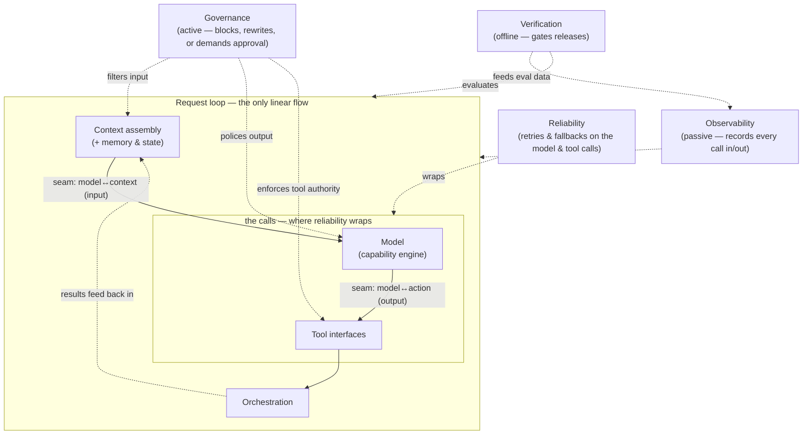
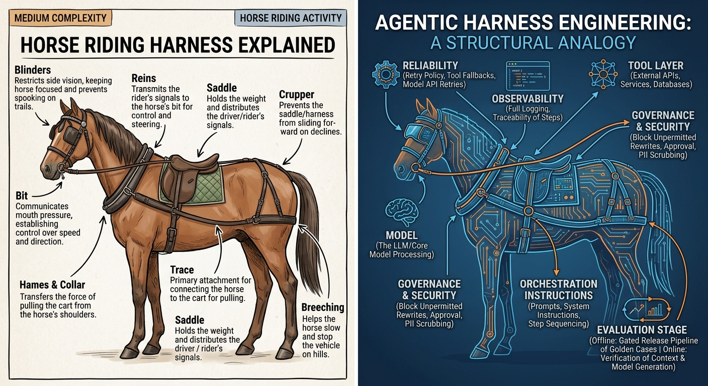

# M3 · Harness Architecture & the ADK Surface

> **Module question:** What are the parts of a harness, how do they connect — and how do we record the decisions that hold them together?
> **Cross-cutting threads:** Failure modes · Tradeoff ledger · ADK at a glance
> **Domain spine:** a minimal "ticket triage" agent, assembled layer by layer

---

## Opening scene — you can't fix what you can't name

A platform engineer once told me about the week his team's agent product fell over in production, and nobody could agree on *where the bug was*. The same afternoon, five engineers gave five different answers, all confident:

- "The model just answered wrong." *(The model person)*
- "The retrieval returned garbage." *(The search person)*
- "The tool is the problem — it's been flaky all month." *(The integrations person)*
- "The instruction got too long, it's drowning." *(The prompt person)*
- "It's none of that — we have no idea because there's no logging." *(The only person who was right)*

They were all describing the same incident. But they had no shared vocabulary, no named layers, and no record of *why* the system was built the way it was. The incident review degraded into a blame auction, and the "fix" that shipped was another prompt tweak — which changed nothing.

This module is about the two things that would have saved them: **a named architecture** (so everyone points at the same seam when something breaks) and **a written record of decisions** (so the next engineer knows *why* the seam is where it is). Then we meet the concrete parts ADK gives us to build with — and, just as important, what it does *not* give us.

---

## The layers, one more time — with seams

In M1 you saw the stack as a picture. Here it is again, now with the *seams* — the boundaries between layers — made explicit, because the seams are where incidents get diagnosed and where architecture actually lives:



**A seam is a place where one layer's contract ends and another's begins.** Only the two seams where the *model* is a direct participant are true flow seams — the `model↔context` seam (input: "here is the context, produce an answer/action") and the `model↔action` seam (output: "here is what the model asked for; validate it before it touches the world"). The other layers are **not** sequential stages after the action layer — reliability *wraps* the calls, governance *gates* the boundaries, verification *gates releases* offline, and observability *spans* everything passively. Seams are where you add a check, a log line, a guardrail, a cache — and where you look first when something breaks.



*A real harness is nothing but parts and their connection points: where each strap meets the next, where the harness meets the horse, where the load attaches. Those joints are where it breaks, where it chafes, and where you inspect it first — and they are exactly what this module calls seams. The agent's harness is the same object at a different scale: named layers (the straps) and named seams (the joints).*

> **Failure mode (the module in one line):** a harness with no named seams. When the layers blur together — retrieval logic inside the tool, policy inside the prompt, verification inside the instruction — every failure is a five-way blame auction, and every fix ripples through the whole system. Named seams make failures *locatable*.

---

## A shared vocabulary

Before the framework, the words. Each layer has one job, and one set of questions it must answer:

| Layer | What it decides | The questions it answers |
|---|---|---|
| **Context assembly** | What enters the window, in what form, at what cost | "Does the model have the facts, and only the relevant facts?" |
| **Memory & state** | What persists, across what scope, how it stays correct | "What does the agent remember, and is it still true?" |
| **Tool interfaces** | What the model may touch, and how safely | "Is this action validated, authorized, and reversible?" |
| **Orchestration** | How much autonomy, and what control flow | "Who decides the next step, and when does it stop?" |
| **Evaluation** | How we know it worked | "Did it do the right thing, and would we catch it if not?" |
| **Reliability** | How it degrades gracefully | "What happens when the model or a tool fails?" |
| **Security & guardrails** | How it is contained | "What is it forbidden to do, and who enforces it?" |
| **Observability** | How we see inside it | "When it goes wrong, can we reconstruct the run?" |

The point of the table is not to be exhaustive — every box becomes a module later — it's to establish that **each layer has one owner and one question.** When a layer starts answering two questions, it's a sign the seam needs to move.

---

## Seams, coupling, and the art of not boiling the ocean

The temptation, on day one of "harden this agent," is to build every layer at once. That is how you get a six-month project and zero shipped value. The discipline from M1's tradeoff ledger returns here with teeth:

- **Coupling is the enemy of diagnosis.** If the eval suite is embedded in the tool, you can't test one without the other. If the guardrail is a paragraph in the instruction, you can't enforce it independently. Keep layers *separable* even when you ship them together.
- **A seam should let you change one layer without re-justifying the others.** The model provider, the retrieval backend, and the tool implementation should all be swappable behind their seams. If swapping the model means rewriting the *policy* (what the agent must do), the seam is in the wrong place. Adjusting the *phrasing* to elicit a given model's best is a legitimate per-model tuning layer — as long as the policy stays canonical and every variant is held to the same evals.
- **Not every layer needs to be thick.** M1's law: invest in layers *by failure likelihood and blast radius*, not by completeness. A read-only summarizer needs almost no governance layer; a refund-issuing agent needs a thick one. The thickness of each layer is a *decision*, and it's one you record.

This last point is what the ADR is for.

And every seam, wherever it lives, has the same five-part contract:

- **What crosses it** — the artifact that moves across the boundary (context in, a tool call out, an event).
- **In what form** — its shape: structured, typed, marked (M4's formatting, M8's schema).
- **Who validates it at the boundary** — the gate that sits *on* the seam: a check, filter, or confirmation (M5's citation, M8's `require_confirmation`, M14's guardrails).
- **How that validation is tested** — swap one side and assert the contract held: change the model, and the policy must not drift.
- **Which anti-patterns it avoids** — the missing seam, the blurred seam (two layers answering one question), the unvalidated seam (a boundary with no gate), the over-seamed system (boundaries with no payoff).

---

## The ADR discipline

An **architecture decision record** is a short document that captures a decision, the alternatives considered, and the tradeoffs accepted. It is not a design doc for the whole system — it's the smallest unit of "here's what we chose and why," written so the next person doesn't relitigate it in a comment thread.

It is the cheapest high-leverage habit in harness engineering, for three reasons:

1. **It forces the tradeoff to be named.** "We'll use an agentic loop" is a vibe until you write down "…accepting unbounded cost risk, in exchange for handling unseen task shapes."
2. **It survives the author.** The engineer who built the seam is rarely the one debugging it at 2 a.m. — the reader is whoever's on call, on another team, or a successor. The ADR is the note left for that future stranger (sometimes your own later self).
3. **It converts postmortems into archaeology.** When something breaks, the ADR tells you whether the decision was *wrong* or whether the *world changed* under it — which are different fixes.

**The template** (five fields is enough):

```markdown
# ADR-007: Escalate all refunds above $50 to a human

## Status
Accepted (2026-06-14)

## Context
The support agent can issue refunds. A hallucinated refund is
financially consequential and irreversible.

## Decision
Refunds ≤ $50: agent may issue, logged + sampled for review.
Refunds > $50: agent must hand off to a human with a draft ready.

## Alternatives considered
- Let the agent issue all refunds (rejected: blast radius too high)
- Human approval on every refund (rejected: kills the 80% of cases
  that are routine)

## Consequences
- Latency on refunds > $50 goes up (human in loop)
- We must build and maintain a handoff mechanism
- We accept some false escalations to guarantee no un-reviewed refunds
```

Notice what this ADR does that a prompt doesn't: it records the *boundary* (the $50 threshold), the *alternatives*, and the *consequences* — including the one nobody wants to say out loud ("we accept some false escalations"). That sentence is a decision. A prompt can't hold it.

> **Tradeoff (the ledger entry):** writing ADRs costs minutes and buys back *hours* of relitigation and *days* of postmortem archaeology. The failure mode is not writing them: the framework's defaults become your architecture, and nobody can say why anything is where it is.

---

## Meet the framework: ADK at API level

Now the concrete surface. ADK (Agent Development Kit) is Google's open-source, code-first toolkit for building and running agents. For this course it is our *box supplier*: it gives us the primitives, and we make the harness decisions on top.

### The primitives, mapped to the stack

ADK's core concepts (from the [technical overview](https://adk.dev/get-started/about/index.md)) map almost one-to-one onto the harness layers:

| ADK primitive | Harness layer | What it is |
|---|---|---|
| **`LlmAgent`** (alias `Agent`) | the agent itself | The unit that holds a model, an instruction, and tools |
| **`Model`** (`BaseLlm`, `LiteLlm`, Gemini, …) | model layer | The LLM behind reasoning — swappable |
| **`Tool`** (`FunctionTool`, `AgentTool`, MCP tools) | tool interfaces (M8, M9) | The agent's reach into the world |
| **`Session` + `State`** | memory & state (M7) | One conversation thread + its working memory |
| **`Memory`** (+ `MemoryService`) | long-term memory (M7) | Searchable cross-session knowledge |
| **`Event`** | observability (M16) | The unit of history: user msg, agent reply, tool use |
| **`Runner`** (+ `SessionService`) | orchestration + runtime (M10, M16) | The engine that drives execution from events |
| **`Callback`** (before/after agent) | cross-cutting seams | Code you inject at lifecycle points (logging, checks) |

That mapping is the answer to this module's core question. **The framework gives you named boxes for (almost) every harness layer.** What it does *not* give you — and what this course is about — is the *content* of those boxes: the instruction, the tool contracts, the eval, the guardrail. The boxes are free. The decisions inside them are the engineering.

### A framework note: ADK 2.0 and the graph runtime

ADK 2.0 (GA as of mid-2026) changed the execution model in a way that matters to how you think: it moved from a *hierarchical* agent executor to a **graph-based workflow runtime**, where your agents, tools, and functions are evaluated as *nodes* in a workflow graph. Concretely, this means:

- A single agent is a degenerate graph (one node). Multiple agents or executable steps form a *workflow* — the docs call any application with more than one agent or node a workflow.
- Custom execution logic now belongs in `BeforeAgentCallback` / `AfterAgentCallback` hooks, *not* in overridden `run()` methods (which the graph engine bypasses).
- The framework can auto-retry and pause for human input — which means **you should let exceptions propagate** out of your tools (don't swallow them in a broad `except`), or you disable the framework's own retry machinery.

We'll do the deep dive on orchestration in M10–M11. For now, the takeaway is architectural: **the framework's execution model is a decision surface too.** When you choose "one agent with a big instruction" vs. "a graph of small nodes," you are making a harness decision — one that M1's vocabulary ("workflow vs. agent") already anticipated.

### Provider-agnostic models via LiteLLM

Your environment exposes models through Azure OpenAI and LiteLLM endpoints rather than a single vendor. ADK's **LiteLLM connector** is exactly the right seam for that: it's a translation layer giving an OpenAI-compatible interface to 100+ providers. Setup: `pip install "litellm>=1.84"`, set the provider's API key, and point the agent at any model string.

```python
from google.adk.agents import LlmAgent
from google.adk.models.lite_llm import LiteLlm

# OpenAI
agent_openai = LlmAgent(
    model=LiteLlm(model="openai/gpt-4o"),
    name="assistant",
    instruction="You are a helpful assistant.",
)

# Anthropic (direct)
agent_claude = LlmAgent(
    model=LiteLlm(model="anthropic/claude-3-haiku-20240307"),
    name="assistant",
    instruction="You are a helpful assistant.",
)
```

For Azure OpenAI and DeepSeek you pass the equivalent LiteLLM provider strings (`azure/<deployment>` and `deepseek/...`) and the corresponding endpoint/keys — see [LiteLLM's provider docs](https://docs.litellm.ai/docs/providers) for your exact form. **The architectural point:** your `LlmAgent` code does not change when you swap providers — the provider is a *model-layer seam*, not a rewrite.

> **ADK at a glance (the import pattern to remember):** `LlmAgent` (or `Agent`) from `google.adk.agents`, `LiteLlm` from `google.adk.models.lite_llm`, your plain Python functions as `tools=[...]`. That trio — agent, model, tools — is 90% of the framework surface you'll touch in this course.

> **Failure mode (your own supply chain):** the framework's dependencies are part of your harness's attack surface. In March 2026, LiteLLM versions 1.82.7–1.82.8 were [compromised on PyPI](https://docs.litellm.ai/blog/security-update-march-2026); ADK issued a [security advisory](https://github.com/google/adk-python/issues/5005) advising upgrades and secret rotation. The harness you're building sits *on* a harness of dependencies. Pin them, watch them, and treat a pinned-version list as a governance artifact — not a chore.

---

## A first agent, assembled: the ticket triage

Let's make the mapping concrete with the domain spine of this module. A support system wants to classify incoming tickets and look up order details. Here's the agent, provider-agnostic:

```python
# triage/agent.py
from google.adk.agents import LlmAgent
from google.adk.models.lite_llm import LiteLlm

def look_up_order(order_id: str) -> dict:
    """Return the status and total of a customer order by its ID."""
    # In production this calls your order system; here, a stub.
    return {"order_id": order_id, "status": "shipped", "total_usd": 84.20}

triage_agent = LlmAgent(
    model=LiteLlm(model="openai/gpt-4o"),   # swap the string, keep the code
    name="triage_agent",
    description="Classifies support tickets and looks up order details.",
    instruction=(
        "You are a support triage assistant. Classify each ticket as "
        "'billing', 'shipping', or 'account'. If the customer provides an "
        "order ID, call look_up_order and summarize its status. "
        "Never invent an order you did not look up."
    ),
    tools=[look_up_order],
)
```

Run it during development with the framework's CLI/dev UI (`adk create` scaffolds it; `adk run` gives a terminal; `adk web` gives a browser chat; `adk api_server` exposes it over HTTP). In production you'd wire a `Runner` + `SessionService` — we'll cover the runtime surface properly in M16.

**Now read this agent through the layer table, and notice what's missing.** It has:

- ✅ a **model** (via LiteLLM) and a **tool** (the order lookup) — the action layer's most basic cell
- ✅ an **instruction** — the first, thinnest version of the cognitive layer
- ❌ **no context pipeline** (M4/M5) — no retrieval, no budget, no grounding
- ❌ **no memory** (M7) — every turn is amnesiac
- ❌ **no orchestration** (M10) — it's a single response; there's no loop, no handoff
- ❌ **no evaluation** (M12) — nothing checks whether "never invent an order" is actually obeyed
- ❌ **no guardrails** (M14) — the "never invent" rule is a *suggestion in prose*, not an enforced boundary
- ❌ **no observability** (M16) — if it classifies a ticket wrong, nobody would know

The agent works. The harness doesn't exist yet. That gap — between *an agent that runs* and *a harness that can be trusted* — is precisely what the next fourteen modules fill in, layer by layer. The instruction "never invent an order" is the whole course in miniature: as prose it's a wish; as a *verified, enforced, observable* layer it's engineering.

> **Tradeoff (the ledger entry):** the above agent took minutes to write, and that is the danger. A framework makes the *easy* 10% (model + tool + instruction) nearly free, which makes the *hard* 90% (verification, containment, observability) look optional. The fastest way to a production incident is to mistake "runs in the CLI" for "done."

---

## What a framework gives you — and what it does not

This is M1's "platform vs. harness" distinction, now with the framework in front of you. Let it be the module's thesis, restated:

- **ADK gives you:** the boxes (agent, model, tools, sessions, events, callbacks, runner), the run loop, the dev UI, the eval scaffolding, the multi-agent patterns. That is real, and it saves months.
- **ADK does not give you:** the instruction *content*, the tool *contracts*, the context *budget*, the eval *cases*, the guardrail *policy*, the *seams* between them, or the *record* of why you chose any of it.

Every default the framework ships is a decision you didn't make. Defaults are optimized for demos. Harness engineering is the discipline of noticing the defaults and replacing them with decisions — recorded, named, and reviewable.

### ADK vs. DSH: two ways to be a harness

This course's reference stack is ADK, but the field has a second shape worth naming — and it's the one this course is written on:

- **ADK** is a *library*: you `pip install` it and assemble agents from primitives (`Agent`, `Runner`, `Session`, `Tool`). The framework gives you boxes; you fill them. The extension unit is the **agent class you write**.
- **DSH (DeepSeek Harness)** is a *plugin harness*: "everything is a plugin" (Cordis), with no privileged core to patch. The loop, tool registry, session log, and model adapter are all plugins; you extend by **mounting a plugin beside the others**. The extension unit is the **plugin/service you register**.

| | ADK | DSH |
|---|---|---|
| Language | Python-first (+ Go/TS/Java) | TypeScript (pnpm monorepo) |
| Extension unit | agent class / tool function | Cordis plugin / service |
| You assemble | the loop from primitives | nothing — the loop exists; you plug into it |
| Tool interop | `McpToolset` | `mcp` + `acp` packages |
| Seam | "change one layer without re-justifying others" | "a swappable capability: Service Definition + Provider + Consumer" |

The striking convergence: **DSH's own definition of a "seam" is this module's seam principle, formalized.** A seam is *a swappable capability with three roles* — a Service Definition (the interface), Service Providers (implementations), and a Consumer. Example: the `shell` package is one seam — `dsh-shell` (definition), `dsh-bash-local` / `dsh-bash-sandbox` (providers), `dsh-tool-bash` (consumer). Swap the provider and you change the whole product — exactly the "swappable behind its seam" rule.

---

## Design exercise

> *Paper-based. Think, then write.*

**Task.** Write your **first two ADRs** for the ticket-triage agent above (or a real agent you're building). Use the five-field template. Do not write code.

**ADR-1 — The model seam.** Decide how the agent's model is chosen and swapped. Consider at least: pinning a specific model vs. "latest"; a cheap model for classification vs. an expensive one for drafting; what happens when the provider is down. Name the seam, the decision, and the consequence you're accepting.

**ADR-2 — The tool boundary.** Decide what `look_up_order` is allowed to do and return — specifically: can it *modify* orders, or only read them? What fields may it return, and what must it redact (e.g., payment info)? Who may call the agent, and with what authority? Record the boundary as a decision, with the rejected alternatives.

**Then answer in prose:**

1. **Name the seams** in the agent you chose. Where does the model end and the instruction begin? Where does the instruction end and the tool begin? Be specific — if you can't point to the seam, you've found a design problem.
2. **Locate the missing layers.** From the ❌ list above, which two layers would you build first, and why — using M1's rule (invest by failure likelihood and blast radius), not by completeness.
3. **State the default you're overriding.** Name one framework default in this agent (e.g., the instruction, the tool's reach, the session's amnesia) and write one sentence turning it from a default into a decision.

**Why this exercise matters.** ADRs are the thread that will run through every remaining module — every tradeoff in this course can be recorded as one. If you can write ADR-1 and ADR-2 now, you've already learned the single highest-leverage habit in harness engineering.

---

## Sources (ADK docs)

- [Technical Overview — core concepts](https://adk.dev/get-started/about/index.md)
- [Agents overview](https://adk.dev/agents/index.md)
- [Python quickstart](https://adk.dev/get-started/python/index.md)
- [LiteLLM model connector](https://adk.dev/agents/models/litellm/index.md)
- [Session, State & Memory](https://adk.dev/sessions/index.md)
- [Agent Runtime (run/deploy)](https://adk.dev/runtime/index.md)
- [Welcome to ADK 2.0 (graph runtime)](https://adk.dev/2.0/index.md)

---

**Next module:** [M4 — Context Engineering I: Assembly & Budgets](../04-context-engineering-1/README.md) — the first deep layer: what goes into the context window, in what form, and what it costs.
