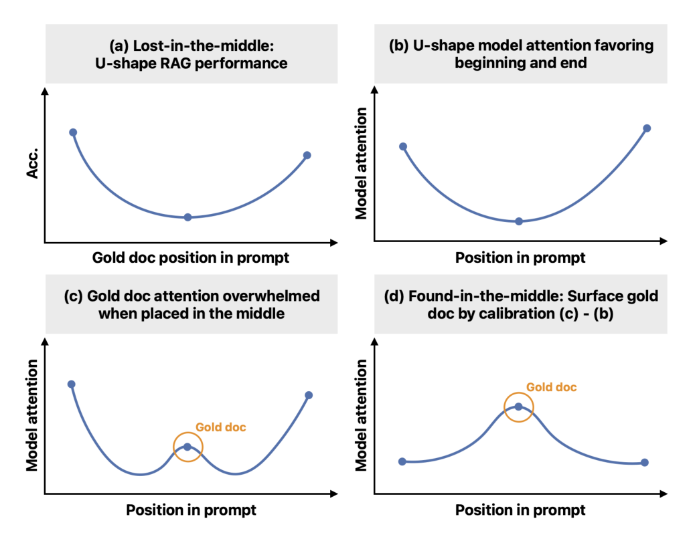
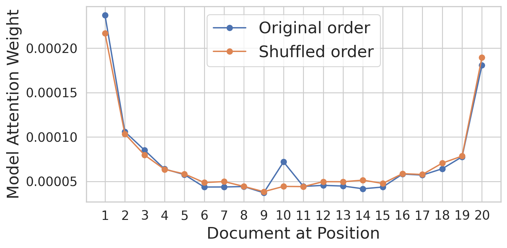
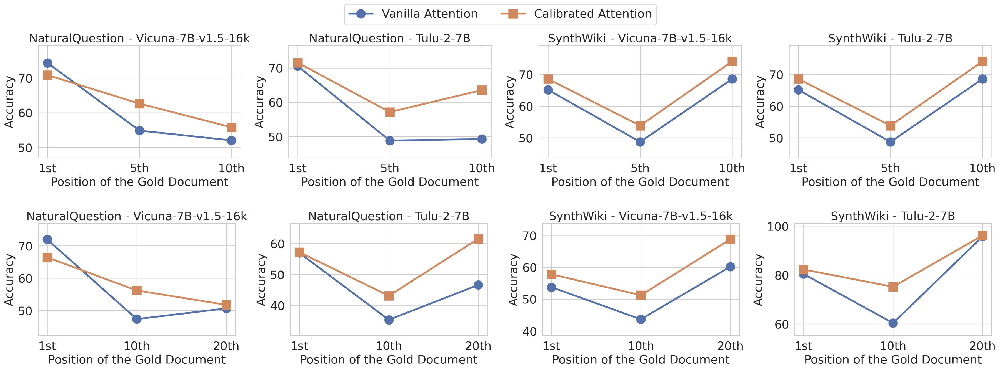

# Paper details — *Found in the Middle: Calibrating Positional Attention Bias Improves Long Context Utilization*

**Citation:** Cheng-Yu Hsieh, Yung-Sung Chuang, Chun-Liang Li, Zifeng Wang, Long T. Le, Abhishek Kumar, James Glass, Alexander Ratner, Chen-Yu Lee, Tomas Pfister, Ranjay Krishna. *Findings of ACL*, 2024. [arXiv:2406.16008](https://arxiv.org/pdf/2406.16008)

---

## Datasets, tasks, and models

**Tasks:** both are multi-document question answering (QA): given a question, K documents in the prompt, exactly one (the "gold" document) contains the answer, the other K−1 are distractors. Evaluation is whether the model's answer appears in its output, at K ∈ {10, 20} documents.

**Datasets** (Appendix A, p. 13):

- **[NaturalQuestions](https://ai.google.com/research/NaturalQuestions)** — 2,655-query subset (Liu et al., 2023), real Wikipedia paragraphs, Contriever-retrieved distractors.
- **[SynthWiki](https://github.com/adamlerer/synthwiki)** (Peysakhovich & Lerer, 2023) — 990 synthetic QA entries; GPT-4-generated Wikipedia paragraphs about *fictional* people, to remove pretraining contamination.

**Models** (Appendix B, p. 13), both open-weight on Hugging Face, both 7B, 32 layers × 32 heads:

- **[Vicuna-7b-v1.5-16k](https://huggingface.co/lmsys/vicuna-7b-v1.5-16k)** — LMSYS, 16k context
- **[Tulu-2-7B](https://huggingface.co/allenai/tulu-2-7b)** — Allen Institute for AI, 8k context

> **The problem this paper attacks (Liu et al. 2023):** *"LLMs struggle to locate relevant documents when they are placed in the middle of their input prompts… They call this the **lost-in-the-middle** phenomenon."*

> **The paper's hypothesis (p. 2):** the loss is not an inability to *see* the middle, it is a **positional attention bias** that out-shouts relevance. The model does attend to relevant mid-context content "but are eventually distracted by leading/ending contexts." The fix follows: **calibrate attention** so it is weighted by relevance instead of position — *"found-in-the-middle… disentangles the effect of U-shape attention bias and allows models to attend to relevant context regardless [of] their positions."*



*Figure 1 (p. 1) — the paper's whole argument in one picture.* **(a)** the behavioral fact from Liu: accuracy is U-shaped in the gold document's position. **(b)** the proposed cause: attention is U-shaped in position *regardless of content*. **(c)** the crux — the model *does* attend to the gold document in the middle (orange circle), but the ends still dominate. **(d)** the paper's fix: calibrate, i.e. subtract the positional baseline, so the gold document surfaces as a peak wherever it sits.

Page numbers below refer to the arXiv PDF (14 pages; references begin on p. 10).

## The notation: `x_prompt`, `x_k^doc`, `x_{k,i}^doc`

The paper defines this **twice, and the two definitions disagree**.

**Page 3 (§2 setup):** the query is repeated before and after the documents.

$$x^{prompt} = [x_q,\ x^{doc}_1,\ \dots,\ x^{doc}_k,\ x_q]$$

Footnote 1 on the same page explains why: *"We repeat the question before and after the documents so that the model can better attend to relevant contexts (Liu et al., 2023; Xu et al., 2023b)."*

**Page 4 (§2.1, "More formally"):** the query has vanished.

$$x^{prompt} = [x^{doc}_1,\ \dots,\ x^{doc}_K]$$

**Note the inconsistency.** The formalization silently drops the query that page 3 says is present twice, and the index case changes (`k` → `K`). Anyone reproducing this must decide which construction they mean — it changes what "position" even refers to.

### The containment hierarchy

| Symbol | What it is | Defined |
|---|---|---|
| `x_prompt` | the entire input prompt — the ordered list of all K documents (plus, per p. 3, the query at both ends) | p. 3, p. 4 |
| `x_k^doc` | the k-th document, i.e. `{x_{k,i}^doc}_{i=1}^{N_k}` — a sequence of `N_k` tokens | p. 4 |
| `x_{k,i}^doc` | token `i` of document **at position `k`** — the atomic unit the attention weight is measured on | p. 4 |
| `N_k` | number of tokens in document `k` | p. 4 |
| `K` | number of documents | p. 4 |

So: `x_prompt` ⊃ `x_k^doc` ⊃ `x_{k,i}^doc`. The averaging in `Attn(x_prompt, k)` runs over exactly the `N_k` tokens that make up document `k`.

**Experimental setting (p. 3):** Vicuna-7b-v1.5-16k, **K = 20** documents, gold document at position **10** (the middle).

---


## What the paper actually does: attention calibration

The U-shape itself has no algorithm. The paper's contribution is the **calibration method**, in **§3.1 "Two main factors in model attention", page 5, Equation (1)**:

$$\text{Attn}(x^{prompt}, k) = f\big(\text{rel}(x_k^{doc}),\ \text{bias}(k)\big)$$

*(Hsieh's Equation (1). The number collides with Vaswani's Equation (1) quoted further down — two papers, two numbering schemes.)*

"where `rel(·)` measures the relevance of an input document, `bias(·)` characterizes the positional attention bias, and `f(·)` is some unknown monotonically increasing function w.r.t. both."

### What monotonicity is claimed to imply — Conditions 1 & 2

The paper does not observe `f` directly. It tests the two implications that monotonicity in each argument forces (p. 5):

- **Condition 1 (antecedent: relevance fixed, consequent: position varies):** for any two documents `x_doc1`, `x_doc2`, if `Attn(x_doc1, k) > Attn(x_doc1, l)`, then it must also hold that `Attn(x_doc2, k) > Attn(x_doc2, l)`. In words: *the cross-position ordering of attention is the same for every document*, i.e. position `k` beats position `l` regardless of which document sits there.
- **Condition 2 (position fixed, relevance varies):** if `Attn(x_doc1, k) > Attn(x_doc2, k)`, then `Attn(x_doc1, l) > Attn(x_doc2, l)`. In words: *the cross-document ordering is the same at every position*, i.e. a more-relevant document outranks a less-relevant one regardless of where they sit.

### What a "violation" is

A pair **violates** a condition when the *antecedent* holds but the *consequent* fails. Concretely for Condition 1: document 1 gets more attention at position `k` than at `l`, yet document 2 does **not** — it reverses or ties. That breaks "attention = relevance + a position-only bias", because a position effect should apply identically to every document.

**What is violated is the separability premise** — that `Attn(x_doc, k)` splits into a term depending only on the document plus a term depending only on the position.

### How weak the support is — the percentages

Validated on 100 randomly sampled NaturalQuestions examples, K = 20 (p. 5, Table 2):

- **Condition 1: 83% valid pairs → 17% violate**
- **Condition 2: 72% valid pairs → 28% violate**

These are weak for three reasons: they test a *consequence* of monotonicity, not monotonicity itself; they are far from 100% (a genuinely monotone `f` should satisfy all pairs); and they only confirm rank ordering, which cannot single out the additive form the method needs.

### The additive form — taken for convenience, not derived

Nothing in Eq. (1) forces additivity; monotonicity admits infinitely many forms. Additivity is chosen for **one reason**: it is the simplest form under which `bias(k)` cancels exactly when a dummy document is subtracted (Eqs. 3–4 below). The paper's "Occam's razor" (p. 5) is a label for "simplest thing that works", not a derivation.

$$\text{Attn}(x^{doc}, k) = \text{rel}(x^{doc}) + \text{bias}(k) + \epsilon$$

Equation (4) is the subtraction that isolates relevance: `rel(x_doc) = Attn(x_doc, k) − Attn(x_dum, k) + rel(x_dum)`. Note `bias(k)` is **cancelled, not estimated** — it appears in both terms and disappears in the subtraction.
- if the dummy doc is kept the same for all docs across all types of experiments, the results become comparable
- here the `Attn(x_doc, k)` is the self-attention weight of that document when positioned at position `k`.

```python
def calibrated_attention(Attn, x_doc, x_dum, k):
    # Eq. 3 - Eq. 2 = Eq. 4: bias(k) cancels; rel up to an additive constant
    return Attn(x_doc, k) - Attn(x_dum, k)
```

Validation is Spearman rank correlation between calibrated scores and ground-truth relevance (linear ≈ 0.76, log-linear ≈ 0.75).

## Vanilla attention



*Figure 4 (p. 3): the U-shape. Documents at positions 1 and 20 get the most attention; the middle gets the least. The orange line is the **shuffled** control — the U survives, so the bias is positional, not content-driven. Note the spike at position 10 in the blue line only: that is the gold document when placed in the middle.*

What the paper calls **vanilla attention** (p. 6: "Using uncalibrated attention `Attn(x_prompt,k)` to rank the documents") is the raw self-attention weight — the number that feeds the calibration above. The paper never writes its formula, and never states "vanilla attention = Vaswani's scaled dot-product attention", but the models are standard transformers, so that is what the number *is*.

<details>
<summary><strong>What Hsieh says it is — page 4, §2.1</strong></summary>

> "let `Attn : X × N → R` denote a function that computes the average attention weights assigned to document `x_k^doc` as
> `Attn(x_prompt, k) = Σ_{i=1}^{N_k} attn(x_{k,i}^doc) / N_k`,
> where `attn(x_{k,i}^doc)` is the **attention weight value allocated to token `x_{k,i}^doc` when predicting the next `|x_prompt| + 1` token**. Specifically, we visualize the **self-attention weights** assigned to each document, **averaged across all its tokens, all decoder layers, and heads**."

**Hsieh never writes the formula for `attn(·)`.** Zero occurrences of "softmax" in the paper.

</details>

<details>
<summary><strong>The computation it inherits — Attention Is All You Need (Vaswani et al., 2017)</strong></summary>

Hsieh cites the mechanism lineage in §5 Related Work (p. 8) but never restates the math. The weight is the standard scaled dot-product attention weight — **§3.2.1, p. 4, Equation (1)** (Vaswani's Eq. (1), not Hsieh's):

$$\text{Attention}(Q,K,V) = \text{softmax}\!\left(\frac{QK^\top}{\sqrt{d_k}}\right)V$$

"…apply a softmax function to obtain the weights on the values" (p. 4). Multi-head — **§3.2.2, p. 5**: `MultiHead(Q,K,V) = Concat(head_1,…,head_h)W^O`, `head_i = Attention(QW_i^Q, KW_i^K, VW_i^V)`, `h = 8`, `d_k = d_v = d_model/h = 64`.

**The attention is causal** — **§3.2.3, p. 5**: decoder self-attention lets each position attend "up to and including that position", masking out future positions (setting softmax inputs to −∞).

</details>

<details>
<summary><strong>Reading the two together — why it's the last row</strong></summary>

Writing pre-softmax scores as `S = QKᵀ/√d_k`, the weight Hsieh measures is the attention mass the final query position places on key position `i`:

```python
import torch, math

def attn_weight_row(Q, K, d_k, mask=None):
    S = (Q @ K.transpose(-2, -1)) / math.sqrt(d_k)
    if mask is not None:
        S = S.masked_fill(mask, float('-inf'))
    return torch.softmax(S, dim=-1)   # A[q, i] = weight on key i
```

Because the decoder mask is causal, only the **final query position** can attend to every preceding token — which is why "when predicting the next token" pins the measurement to the **last row**. Averaging all rows would be a different quantity.

</details>

<details>
<summary><strong>Caveats the paper does not resolve</strong></summary>

| Undefined in Hsieh | Consequence for a reproduction |
|---|---|
| Which query position attends | Implied to be the last, never formalized. |
| Pre- or post-softmax | Standard reading is post-softmax, never stated. |
| Aggregation order | "all tokens, all layers, and heads" — order unstated (commutative for a mean). |
| Which attention type | "self-attention" — decoder self-attention, not cross-attention. |
| Head selection | Deferred (p. 13): they intervene on the last 16 of 32 layers, all heads. |

</details>

<details>
<summary><strong>Why they trust attention weights at all</strong></summary>

The methodological licence is cited in §5 Related Work (p. 9): "Self-attention has also been widely used as a **proxy to understand and explain model behaviors** (Clark et al., 2019; Hao et al., 2021; Vashishth et al., 2019)." And §2.1 (p. 4) hedges: "the weights has been shown to correlate with models' generations, **although not necessarily causal** (Dong et al., 2021; Zhang et al., 2023)."

So the paper is **aware the weights are not causal** and says so.

</details>

---

## How Recall@3 is computed

- For each of the K documents, compute a relevance score (Eq. 4):

$$\text{rel}(x^{doc}) \approx \text{Attn}(x^{doc}, k) - \text{Attn}(x^{dum}, k)$$

- **Rank** the K documents by that score, descending.
- **Recall@3** = fraction of queries where the gold document lands in the **top 3** of that ranked list.
- The ranking key **is** the calibrated attention — the relevance score is the dummy-subtracted attention, so Recall@3 rides directly on calibrated attention.

| Method (Table 3) | Score used to rank | Recall@3 (K=10 / K=20) |
|---|---|---|
| Vanilla attention | raw `Attn(x_prompt, k)` | 0.3638 / 0.2052 |
| Query generation | likelihood of generating the query from the doc | 0.6851 / 0.5815 |
| Relevance generation | prompt "is this relevant?" | 0.5521 / 0.4012 |
| **Calibrated attention** | `Attn(x_doc,k) − Attn(x_dum,k)` | **0.7427 / 0.6832** |

> The paper's own words (p. 6): *"Eq. 4 allows us to leverage calibrated attention to estimate and rank the relevance of different documents."* So the relevance scores **are** the calibrated attention.

---

## The meat: rescaling the model's token attention

### Why ranking is not enough

Locating the relevant document (Table 3) does not fix *utilization*. The paper's Introduction is explicit that re-ranking *"does not fundamentally improve LLMs' ability to utilize and capture relevant information."* Even after you move the relevant doc to the front, the model's **attention still favors the terminals positionally** — the bias lives in the model's weights, not in the document order.

### What the paper recommends instead — §4.1, Equations 5–6 (p. 6)

> *"To allow the model to attend to contexts **without being dictated by positional bias**, we propose to **intervene the model's attention**… instead of allocating `rel(x_k^doc) + bias(k)` attention to the k-th document, our ideal model attention would reflect **only the relevance** `rel(x_k^doc)`."*

Per token within each document (token `i` in document `k`):

$$\text{attn}_{calibrated}(x_{k,i}^{doc}) = \frac{\alpha_k}{\text{Attn}_{original}(x_k^{doc})} \cdot \text{attn}_{original}(x_{k,i}^{doc}) \cdot C$$

- $\alpha_k = \text{Softmax}(\text{rel}(x_k^{doc}),\ t)$ — temperature-scaled softmax over document relevances
- $C$ — a normalizer so total attention is unchanged

Net effect (Eq. 6):

$$\text{Attn}_{calibrated}(x_k^{doc}) \propto \text{Softmax}(\text{rel}(x_k^{doc}),\ t)$$

### What that equation actually means, operationally

1. **$\alpha_k$ is one scalar per document, computed once per query.** $\alpha_k = \text{softmax}(\text{rel}(x_k^{doc}), t)$ — the *same* value applies to every token `i` inside document `k`. It is the output of a softmax over all K documents' relevance scores, so $\alpha_k \in (0,1)$ and $\sum_k \alpha_k = 1$.

2. **The denominator is the document's attention mass.** $\text{Attn}_{original}(x_k^{doc}) = \sum_{i} \text{attn}_{original}(x_{k,i}^{doc})$ — the sum of attention over all of document `k`'s tokens (the uppercase `Attn`). Dividing by it normalizes out how much attention the document *currently* gets, so the ratio $\alpha_k / \text{Attn}_{original}(x_k)$ is a pure re-weighting factor.

3. **$C$ is mass preservation, not decoration.** After re-weighting every document, the attention matrix's rows must still sum to 1 for the next-token distribution to be valid. $C$ rescales the whole thing so total attention is unchanged. Without it, the softmax row breaks.

4. **It happens inside the forward pass, per layer/head, at inference — and per query.** Attention is recomputed every generation step, so the intervention runs every step. Appendix B (p. 13): they apply it to the **last 16 of 32 decoder layers, all heads**. And because $\text{rel}(x_k)$ comes from Eq. 4 (calibrated attention against the *current* query), the rescaling is **query-dependent** — there is no static weight.

<details>
<summary><strong>Implementation sketch</strong></summary>

```python
import torch
import torch.nn.functional as F

# One decoder layer, one head, at the generation step for query x^q.
# prompt_tokens : [T]   token ids of the whole prompt, T = prompt length in tokens
# doc_spans     : list of (start, end) spans for the K documents
# x_dum_tokens  : [N_dum]   token ids of the FIXED dummy document

def replace_span(tokens, span, replacement):
    """Swap the token slice [s, e) with `replacement`, padded/truncated to the same length."""
    s, e = span
    length = e - s
    rep = replacement[:length] + [0] * max(0, length - len(replacement))  # 0 = pad id
    return torch.cat([tokens[:s], torch.tensor(rep), tokens[e:]])

def attention_mass(attn, span):
    """Attn(x_doc, k): total attention on a token span, summed over the last query row."""
    s, e = span
    return attn[-1, s:e].sum()          # last row = the position predicting the next token

def calibrated_relevance(model, prompt_tokens, doc_spans, x_dum_tokens):
    """Eq. 4, done faithfully: compare doc vs dummy AT THE SAME position k."""
    rel = []
    # pass A: the REAL prompt.
    # attn_A : [T, T]  — T = |prompt_tokens| = query(doubled) + K documents
    attn_A = model(prompt_tokens)["attention"]

    for k, (s, e) in enumerate(doc_spans):
        # pass B: swap doc k's tokens for the dummy, SAME span -> SAME position k.
        # prompt_B has the SAME length as prompt_tokens, so attn_B is also [T, T].
        prompt_B = replace_span(prompt_tokens, (s, e), x_dum_tokens)
        attn_B = model(prompt_B)["attention"]             # [T, T]

        a_doc = attention_mass(attn_A, (s, e))            # Attn(x_doc, k): scalar
        a_dum = attention_mass(attn_B, (s, e))            # Attn(x_dum, k): scalar  <- same k
        rel.append(a_doc - a_dum)                          # bias(k) cancels; scalar

    return torch.stack(rel)                               # [K]; rel up to a constant

def temp_scaled_softmax(rel, temp):
    """alpha_k = softmax(rel / temp). temp -> 0: sharper (argmax); temp -> inf: uniform."""
    return F.softmax(rel / temp, dim=-1)

def rescale(model, prompt_tokens, doc_spans, x_dum_tokens, temp):
    rel   = calibrated_relevance(model, prompt_tokens, doc_spans, x_dum_tokens)   # [K], Eq. 4
    alpha = temp_scaled_softmax(rel, temp)                                        # [K], alpha_k

    attn_A = model(prompt_tokens)["attention"]
    attn_calibrated = attn_A.clone()

    for k, (s, e) in enumerate(doc_spans):
        Attn_k = attention_mass(attn_A, (s, e))
        attn_calibrated[:, s:e] *= (alpha[k] / Attn_k)     # same scalar for every token i

    # C: keep total attention mass unchanged (rows still sum to 1)
    attn_calibrated *= (attn_A.sum() / attn_calibrated.sum())
    return attn_calibrated
```

- `attn_A.sum()` is a **scalar** — the total of all attention entries.
- `[T, T]` = query token × key token; **T is the sequence length** (prompt length in tokens), not a model dimension. The lowercase `temp` (temperature) is unrelated to `T`.

<details>
<summary><strong>Where does T come from? — a NaturalQuestions walkthrough</strong></summary>

- Take one query, e.g. **"who wrote the song 'American Pie'"**, plus its K documents (one gold, K−1 distractors).
- Concatenate them into one sequence, then **tokenize** it. Each subword becomes one position. Suppose the whole thing yields **800 tokens** — the question's ~10 tokens, each document's ~250 tokens, etc.
- `T = 800`. **T is just "how many tokens are in the prompt."** Nothing model-internal decides it; it's the count of positions after tokenization.
- Every token produces a query, a key, and a value (projections of the same token). So there are **800 queries and 800 keys** — same count, because it's the *same* 800 tokens wearing two hats.
- `Q` is `[800, d_k]`, `K` is `[800, d_k]`, so `QKᵀ` is `[800, 800]`: row = a query token (asker), column = a key token (asked-about).
- The row the paper reads is the **last** one — the query position predicting the *next* token. Its 800 entries say how much attention that position gives to each earlier token, e.g. high on `Don` and `McLean` (the gold), low on the distractors.
- The doc spans (`docs` in the code) are just `(start, end)` token ranges within those 800 — e.g. Doc 2 = tokens 290 to 540. `doc_attn` sums the relevant column block for that span.

</details>
- Run for each of the last 16 layers and all heads, at every generation step, with `rel` recomputed per query.

</details>

### The impact — numbers



*Figure 5 (p. 7): calibrated (orange) sits above vanilla (blue) in 22 of 24 cases. The dip in the middle is the lost-in-the-middle effect; calibration lifts exactly that dip — 6–15 points where the gold document is mid-sequence.*

- **Fig. 5 (p. 7):** calibrated attention lies "almost entirely above standard vanilla attention (on **22 out of 24** cases)."
- **Middle positions — the hard case:** "attention calibration provides **6–15 points** improvements."
- **Overall:** "improvements over standard model generation by **up to 15 percentage point** on NaturalQuestion."

---

## The science, compressed

The causal claim is: **attention-mass allocation is the bottleneck, not document position.** Position only matters because it *distorts* attention mass (the U-shape). Fix the mass — rescale it ∝ relevance — and position stops mattering.

Two steps, mirroring the paper's two halves:

1. **Estimate relevance without position** — subtract a fixed dummy document at the same position (Eq. 4), cancelling `bias(k)`.
2. **Allocate attention by relevance without position** — rescale per-document attention to `softmax(relevance)` (Eq. 5).

> **One honest caveat the paper carries:** attention "correlate[s] with models' generations, **although not necessarily causal**." Directly editing attention moves accuracy, which is strong intervention evidence — but "attention is the mechanism" is the best available account, not a settled proof.
