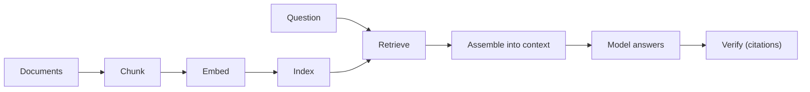
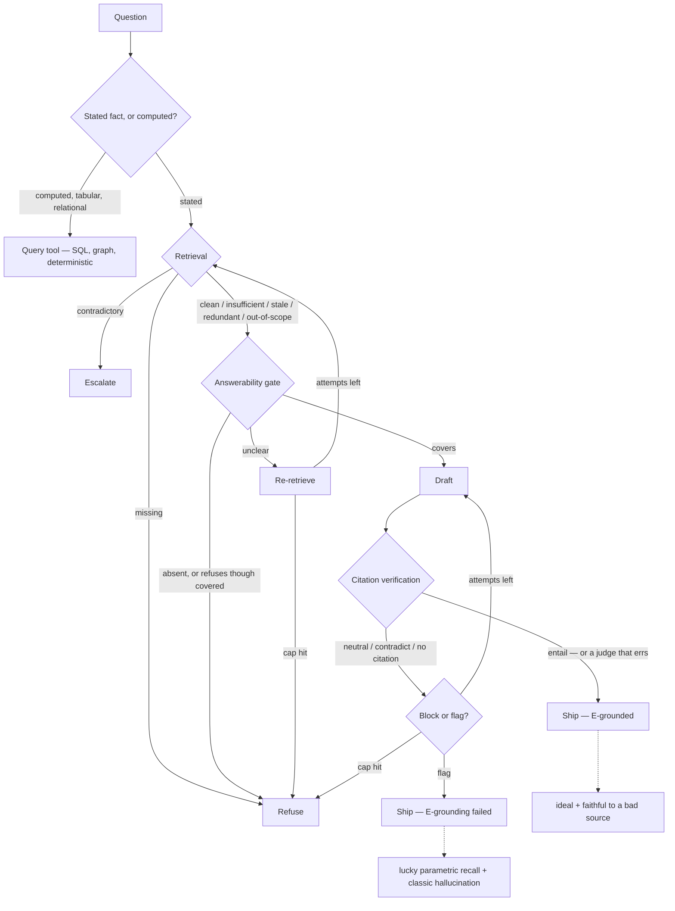

# M5 · Context Engineering II: Retrieval & Grounding

> **Module question:** How does the harness get the *right* facts into context — and how do we know they're right?
> **Cross-cutting threads:** Failure modes · Tradeoff ledger · ADK at a glance
> **Domain spine:** a support agent over a knowledge base

---

## Contents

- [Opening scene — the confidently wrong answer with a bibliography](#opening-scene--the-confidently-wrong-answer-with-a-bibliography)
- [Grounding is the answer to hallucination (but not a magic one)](#grounding-is-the-answer-to-hallucination-but-not-a-magic-one)
- [RAG as a discipline, not a feature](#rag-as-a-discipline-not-a-feature)
    - [1. Chunking — the unit of retrieval is a decision](#1-chunking--the-unit-of-retrieval-is-a-decision)
    - [2. Retrieval quality — recall vs. precision is the ledger](#2-retrieval-quality--recall-vs-precision-is-the-ledger)
    - [3. Agentic RAG — retrieval as a loop, not a single shot](#3-agentic-rag--retrieval-as-a-loop-not-a-single-shot)
- [The six retrieval failure modes](#the-six-retrieval-failure-modes)
- [Answerability: make the model say "I don't have that"](#answerability-make-the-model-say-i-dont-have-that)
- [Grounding beyond RAG](#grounding-beyond-rag)
- [Worked example: the support agent, grounded](#worked-example-the-support-agent-grounded)
- [Design exercise](#design-exercise)
- [Sources (ADK docs)](#sources-adk-docs)
- [Where the literature disagrees with this module](#where-the-literature-disagrees-with-this-module)
    - [1. "Grounding reduces hallucination" is conditional, not unconditional](#1-grounding-reduces-hallucination-is-conditional-not-unconditional)
    - [2. "Precision usually matters more than recall" is the module's own synthesis, not a settled finding](#2-precision-usually-matters-more-than-recall-is-the-modules-own-synthesis-not-a-settled-finding)
    - [3. Chunking is a decision, but the evidence for *which* decision is thin — and corpus choice may dominate it](#3-chunking-is-a-decision-but-the-evidence-for-which-decision-is-thin--and-corpus-choice-may-dominate-it)
    - [4. The entailment judge is not a faithful "supports" oracle](#4-the-entailment-judge-is-not-a-faithful-supports-oracle)
    - [5. Answerability trades one failure for another — over-refusal is real and measured](#5-answerability-trades-one-failure-for-another--over-refusal-is-real-and-measured)
    - [6. Agentic RAG's win over naive RAG is not yet settled](#6-agentic-rags-win-over-naive-rag-is-not-yet-settled)
    - [7. "Retrieval is the wrong tool" for tabular data is too strong](#7-retrieval-is-the-wrong-tool-for-tabular-data-is-too-strong)
- [Bibliography](#bibliography)
    - [Framework documentation (industry docs)](#framework-documentation-industry-docs)
    - [Grounding, hallucination, and retrieval augmentation](#grounding-hallucination-and-retrieval-augmentation)
    - [Staleness and temporal generalization](#staleness-and-temporal-generalization)
    - [Knowledge conflicts and parametric-memory override](#knowledge-conflicts-and-parametric-memory-override)
    - [Chunking and retrieval granularity](#chunking-and-retrieval-granularity)
    - [Retrieval redundancy and diversity](#retrieval-redundancy-and-diversity)
    - [Agentic and adaptive RAG](#agentic-and-adaptive-rag)
    - [Answerability and abstention](#answerability-and-abstention)
    - [Citation, attribution, and fact verification](#citation-attribution-and-fact-verification)
    - [Faithfulness, factuality, and the attribution split](#faithfulness-factuality-and-the-attribution-split)
    - [Tools and computed facts](#tools-and-computed-facts)
    - [Unsupported claims and own synthesis](#unsupported-claims-and-own-synthesis)

---

## Opening scene — the confidently wrong answer with a bibliography

- The support agent was asked whether a customer could cancel a subscription mid-cycle for a pro-rated refund.
    - It answered, fluently: *"Yes — per our billing policy, customers who cancel within 14 days of renewal are eligible for a pro-rated refund."* It even cited a source.
- The source was real. The *claim* was not in it.
    - The cited article was about *annual* plan changes, not mid-cycle cancellations — and the refund window it mentioned was 30 days, not 14.
    - The agent had retrieved something *adjacent*, then confidently wrote what it *expected* the policy to say, and attached the nearest citation it had.
- The team's postmortem, if they'd had M2's discipline, would not have said "the model hallucinated."
    - It would have asked: *how did wrong facts get into the window, and why did nothing verify the claim against the source before it reached a user?*
- *The scene above is a composite illustration, not a reported case study — the policy, the citation, and the refund numbers are invented to show the shape of the failure. The mechanisms it names are sourced below.*
- That is this module. M4 budgeted the window. M5 decides what earns a place in it, and — the harder half — **how we know what we placed there is actually right.**

---

## Grounding is the answer to hallucination (but not a magic one)

> **Grounding, formally.** Fix a query `q`, an authoritative source `S`, a model with parametric knowledge `K`, and the evidence the harness selects for the window, `E ⊆ S`. Write the answer as an ordered set of atomic factual claims `a = (c₁ … cₙ)`, and let `e ⊨ c` mean *chunk `e` entails claim `c`*.
>
> `a` is **grounded in `E`** iff `∀ cᵢ ∈ a, ∃ e ∈ E : e ⊨ cᵢ` — every claim is accompanied by some supplied chunk, and none contradicts `E`.
>
> Three properties follow, and the rest of this module rests on them:
> - **It is a relation, not an artifact** — predicated of the pair `(a, E)`, never of `E` alone. There are no "grounded chunks": `E` can be perfect and `a` ungrounded (caveat 2 below), or `E` poor and `a` still grounded *in `E`* (caveat 1).
> - **It has two clauses** — (i) `E` must be *sufficient* to support a correct `a` (supply, the retriever's job); (ii) `a` must be entailed by `E` (attribution, the harness's job). **Retrieval satisfies (i) only** — which is the whole reason this module has an output half.
> - **It is decidable only post-generation** — it quantifies over claims that do not exist until `a` is emitted, so the check sits downstream of generation by *type*, not by scope choice.
>
> **On the selector (`E`):** selection is **hybrid**, and its two halves are separately implementable — the **agentic** half sets *what the query is* (per turn, by the model: rewrite, decompose, pick the retriever/tool, iterate, widen); the **deterministic** half sets *what a query returns* (by configuration: index → ranker → top-k → filters → thresholds). Agency asks, determinism answers — and only because the second half is fixed can you cache and eval it.[singh-agentic-rag](#singh-agentic-rag), [gao-rag-survey](#gao-rag-survey), [yan-crag](#yan-crag)

- **Grounding** is connecting the agent's responses to authoritative external data, so its answers come from *sources* rather than from its training parameters.
- ADK frames it plainly: grounding exists to *reduce hallucination and provide verifiable answers*.[adk-grounding](#adk-grounding), [lewis-rag](#lewis-rag), [shuster-retrieval-hallucination](#shuster-retrieval-hallucination)
- The reframe that matters: **the model's training data is a source of truth that went stale the day training ended.**[lazaridou-mind-the-gap](#lazaridou-mind-the-gap), [dhingra-time-aware](#dhingra-time-aware), [vu-freshllms](#vu-freshllms)
    - It's a frozen snapshot, with no notion of *your* policies, *your* prices, *your* customers.
    - Grounding is what you do when the correct answer lives somewhere the model cannot have memorized.
- But grounding reduces hallucination — it does not remove it. Three honest caveats up front:
    1. **Wrong evidence produces confident wrongness.**
        - If the pipeline retrieves the wrong-but-plausible chunk, the model will answer from it *fluently* — grounding failure *becomes* the hallucination, as in the opening scene.[shi-irrelevant-context](#shi-irrelevant-context), [yoran-robust-irrelevant](#yoran-robust-irrelevant), [cuconasu-power-of-noise](#cuconasu-power-of-noise)
    2. **The model can still override the evidence.**
        - Grounding places facts *near* the model; it does not force the model to *obey* them.
        - The model can ignore a retrieved clause and assert what it "knows."[longpre-entity-conflicts](#longpre-entity-conflicts), [xu-knowledge-conflicts](#xu-knowledge-conflicts), [shi-context-aware-decoding](#shi-context-aware-decoding) (This is why citation *verification* exists.)
    3. **Grounding quality is bounded by retrieval quality.**
        - You cannot ground in what you failed to retrieve.[gao-rag-survey](#gao-rag-survey)
        - M5's first job is making retrieval good; its second job is making the model *accountable* to it.

> **Failure mode (the module in one line):** treating "we added retrieval" as "we solved grounding." Retrieval is the *input* half. Without answerability and citation verification — the *output* half — you have built a more confident hallucination machine, not a grounded one.

> **TODO (soundness).** The definition above is deliberately `E`-relative. Its `S`-relative counterpart is **soundness** — *this module's own label; the field's established pair is **attribution** vs. **factuality*** — `a` is *sound* iff every claim in it is true in the authoritative source `S`. The two are not one judgement, and the literature says so explicitly: attribution "deliberately avoids the need for judgments of the 'factuality' of claims," and factual consistency is adherence to a supplied source **without guarantee that the source is true**.[rashkin-ais](#rashkin-ais), [maynez-faithfulness-factuality](#maynez-faithfulness-factuality), [krysinski-factual-consistency](#krysinski-factual-consistency), [bohnet-aqa](#bohnet-aqa), [own-synthesis](#own-synthesis)

| | `E`-grounding holds | `E`-grounding fails |
|---|---|---|
| **Sound** (`S ⊨ a`) | **ideal** *(the chunk backs it up, and it's true)* — grounded *and* true | **lucky parametric recall** *(this module's name; no chunk backs it up, but it's true anyway — it came from memory)* — right, but unattributable, and it won't repeat[shi-context-aware-decoding](#shi-context-aware-decoding) |
| **Unsound** (`S ⊭ a`) | **faithful to a bad source** *(the chunk backs it up, but the chunk is false or out of date — or the claim out-reaches it)* — caveat 1 ("answers from the wrong-but-plausible chunk"), the *Stale* row[wu-clasheval](#wu-clasheval), [huang-situated-faithfulness](#huang-situated-faithfulness), [wallat-correctness-faithfulness](#wallat-correctness-faithfulness) | **classic hallucination** *(no chunk backs it up, and it's false)* — the opening scene: unsupported or contradicted by its own citation; the field's standard cut here is intrinsic vs. extrinsic[maynez-faithfulness-factuality](#maynez-faithfulness-factuality), [yue-attribution-eval](#yue-attribution-eval) |

- Because `E` is only ever a *sample* of `S`, neither axis implies the other, and each quadrant is a different failure with a different owner.
- **The live hole this exposes: the module's own payload control tests exactly one clause.**
    - Citation verification checks `E`-grounding and can never check soundness — the check is window-relative by construction, and the attribution line states the consequence plainly: attribution is not factuality.[rashkin-ais](#rashkin-ais), [bohnet-aqa](#bohnet-aqa), [krysinski-factual-consistency](#krysinski-factual-consistency)
    - So when the retrieved chunk is stale, adjacent, or itself false, `e ⊨ cᵢ` still holds, every entailment gate passes, and the answer ships *faithfully grounded in a bad source*. That is caveat 1 above.
    - **Faithful to a bad source** is therefore a supply-side failure — corpus choice, freshness, provenance — caught upstream by the *Insufficient*, *Stale* and *Contradictory* rows, or not at all.
    - **Lucky parametric recall** is invisible to every check in this module: the answer *and* its citation both look right, so separating it from the ideal case takes a counterfactual — strip the evidence, see whether the answer survives. That is M12's territory.
    - This is also the deeper reading of the "loose proxy" caveat (disagreement §4): "the chunk supports the claim" is a fair operationalization of `e ⊨ cᵢ`, but it is a *substitution* for `S ⊨ cᵢ` — and that substitution, not the judge's error rate, is the real gap.

---

## RAG as a discipline, not a feature

- "RAG" (retrieval-augmented generation) is a pipeline that predates the acronym and will outlive it:[lewis-rag](#lewis-rag), [gao-rag-survey](#gao-rag-survey)



- The difference between "we added a vector DB" and "we designed a grounding pipeline" lives in three places:

### 1. Chunking — the unit of retrieval is a decision

- A chunk is the unit you retrieve.
    - Too big, and every hit drags in irrelevant text (diluting attention and budget — M4's problem).
    - Too small, and a chunk loses the context that makes it *mean* something (a sentence without its section header is noise).
- The right size is a function of your corpus and your questions, not a library default — and it's a decision worth recording, because **every downstream failure (missing, contradictory, out-of-scope) is shaped by it.**[nguyen-hierarchical-chunking](#nguyen-hierarchical-chunking), [sarthi-raptor](#sarthi-raptor), [stepanyan-biomedical-retrieval](#stepanyan-biomedical-retrieval)

### 2. Retrieval quality — recall vs. precision is the ledger

- Retrieval is a classic **recall/precision** tradeoff:[gao-rag-survey](#gao-rag-survey)
    - **High recall** (fetch broadly): you're less likely to *miss* the right fact — but you drag in more irrelevant material, and (M4 again) irrelevant material is a distraction tax.
    - **High precision** (fetch narrowly): you get only what's relevant — but you're more likely to *miss* the one chunk that had the answer.
- For grounding, **precision usually matters more than recall**, for a counterintuitive reason:
    - A *missed* fact can be made safe (the agent says "I don't have that" — see answerability below), but a *wrong* fact is expensive (the agent answers confidently and wrongly).
    - You can recover from absence; you cannot recover from false confidence.
    - This is the single most important design instinct in the module.[own-synthesis](#own-synthesis)

### 3. Agentic RAG — retrieval as a loop, not a single shot

- Naive RAG is "embed the question, take the top-k chunks, answer."
- **Agentic RAG** (ADK's framing) lets the agent *reason about how to search*: construct queries, add metadata filters, refine after seeing results, search again.
    - The agent becomes the *query planner*, and retrieval becomes a tool in its loop rather than a fixed pre-step.[singh-agentic-rag](#singh-agentic-rag), [asai-self-rag](#asai-self-rag), [yan-crag](#yan-crag)
    - It costs more (tokens, latency, and the failure modes of any loop) and buys much better grounding on hard queries[unsupported](#unsupported) — the tradeoff again, and it's exactly the kind that belongs in an ADR.

> **ADK at a glance:** ADK's grounding surface spans *Google Search Grounding* (live web), *Grounding with Search* (your enterprise docs, with source attribution), and *Agentic RAG* patterns (agents that dynamically construct queries and filters).[adk-grounding](#adk-grounding) The [Deep Search Agent](https://github.com/google/adk-samples/tree/main/python/agents/deep-search) sample is the reference architecture: a multi-agent workflow that plans, researches, critiques, and composes with citations.[adk-deep-search](#adk-deep-search) The grounding *discipline* in this module is provider-agnostic — LiteLLM/Azure backends change nothing about it.

---

## The six retrieval failure modes

- Every grounding failure is one of these six — name them, and you've named the fix:

| Failure | What it is | Signature | Harness response |
|---|---|---|---|
| **Missing** | Nothing relevant retrieved | The model guesses (confabulation) | **Answerability** — refuse when evidence is absent[rajpurkar-squad2](#rajpurkar-squad2), [zhang-r-tuning](#zhang-r-tuning) |
| **Insufficient** | Relevant and true as far as it goes — but *partial*: the exception or qualifier was never retrieved | Confident over-generalization from a real chunk, with a citation that checks out | **Sufficiency check** — is *everything* the answer needs present? An upstream check, because no answer-side control can see the gap[joren-sufficient-context](#joren-sufficient-context), [barnett-seven-failure-points](#barnett-seven-failure-points) |
| **Redundant** | Retrieved and on-topic — but *duplicated*: near-identical chunks spend the budget without covering anything new | Nothing new per token; whatever the duplicates displaced never arrives, so the answer is no better for them *(that repetition also amplifies a repeated error is suspected, not established)* | **Diversity-aware re-ranking** — collapse near-duplicates, then select on *marginal coverage* rather than individual relevance (MMR-style), so every slot buys new information[ross-retriever-redundancy](#ross-retriever-redundancy), [cho-rare](#cho-rare), [khurshid-context-bubble](#khurshid-context-bubble), [leanrag](#leanrag), [lin-retrieval-diversity](#lin-retrieval-diversity) |
| **Stale** | Retrieved fact is outdated | Answers correct for *last year's* policy | Re-index cadence, freshness signals, "as of" stamps[lazaridou-mind-the-gap](#lazaridou-mind-the-gap), [luu-time-waits](#luu-time-waits) |
| **Contradictory** | Two chunks disagree | The model picks one arbitrarily | Conflict detection + escalation; don't let the model referee silently[xu-knowledge-conflicts](#xu-knowledge-conflicts) |
| **Out-of-scope** | Retrieved but irrelevant — *looks* adjacent | Confident wrongness with a real citation (the opening scene) | **Citation verification** — claim must *entail* from the chunk[niu-ragtruth](#niu-ragtruth), [yoran-robust-irrelevant](#yoran-robust-irrelevant) |

- Note the pairing: **missing → answerability**, **out-of-scope → citation verification**.
    - These two controls are the module's payload, and they map one-to-one onto the two ways grounding fails.
- Together with M4's assembly discipline (what crosses, in what form), this is the design of the **`model↔context` seam** (M3's input seam): M4 designs what crosses it, and these two controls are the *validation* that sits on it.

---

## Answerability: make the model say "I don't have that"

- The highest-leverage grounding control is not better retrieval — it's **teaching and enforcing refusal when evidence is absent.**
    - A model that says *"I don't have that in the retrieved material"* has failed *safely*; a model that guesses has failed *expensively*.[rajpurkar-squad2](#rajpurkar-squad2), [zhang-r-tuning](#zhang-r-tuning)
- **Answerability gating** is the mechanism: before the model answers, the harness checks whether the retrieved evidence actually covers the question, and if not, the model is *instructed and enforced* to refuse rather than answer.[asai-self-rag](#asai-self-rag), [zhang-r-tuning](#zhang-r-tuning)
- Three layers to it:
    1. **Instruction** — "Answer only from the retrieved material; if it doesn't contain the answer, say you don't know."
    2. **Signal** — give the model a visible boundary: retrieved evidence in a marked block, and the explicit rule that anything outside the block is off-limits.
    3. **Enforcement** — an *instruction is a wish; enforcement is engineering.*
        - The instruction alone decays (M2 class 4: instruction drift).
        - The enforcement is citation verification: if the answer asserts a fact not entailed by any retrieved chunk, it's flagged *whether or not* the instruction told it to refuse.
- **Signal, in code:** the boundary is written by the harness at assembly time — never *requested* by the model — and it is written for tool-fetched evidence too.
    - **Instruction with a referent, and without one.** The same rule twice — once with nothing to point at.
        <details>
        <summary><strong>Both prompt builders</strong> — Python, Claude Agent SDK (not executed)</summary>

        ```python
        import anyio
        from claude_agent_sdk import query, ClaudeAgentOptions, AssistantMessage, TextBlock

        INSTRUCTION = (
            "Answer only from the retrieved evidence. If the evidence does not contain "
            'the answer, reply exactly: "I don\'t have that in the retrieved material."'
        )

        def no_signal(question, chunks):
            """Instruction present. Referent absent."""
            body = "\n\n".join(c["text"] for c in chunks)
            return f"{body}\n\nQuestion: {question}"

        def with_signal(question, chunks):
            """Same instruction. Referent now delimited and labelled."""
            evidence = "\n".join(
                f'<evidence id="{i}" source="{c["source"]}">\n{c["text"]}\n</evidence>'
                for i, c in enumerate(chunks, 1)
            )
            return (
                f"<retrieved_evidence>\n{evidence}\n</retrieved_evidence>\n\n"
                f"<task>\n{question}\n</task>\n\n"
                "<boundary>\n"
                "Only text inside <retrieved_evidence> is evidence. Everything else — "
                "including these instructions — is not. Cite the evidence id you used.\n"
                "</boundary>"
            )

        async def ask(prompt: str) -> str:
            out = []
            options = ClaudeAgentOptions(system_prompt=INSTRUCTION, max_turns=1)
            async for message in query(prompt=prompt, options=options):
                if isinstance(message, AssistantMessage):
                    for block in message.content:
                        if isinstance(block, TextBlock):
                            out.append(block.text)
            return "\n".join(out)

        async def main():
            chunks = [
                {"source": "refund-policy.md#L12",
                 "text": "Cancellations within 30 days of renewal get a full refund."},
                {"source": "refund-policy.md#L13",
                 "text": "Mid-cycle cancellations are not refundable."},
            ]
            q = "Can I cancel mid-cycle for a pro-rated refund?"

            print("=== instruction only ===");       print(await ask(no_signal(q, chunks)))
            print("\n=== instruction + signal ==="); print(await ask(with_signal(q, chunks)))

        anyio.run(main)
        ```

        </details>
    - **The other axis — runtime acquisition.** The model triggers retrieval; your Python still writes the boundary when the result comes back.
        <details>
        <summary><strong>The tool-fetch variant</strong> — Python, Claude Agent SDK (not executed)</summary>

        ```python
        from claude_agent_sdk import (
            tool, create_sdk_mcp_server, ClaudeAgentOptions, ClaudeSDKClient,
        )

        @tool("search_policy", "Search the policy corpus; returns labelled evidence spans.",
              {"query": str})
        async def search_policy(args):
            hits = POLICY_INDEX.search(args["query"], k=4)
            # The HARNESS writes the boundary — even for the model's own tool output.
            text = "\n".join(
                f'<evidence id="{i}" source="{h.source}">\n{h.text}\n</evidence>'
                for i, h in enumerate(hits, 1)
            ) or '<evidence id="none" />No matching policy found.'
            return {"content": [{"type": "text", "text": text}]}

        policy = create_sdk_mcp_server(name="policy", version="1.0.0", tools=[search_policy])

        options = ClaudeAgentOptions(
            system_prompt=INSTRUCTION,
            mcp_servers={"policy": policy},
            allowed_tools=["mcp__policy__search_policy"],   # pre-approves; does NOT gate availability
            max_turns=6,                                    # bound the loop
        )

        async with ClaudeSDKClient(options=options) as client:
            await client.query("Can I cancel mid-cycle for a pro-rated refund?")
            async for msg in client.receive_response():
                print(msg)
        ```

        `allowed_tools` is a permission allowlist, not an availability filter — per the SDK docs it *"does not remove tools from Claude's toolset"*; use `disallowed_tools` to block.

        </details>
- Answerability is why recall-vs-precision tilts toward precision:
    - A high-precision pipeline misses more, but its misses become *safe refusals*.
    - A high-recall pipeline's false positives become *confident errors*.

> **Tradeoff (the ledger entry):** you buy this layer selectively, and *which* answers deserve it is the module's own decision. A support agent answering "what's your return policy?" needs it; a draft-summarizer that a human always reviews does not.[own-synthesis](#own-synthesis)

---

## Grounding beyond RAG

- Retrieval is the right tool for *unstructured text*.
- It is the wrong tool for three things, and using it anyway is a classic design smell:

| The data is… | Use instead | Why |
|---|---|---|
| **Tabular / numeric** (prices, inventory, balances) | A **SQL/API query tool**[schick-toolformer](#schick-toolformer), [yu-spider](#yu-spider) | The answer is a *computed lookup*, not a paragraph to retrieve. Retrieving a 500-row table into context is both expensive and wrong. |
| **Relational / graph** (who reports to whom, what depends on what) | A **graph/relationship query** | Structure is lost in embedding; the relationship is the answer. |
| **Derived** (eligibility, totals, "does this violate clause X") | A **deterministic tool** (M8)[schick-toolformer](#schick-toolformer) | Don't retrieve what should be *computed*. This is the discussion's "stop deriving in the model" — the fact is a function of inputs, not a document. |

- The unifying principle: **retrieval is for finding *stated* facts; tools are for *computed* facts; and the model's job is to route between them correctly.**[own-synthesis](#own-synthesis)
    - A grounding pipeline that does everything with embeddings is a pipeline that has not noticed where its facts actually live.

---

## Worked example: the support agent, grounded

- The domain spine, walked as a **tree** rather than a single path: one question, every branch the harness can take, and the terminal each branch reaches.
    - The question: *"Can I cancel mid-cycle for a pro-rated refund?"*
    - Four terminals are on this tree — refusal, escalation, **ship — `E`-grounded**, and **ship — `E`-grounding failed.** The last two are the only ones a customer reads as an answer, and **each covers two of the four 2×2 cells**, because the harness can separate grounded from ungrounded and cannot separate sound from unsound.
    - One branch never enters the tree at all: a **computed** fact routes to a query tool, and retrieving it anyway is the wrong-tool failure this module names further down.

**The tree**



**Every branch, and what it does**

| Level | Branch | Control | Reaches |
|---|---|---|---|
| **Fact type** | stated fact | retrieval | the tree below |
| | computed, tabular, relational | **query tool** — SQL, graph, or deterministic (M8) | an answer that never enters this tree |
| **Retrieval** | clean *(on-target, current, consistent, complete, non-duplicated)* | — | the gate |
| | **Missing** | answerability | refusal |
| | **Insufficient** | sufficiency check *(upstream)* | the gate — **which cannot see it** |
| | **Redundant** | diversity re-rank *(upstream)* | the gate |
| | **Stale** | re-index *(upstream)*; its answer-side signal is the "as of" stamp | the gate |
| | **Contradictory** | conflict detection | escalation |
| | **Out-of-scope** | citation verification — the chunk looks adjacent until the claim is checked | the gate, then verification |
| **Gate** | covers | — | draft |
| | absent | answerability | refusal |
| | refuses though covered | **none** — this is *over-refusal* | refusal, though the answer was there |
| | unclear | — | re-retrieve, capped → refusal |
| **Draft** | from the evidence | — | verification |
| | from the model's memory | — | verification — the **no-citation** branch fires first |
| **Verification** | `entail` | — | **ship — `E`-grounded** |
| | `entail` from a judge that erred | **none** — the judge is a model too (Discussion 01 §5 step 6) | **ship — `E`-grounded, wrongly** |
| | `neutral` | cited, but the chunk does not back the claim | block or flag |
| | `contradict` *(the claim contradicts its cited chunk — distinct from the **Contradictory** class, which is chunk-against-chunk)* | the chunk negates the claim | block or flag |
| | no citation | the rule — *every claim carries a citation* — checked **before** the judge | block or flag |
| | phantom citation | closed when citations are API-managed; otherwise a fabricated source | block or flag |
| **Gate on failure** | block | — | regenerate, capped → refusal |
| | **flag** | — | **ship — `E`-grounding failed** |

- **A deviation from Discussion 01 §5–§6:** the discussion routes `contradict` → *block*. This tree allows `block` **or** `flag`, and a flag still ships — which is the only way either ungrounded cell is reachable at all.
- **The classes are per-chunk, not per-set, and they co-occur.** Trace 3's cached FAQ is *Contradictory* **and** *Stale*; trace 5's 2023 page is *Stale* **and** it contradicts the current policy sitting in `E`. The edges above are drawn exclusive for legibility; a real `E` can carry several defects at once, and each needs its own control.

**The traces** — each labelled with the terminal it reaches and the 2×2 cell it lands in

1. **The ideal path → ship — `E`-grounded → *ideal*.** `E` holds the current refund and cancellation policy, both on-topic and current. The gate says *covers*. The draft cites both chunks and verification returns `entail` on every claim. → **a correct answer.**

2. **Missing → refusal.** The index returns three chunks about *order tracking* — nothing on cancellations. The gate finds no evidence covering the question and refuses: *"I don't have that in our policy."* No claim is made, so nothing is verified and nothing can be wrong. → **the safe terminal.**

3. **Contradictory → escalation.** `E` returns the current refund policy (*30 days, full*) **and** a cached FAQ (*14 days, pro-rated*). Conflict detection fires **before** generation rather than letting the model referee. → **a human decides.**

4. **Insufficient → ship — `E`-grounded → *faithful to a bad source*.** `E` holds the refund policy but **not** the mid-cycle exclusion, which lives on a page the retriever never returned. The gate asks *"is there evidence?"* — yes — so it passes. The draft over-generalizes: *"mid-cycle cancellations are refundable within 30 days."* The chunk **does** back it, and the chunk is current. → **shipped, wrong, with every control firing.** The control that would have caught it is a sufficiency check — *"is everything the answer needs present?"* — asked upstream.

5. **Stale → ship — `E`-grounded → *faithful to a bad source*.** `E` returns a **cached 2023 page**: *"Cancellations within 14 days get a pro-rated refund."* The current policy says 30 days, full. The model quotes the cached page faithfully. Verification returns `entail` — the chunk *does* back the claim. Verification asks whether the chunk backs the claim, never whether the chunk is true. → **shipped, wrong.**

6. **Out-of-scope → `neutral` → bounded re-retrieve → refusal.** `E` returns pages about *annual plans* — topically adjacent, not answering, which is the **Out-of-scope** signature. The gate passes it. The draft asserts *"cancellations within 30 days get a full refund"* — **true**, but with no chunk behind it, so the **no-citation** branch fires before the judge runs. → re-retrieve → still nothing → cap. → **a refusal.** The customer would have been right by luck; the same machinery ships equally confident falsehoods.

7. **Contradict → block → regenerate → ship — `E`-grounded → *ideal*.** The opening scene's case: the draft cites the refund policy for a claim it does not make, verification returns `contradict`, and the claim is blocked. The agent regenerates from the actual chunk and the replacement answer passes. → **a correct answer.**

8. **Contradict → flag → ship — `E`-grounding failed → *classic hallucination* or *lucky parametric recall*.** The same wrong claim, with the gate configured to **flag** instead of block, ships with a warning attached. This single edge carries **both** ungrounded cells: *classic hallucination* if the unbacked claim is false, *lucky parametric recall* if it happens to be true. **The flag cannot tell them apart** — which is why they are one terminal.

9. **Redundant → ship — `E`-grounded.** The corpus holds the exclusion clause on one page and **four near-duplicates** of the headline policy on the others. The retriever returns only the duplicate cluster, so the exclusion is **displaced** by restatements of what the agent already had. The gate sees coverage — it is reading real policy text — and the over-generalized answer ships. It lands in *ideal* if the surviving text happens to answer the question, and *faithful to a bad source* if the displaced clause was the one that mattered. **Nothing downstream counts duplicates**, which is why this row's control is a diversity re-rank and not a check.

**What the tree exposes**

- The gate is written as a **boolean** in the answerability section, but the judgment it rests on is **three-valued**. "Unclear" must collapse into one of the two, and collapsing it into *covers* is exactly how **Insufficient** gets through.
- Three of the six retrieval classes — **Insufficient**, **Redundant** and **Stale** — have **no answer-side control.** Their fixes are upstream, which is why the table gives them upstream responses; Stale's only answer-side artefact is an "as of" stamp, which informs a human rather than gating anything.
- **The customer-visible tree is two edges, not four.** `entail` ships; a failed check ships *or* blocks depending on one configuration flag. The harness separates *grounded* from *ungrounded* and **cannot separate *sound* from *unsound*** — so each ship edge carries two 2×2 cells, and the pairing is the module's whole thesis in one picture.
- **`faithful to a bad source` is reachable with every control working as designed.** Verification answered *"does the chunk back the claim?"*; nobody asked *"is the chunk true?"* — and trace 4 shows the same cell reached with a chunk that is *current and true*, when the claim over-reaches it.
- The tree has **three cycles**: re-retrieve → retrieval and re-retrieve → draft → verify are bounded by the re-retrieve cap; **regenerate → draft → verify is bounded only by the block cap.** Unbounded, that cycle does not terminate — the "failure modes of any loop" this module warns about.
- The difference between the opening scene's agent and this one is **not** a better model.

> **Failure mode (the closing one):** building retrieval and answerability and stopping there. The tree then has one ship edge, and that edge carries both the best and the worst outcome the module can produce — a correct answer, and a faithful quote of a stale page — with nothing downstream able to tell them apart.

---

## Design exercise

> *Paper-based. Think, then write.*

- **Task.** Design the grounding strategy for a **regulated-domain support agent** (pick one: healthcare benefits, insurance claims, or banking). It answers customer questions from a policy corpus, and wrong answers carry legal and financial consequence.
    1. **Chunking decision.** State your chunk unit and size, and one sentence on why — against the *corpus* and the *questions* it will face, not a library default.
    2. **Retrieval decision.** Recall or precision? State your answer and defend it in one sentence, using the "absence is safe, false confidence is expensive" argument.
    3. **Answerability.** Write the refusal rule you'd give the agent, and the *enforcement* mechanism that backs it (not just the instruction).
    4. **Citation verification.** Which claims get the entailment check — every claim, or only a subset? Name the subset by *consequence*, and state what the gate does on `contradict` vs. `neutral`.
    5. **List what could go wrong per strategy.** For each of the six failure modes (missing / insufficient / redundant / stale / contradictory / out-of-scope), write the concrete scenario in *your* domain and the control that catches it. If a control is missing, say so explicitly — that's the point of the exercise.
    6. **The wrong-tool check.** Is there any fact in your domain that retrieval should *not* be handling (tabular, relational, derived)? Name it and say which tool should own it instead.
- **Why this exercise matters.**
    - This is the module where "we have RAG" stops being a sentence and becomes a *design*: named decisions (chunking, precision, answerability, verification) each with a failure mode it exists to catch.
    - In a regulated domain, the difference between "grounded" and "grounded-looking" is the difference between a support channel and a liability.

---

- **In DSH:** grounding flows through the `context` package and the tool-schema assembly in `core/tools` — tool results and injected context are what the model is grounded on, and it all derives from the session log.

## Sources (ADK docs)

- [Grounding agents with data](https://adk.dev/grounding/index.md)[adk-grounding](#adk-grounding)
- [Deep Search Agent (reference architecture)](https://github.com/google/adk-samples/tree/main/python/agents/deep-search)[adk-deep-search](#adk-deep-search)
- Related from earlier: [Discussion 01 §5–§6](../../discussions/01-failure-attribution-to-derivation.md)

---

## Where the literature disagrees with this module

- The claims above are directionally right and mostly well-supported, but several are asserted more strongly than the literature allows, and two of the module's *central* instincts are genuinely contested.
- Recording them is the same discipline this module teaches — trace the claim to its source, and flag where the source says "maybe."

### 1. "Grounding reduces hallucination" is conditional, not unconditional

- The module opens with grounding as "the answer to hallucination," then correctly walks it back.
- The literature supports the walk-back harder than the opening line.
- **The headline result is real but task-scoped.** Retrieval-augmented dialogue models "substantially reduce … knowledge hallucination" as verified by human evaluation — but on *conversational* knowledge-grounded tasks, not everywhere.[shuster-retrieval-hallucination](#shuster-retrieval-hallucination)
- **Retrieval can *introduce* the failure.** A systematic study of retrieval strategies finds the retriever's highest-scoring *irrelevant* documents "negatively impact the effectiveness of the LLM," while — counterintuitively — "adding random documents in the prompt improves the LLM accuracy by up to 35%."[cuconasu-power-of-noise](#cuconasu-power-of-noise) Relevance-to-answer-quality is not monotone.
- **RAG still hallucinates, measurably.** A dedicated corpus of ~18,000 RAG responses finds LLMs still "present unsupported or contradictory claims to the retrieved contents" — grounding does not eliminate the problem it exists to solve.[niu-ragtruth](#niu-ragtruth)
- **Irrelevant context actively hurts.** On five open-domain QA benchmarks, retrieval augmentation "can sometimes have a negative effect on performance," especially in multi-hop reasoning where misuse of irrelevant evidence causes cascading errors.[yoran-robust-irrelevant](#yoran-robust-irrelevant)
- **Consequence.** Keep the module's framing — it already says "reduces, not removes."
    - But the honest version is sharper: grounding *re-routes* hallucination (from parametric to retrieval-induced) rather than removing it.
    - The opening line "the answer to hallucination" should read "a re-routing of hallucination, not its elimination."

### 2. "Precision usually matters more than recall" is the module's own synthesis, not a settled finding

- This is the module's most load-bearing claim — it drives answerability, chunking, and the whole "absence is safe, false confidence is expensive" argument.
- It is a *cost* argument, not a measured retrieval result, and the retrieval literature does not uniformly agree.
- **The module's own cited sources split on it.** On-demand retrieval — retrieving only when the model actually needs external memory — improves accuracy and cuts cost, a precision-leaning result.[mallen-when-not-to-trust](#mallen-when-not-to-trust) But precision filtering has a measured cost: an NLI-based filter that removes irrelevant passages is "effective in preventing performance reduction, but at a cost of also discarding relevant passages."[yoran-robust-irrelevant](#yoran-robust-irrelevant) A recall miss is exactly what the module calls "safe," yet here it is measured as real harm.
- **What actually matters may be neither.** The systematic retrieval study finds the *type*, *position*, and *number* of retrieved passages each move accuracy — implying the controllable lever is not recall-vs-precision but *which* documents land *where*.[cuconasu-power-of-noise](#cuconasu-power-of-noise)
- **"Absence is safe, false confidence is expensive" is a product decision, not a finding.** Nothing in the retrieval literature establishes that a refusal is cheaper than a wrong answer in general — that is a property of the *deployment*, which the module itself admits in its own tradeoff ledger.
- **Consequence.** Teach precision-first as the module's *recommendation*, not as a result.
    - The defensible version: for consequence-bearing grounding, bias toward precision because a miss degrades to a refusal you can catch, while a false positive degrades to confident error you cannot.
    - But recall is load-bearing wherever the answer must chain through multiple facts, and the precision tilt also manufactures some refusals that were not necessary (see §5).

### 3. Chunking is a decision, but the evidence for *which* decision is thin — and corpus choice may dominate it

- The module says the right chunk size is "a function of your corpus and your questions" and that downstream failures are "shaped by it."
- Both directions of that claim are thinner than the prose suggests.
- **Chunking moves the needle, but modestly and benchmark-specifically.** Hierarchical, structure-aware chunking improves retrieval on NarrativeQA, QuALITY, and QASPER versus "traditional chunking techniques" — a granularity argument, not a universal chunk-size law.[nguyen-hierarchical-chunking](#nguyen-hierarchical-chunking) Recursive multi-granularity retrieval (RAPTOR) improves multi-step QA — again a granularity argument.[sarthi-raptor](#sarthi-raptor)
- **The strongest measured factor may not be chunking at all.** A systematic study of retrieval-pipeline design finds corpus choice is "the dominant factor governing retrieval quality, outweighing chunking and indexing decisions."[stepanyan-biomedical-retrieval](#stepanyan-biomedical-retrieval) If corpus selection dominates, the module's "chunk size is a decision worth recording" is true but *second-order*.
- **Consequence.** Keep "chunking is a decision, don't inherit the default" — it's correct and cheap.
    - But downgrade "every downstream failure is shaped by it": the bigger, quieter lever is *what you index in the first place*.
    - A chunking decision recorded in an ADR should say what it can and cannot buy.

### 4. The entailment judge is not a faithful "supports" oracle

- The citation-verification engine (Discussion 01 §5) rests on a judge returning `entail | contradict | neutral` and gating on `entail`.
- The procedure's own caveat — the judge itself can err — sits at Discussion 01 §5 step 6. The literature supports a stronger version: entailment is a *loose proxy* for "the chunk supports the claim," not the thing itself.
- **Attribution and entailment are different quantities.** Attributed-QA evaluation finds automatic attribution metrics correlate only moderately with human judgments of whether a citation actually supports a claim.[bohnet-aqa](#bohnet-aqa) Generating text with citations and *checking* those citations are separate tasks, and the checking side remains open.[gao-alce](#gao-alce)
- **Even the strong factuality meters are approximate.** FActScore's atomic-fact decomposition reports "less than a 2% error rate" — but only against a *chosen* knowledge source; it measures support-by-that-source, not ground truth.[min-factscore](#min-factscore) SelfCheckGPT detects hallucination by sampling consistency, which catches *some* unsupported claims and misses others.[manakul-selfcheckgpt](#manakul-selfcheckgpt)
- **The NLI substrate is a specific, imperfect task.** The `entail/contradict/neutral` triad comes from NLI benchmarks never designed to judge *document-grounded* attribution, and their labels do not capture "the chunk mentions the entity but doesn't state the number" — precisely the opening scene's failure.[bowman-snli](#bowman-snli), [thorne-fever](#thorne-fever)
- **Consequence.** The entailment gate is a reasonable *first pass*, not a guarantee.
    - Discussion 01 §5 step 6 ("the judge can err") is doing more work than it appears: it is the reason the gate is a *flag*, not a *proof*.
    - Where wrongness is expensive, a judge's `entail` should still route to a human or a second, independent check.

### 5. Answerability trades one failure for another — over-refusal is real and measured

- The module frames refusal as the safe failure.
- The literature agrees refusal is learnable — and records that it has its own failure mode.
- **Refusal is trainable and calibratable.** R-Tuning's refusal-aware instruction tuning lets models "refrain from responding to questions beyond its parametric knowledge," and "learning the uncertainty results in better calibration."[zhang-r-tuning](#zhang-r-tuning) Unanswerable-question detection is a solved-enough task (SQuAD 2.0) to be a reasonable harness control.[rajpurkar-squad2](#rajpurkar-squad2)
- **But the module never names over-refusal.** An abstention policy that fires on *any* non-entailment will also fire when the answer is present but the judge is weak — turning a fixable retrieval miss into a hard "I don't know." Self-RAG's on-demand retrieval exists precisely because *always* retrieving and *never* retrieving both degrade output.[asai-self-rag](#asai-self-rag)
- **"Failed safely" assumes silence is cheap.** Whether a refusal is cheaper than a wrong answer is a deployment property (a support channel may prefer "I don't have that" to a confident lie; a research assistant may prefer a hedged attempt). The module asserts it as universal.
- **Consequence.** Keep answerability — it's the module's best control.
    - But record over-refusal as the *reciprocal* failure mode, and gate on a confidence that accounts for judge error, not on entailment alone.

### 6. Agentic RAG's win over naive RAG is not yet settled

- The module says agentic RAG "buys much better grounding on hard queries" and costs more.
- Directionally fair, but the *net* win is not established.
- **The survey is descriptive, not comparative.** The agentic-RAG survey traces a taxonomy and "practical lessons," and names evaluation and efficiency as open problems — it does not establish that agentic beats naive on a held-out benchmark.[singh-agentic-rag](#singh-agentic-rag)
- **On-demand and corrective loops help on the tasks they were tuned for.** Self-RAG and CRAG each report gains by retrieving selectively and correcting retrieval — over *indiscriminate* RAG baselines, on their own benchmark suites, not over a well-tuned fixed pipeline.[asai-self-rag](#asai-self-rag), [yan-crag](#yan-crag)
- **Simple can be competitive.** The systematic retrieval study finds large effects from *document selection and placement* in a plain RAG setup — suggesting some of what "agentic" buys is available by fixing the retrieval inputs directly.[cuconasu-power-of-noise](#cuconasu-power-of-noise)
- **Consequence.** The module's own framing already calls this "the tradeoff again … the kind that belongs in an ADR." Keep that.
    - The honest note: agentic RAG is a *hypothesis* about where the complexity pays off, not a measured superiority.
    - So the ADR should record the benchmark where the loop actually beat the single shot, or say there isn't one yet.

### 7. "Retrieval is the wrong tool" for tabular data is too strong

- The module's wrong-tool table says tabular/numeric data should go to SQL/API, not retrieval.
- As engineering advice that's fine — but the categorical "wrong tool" is contradicted by an active, competitive line of work that *retrieves* over tables.
- **Text-to-SQL is a retrieval-adjacent task with a mature benchmark.** Spider's 10k questions over 200 databases exist precisely because "the answer is a computed lookup" is a *skill* a model can acquire, not a reason to skip the model.[yu-spider](#yu-spider)
- **Tool use is the right frame, but it's still the model routing.** Toolformer shows a model can learn to *call* a calculator/search API rather than retrieve a paragraph — supporting the module's direction — but the line between "retrieve a table chunk" and "query the table" is an implementation choice, not a law.[schick-toolformer](#schick-toolformer)
- **Consequence.** Soften "wrong tool" to "usually the more reliable tool."
    - Retrieval-over-tables is a legitimate, competitive paradigm.
    - The module's real point — *don't stuff a 500-row table into the context window and ask the model to compute* — survives, because that is a cost-and-attention argument, not a "retrieval can't do it" argument.

---

## Bibliography

- *Literature behind the module's claims, with the framework documentation the module itself cites.*
    - **Citations use stable identifier keys, not position numbers.** Every inline citation is written `[key](#key)` and resolves to the bullet carrying that key, so entries can be added, removed, or reordered without rewriting a single citation — the BibTeX model, minus a backend to assign numbers.
    - The bibliography is therefore an unordered bullet list, not a ranked one: the order of entries carries no meaning. Every entry hyperlinks to the paper's PDF.
    - Items tagged (industry doc) are vendor documentation, (preprint) are not yet peer-reviewed, and (own synthesis) are the module's inferences rather than sourced claims.
    - `cf.` marks a source that qualifies or contradicts the sentence it follows.
    - `unsupported` is the module's unsupported-claims bucket and `own-synthesis` collects the course's own un-sourced synthesis.

### Framework documentation (industry docs)

- <a id="adk-grounding"></a>[adk-grounding](#adk-grounding) · [**Grounding agents with data** — Google ADK documentation](https://adk.dev/grounding/index.md) (industry doc)
- <a id="adk-deep-search"></a>[adk-deep-search](#adk-deep-search) · [**Deep Search Agent (reference architecture)** — Google ADK samples](https://github.com/google/adk-samples/tree/main/python/agents/deep-search) (industry doc)

### Grounding, hallucination, and retrieval augmentation

- <a id="lewis-rag"></a>[lewis-rag](#lewis-rag) · [**Retrieval-Augmented Generation for Knowledge-Intensive NLP Tasks** — Patrick Lewis, Ethan Perez, Aleksandra Piktus, Fabio Petroni, Vladimir Karpukhin, Naman Goyal, Heinrich Küttler, Mike Lewis, Wen-tau Yih, Tim Rocktäschel, Sebastian Riedel, Douwe Kiela](https://arxiv.org/pdf/2005.11401) — *NeurIPS*, 2020.
- <a id="shuster-retrieval-hallucination"></a>[shuster-retrieval-hallucination](#shuster-retrieval-hallucination) · [**Retrieval Augmentation Reduces Hallucination in Conversation** — Kurt Shuster, Spencer Poff, Moya Chen, Douwe Kiela, Jason Weston](https://arxiv.org/pdf/2104.07567) — *Findings of EMNLP*, 2021.
- <a id="vu-freshllms"></a>[vu-freshllms](#vu-freshllms) · [**FreshLLMs: Refreshing Large Language Models with Search Engine Augmentation** — Tu Vu, Mohit Iyyer, Xuezhi Wang, Noah Constant, Jerry Wei, Jason Wei, Chris Tar, Yun-Hsuan Sung, Denny Zhou, Quoc Le, Thang Luong](https://arxiv.org/pdf/2310.03214) — *Findings of ACL*, 2024.
- <a id="cuconasu-power-of-noise"></a>[cuconasu-power-of-noise](#cuconasu-power-of-noise) · [**The Power of Noise: Redefining Retrieval for RAG Systems** — Florin Cuconasu, Giovanni Trappolini, Federico Siciliano, Simone Filice, Cesare Campagnano, Yoelle Maarek, Nicola Tonellotto, Fabrizio Silvestri](https://arxiv.org/pdf/2401.14887) — *SIGIR*, 2024. *cf.* — retrieval relevance and answer quality are not monotone.
- <a id="niu-ragtruth"></a>[niu-ragtruth](#niu-ragtruth) · [**RAGTruth: A Hallucination Corpus for Developing Trustworthy Retrieval-Augmented Language Models** — Cheng Niu, Yuanhao Wu, Juno Zhu, Siliang Xu, Kashun Shum, Randy Zhong, Juntong Song, Tong Zhang](https://arxiv.org/pdf/2401.00396) — *ACL*, 2024. *cf.* — RAG still produces unsupported/contradictory claims.
- <a id="yoran-robust-irrelevant"></a>[yoran-robust-irrelevant](#yoran-robust-irrelevant) · [**Making Retrieval-Augmented Language Models Robust to Irrelevant Context** — Ori Yoran, Tomer Wolfson, Ori Ram, Jonathan Berant](https://arxiv.org/pdf/2310.01558) — *ICLR*, 2024. *cf.* — retrieval augmentation can harm performance; precision filtering trades away relevance.
- <a id="joren-sufficient-context"></a>[joren-sufficient-context](#joren-sufficient-context) · [**Sufficient Context: A New Lens on Retrieval Augmented Generation Systems** — Hailey Joren, Jianyi Zhang, Chun-Sung Ferng, Da-Cheng Juan, Ankur Taly, Cyrus Rashtchian](https://arxiv.org/pdf/2411.06037) — *ICLR*, 2025. — separates *"the context itself is insufficient to answer the query"* from *"the model failed to use the context,"* and finds stronger models *"often output incorrect answers instead of abstaining when the context is not"* sufficient. Owns the **sufficiency** check the *Insufficient* row needs.
- <a id="barnett-seven-failure-points"></a>[barnett-seven-failure-points](#barnett-seven-failure-points) · [**Seven Failure Points When Engineering a Retrieval Augmented Generation System** — Scott Barnett, Stefanus Kurniawan, Srikanth Thudumu, Zach Brannelly, Mohamed Abdelrazek](https://arxiv.org/pdf/2401.05856) — *CAIN*, 2024. — a failure taxonomy from three production RAG case studies (Deakin University), and the named precedent for the *Insufficient* row: **FP3 "Not in Context"** — "documents with the answer were retrieved from the database but did not make it into the context"; **FP6 "Incorrect Specificity"** — the answer "is not specific enough or is too specific"; and **FP7 "Incomplete"**, explicitly *"not incorrect"* yet missing information — sound but partial.
- <a id="shi-irrelevant-context"></a>[shi-irrelevant-context](#shi-irrelevant-context) · [**Large Language Models Can Be Easily Distracted by Irrelevant Context** — Freda Shi, Xinyun Chen, Kanishka Misra, Nathan Scales, David Dohan, Ed Chi, Nathanael Schärli, Denny Zhou](https://arxiv.org/pdf/2302.00093) — *ICML*, 2023.
- <a id="shi-context-aware-decoding"></a>[shi-context-aware-decoding](#shi-context-aware-decoding) · [**Trusting Your Evidence: Hallucinate Less with Context-aware Decoding** — Weijia Shi, Xiaochuang Han, Mike Lewis, Yulia Tsvetkov, Luke Zettlemoyer, Scott Wen-tau Yih](https://arxiv.org/pdf/2305.14739) — arXiv:2305.14739, 2023. *cf.* — prior knowledge wins unless decoding is biased toward context; the "model can override the evidence" mechanism.
- <a id="gao-rag-survey"></a>[gao-rag-survey](#gao-rag-survey) · [**Retrieval-Augmented Generation for Large Language Models: A Survey** — Yunfan Gao, Yun Xiong, Xinyu Gao, Kangxiang Jia, Jinliu Pan, Yuxi Bi, Yi Dai, Jiawei Sun, Meng Wang, Haofen Wang](https://arxiv.org/pdf/2312.10997) — arXiv:2312.10997, 2023 (preprint).
- <a id="gao-rarr"></a>[gao-rarr](#gao-rarr) · [**RARR: Researching and Revising What Language Models Say, Using Language Models** — Luyu Gao, Zhuyun Dai, Panupong Pasupat, Anthony Chen, Arun Tejasvi Chaganty, Yicheng Fan, Vincent Y. Zhao, Ni Lao, Hongrae Lee, Da-Cheng Juan, Kelvin Guu](https://arxiv.org/pdf/2210.08726) — *ACL*, 2023.

### Staleness and temporal generalization

- <a id="lazaridou-mind-the-gap"></a>[lazaridou-mind-the-gap](#lazaridou-mind-the-gap) · [**Mind the Gap: Assessing Temporal Generalization in Neural Language Models** — Angeliki Lazaridou, Adhiguna Kuncoro, Elena Gribovskaya, Devang Agrawal, Adam Liska, Tayfun Terzi, Mai Gimenez, Cyprien de Masson d'Autume, Tomas Kocisky, Sebastian Ruder, Dani Yogatama, Kris Cao, Susannah Young, Phil Blunsom](https://arxiv.org/pdf/2102.01951) — *NeurIPS* (Spotlight), 2021.
- <a id="dhingra-time-aware"></a>[dhingra-time-aware](#dhingra-time-aware) · [**Time-Aware Language Models as Temporal Knowledge Bases** — Bhuwan Dhingra, Jeremy R. Cole, Julian Martin Eisenschlos, Daniel Gillick, Jacob Eisenstein, William W. Cohen](https://arxiv.org/pdf/2106.15110) — *TACL*, 2022.
- <a id="luu-time-waits"></a>[luu-time-waits](#luu-time-waits) · [**Time Waits for No One! Analysis and Challenges of Temporal Misalignment** — Kelvin Luu, Daniel Khashabi, Suchin Gururangan, Karishma Mandyam, Noah A. Smith](https://arxiv.org/pdf/2111.07408) — *NAACL*, 2022.

### Knowledge conflicts and parametric-memory override

- <a id="xu-knowledge-conflicts"></a>[xu-knowledge-conflicts](#xu-knowledge-conflicts) · [**Knowledge Conflicts for LLMs: A Survey** — Rongwu Xu, Zehan Qi, Zhijiang Guo, Cunxiang Wang, Hongru Wang, Yue Zhang, Wei Xu](https://arxiv.org/pdf/2403.08319) — *EMNLP*, 2024.
- <a id="longpre-entity-conflicts"></a>[longpre-entity-conflicts](#longpre-entity-conflicts) · [**Entity-Based Knowledge Conflicts in Question Answering** — Shayne Longpre, Kartik Perisetla, Anthony Chen, Nikhil Ramesh, Chris DuBois, Sameer Singh](https://arxiv.org/pdf/2109.05052) — *EMNLP*, 2021.
- <a id="mallen-when-not-to-trust"></a>[mallen-when-not-to-trust](#mallen-when-not-to-trust) · [**When Not to Trust Language Models: Investigating Effectiveness of Parametric and Non-Parametric Memories** — Alex Mallen, Akari Asai, Victor Zhong, Rajarshi Das, Daniel Khashabi, Hannaneh Hajishirzi](https://arxiv.org/pdf/2212.10511) — *ACL*, 2023.

### Chunking and retrieval granularity

- <a id="nguyen-hierarchical-chunking"></a>[nguyen-hierarchical-chunking](#nguyen-hierarchical-chunking) · [**Enhancing Retrieval Augmented Generation with Hierarchical Text Segmentation Chunking** — Hai Toan Nguyen, Tien Dat Nguyen, Viet Ha Nguyen](https://arxiv.org/pdf/2507.09935) — arXiv:2507.09935, 2025 (preprint).
- <a id="sarthi-raptor"></a>[sarthi-raptor](#sarthi-raptor) · [**RAPTOR: Recursive Abstractive Processing for Tree-Organized Retrieval** — Parth Sarthi, Salman Abdullah, Aditi Tuli, Shubh Khanna, Anna Goldie, Christopher D. Manning](https://arxiv.org/pdf/2401.18059) — *ICLR*, 2024.
- <a id="stepanyan-biomedical-retrieval"></a>[stepanyan-biomedical-retrieval](#stepanyan-biomedical-retrieval) · [**A Systematic Study of Biomedical Retrieval Pipeline Trade-offs in Performance and Efficiency** — Hayk Stepanyan, Matthew McDermott](https://arxiv.org/pdf/2604.20853) — arXiv:2604.20853, 2026 (preprint). *cf.* — corpus choice is reported to dominate chunking and indexing decisions.

### Retrieval redundancy and diversity

- <a id="ross-retriever-redundancy"></a>[ross-retriever-redundancy](#ross-retriever-redundancy) · [**How retriever redundancy and diversity impact RAG effectiveness** — Jonathan J Ross, Bevan Koopman, Anton van der Vegt, Guido Zuccon](https://arxiv.org/pdf/2608.13956) — arXiv:2608.13956, 2026 (preprint). — owns the controlled result behind the *Redundant* row: **duplicate** and **LLM-paraphrased** document sets give **no significant correctness gain**, while **diverse** sets improve correctness by **17%–47%** *at equal budget*, with the gain driven by genre diversity rather than by more answer-bearing documents. Uses a synthetic dataset so prior parametric knowledge cannot answer the question — the answer must come from the retrieved set.
- <a id="cho-rare"></a>[cho-rare](#cho-rare) · [**RARE: Redundancy-Aware Retrieval Evaluation Framework for High-Similarity Corpora** — Hanjun Cho, Jay-Yoon Lee](https://aclanthology.org/2026.acl-long.923.pdf) — *ACL*, 2026. — owns the **measurement** side: standard QA benchmarks "assume distinct documents with minimal overlap," so retrievers look sound until they meet genuinely redundant corpora (financial reports, legal codes, patents). A strong baseline falls from **66.4% PerfRecall@10 on 4-hop General-Wiki to 5.0–27.9%** at 4-hop depth on redundant corpora.
- <a id="khurshid-context-bubble"></a>[khurshid-context-bubble](#khurshid-context-bubble) · [**Structure and Diversity Aware Context Bubble Construction for Enterprise Retrieval Augmented Systems** — Amir Khurshid, Abhishek Sehgal](https://arxiv.org/pdf/2601.10681) — arXiv:2601.10681, 2026 (preprint). — owns the **control**: top-k selection "causes fragmentation in information graphs, over-retrieval, and duplication of content alongside insufficient query context." Its remedy balances query relevance, *marginal coverage*, and a redundancy penalty under a token budget, and its ablation shows that removing the diversity constraint increases "redundant **or incomplete** context" — the direct link between this row and *Insufficient*.
- <a id="leanrag"></a>[leanrag](#leanrag) · [**LeanRAG: Knowledge-Graph-Based Generation with Semantic Aggregation and Hierarchical Retrieval** — Yaoze Zhang, Rong Wu, Pinlong Cai, Xiaoman Wang, Guohang Yan, Song Mao, Ding Wang, Botian Shi](https://arxiv.org/pdf/2508.10391) — *AAAI*, 2026. — bounds what a diversity-aware retriever can recover: semantic aggregation plus structure-guided retrieval **cut retrieval redundancy by 46%** while improving response quality.
- <a id="lin-retrieval-diversity"></a>[lin-retrieval-diversity](#lin-retrieval-diversity) · [**Beyond More Context: Retrieval Diversity Boosts Multi-Turn Intent Understanding** — Zhiming Lin](https://arxiv.org/pdf/2510.17940) — arXiv:2510.17940, 2025 (preprint). — isolates *set-level diversity* from "just add context" using **budget-matched, position-randomized** prompts: diversity-aware selection wins at equal token budget, which is why redundancy is a *displacement* failure rather than a token-count failure.

### Agentic and adaptive RAG

- <a id="singh-agentic-rag"></a>[singh-agentic-rag](#singh-agentic-rag) · [**Agentic Retrieval-Augmented Generation: A Survey on Agentic RAG** — Aditi Singh, Abul Ehtesham, Saket Kumar, Tala Talaei Khoei, Athanasios V. Vasilakos](https://arxiv.org/pdf/2501.09136) — arXiv:2501.09136, 2025 (preprint).
- <a id="asai-self-rag"></a>[asai-self-rag](#asai-self-rag) · [**Self-RAG: Learning to Retrieve, Generate, and Critique through Self-Reflection** — Akari Asai, Zeqiu Wu, Yizhong Wang, Avirup Sil, Hannaneh Hajishirzi](https://arxiv.org/pdf/2310.11511) — *ICLR*, 2024.
- <a id="yan-crag"></a>[yan-crag](#yan-crag) · [**Corrective Retrieval Augmented Generation** — Shi-Qi Yan, Jia-Chen Gu, Yun Zhu, Zhen-Hua Ling](https://arxiv.org/pdf/2401.15884) — arXiv:2401.15884, 2024 (preprint).

### Answerability and abstention

- <a id="rajpurkar-squad2"></a>[rajpurkar-squad2](#rajpurkar-squad2) · [**Know What You Don't Know: Unanswerable Questions for SQuAD** — Pranav Rajpurkar, Robin Jia, Percy Liang](https://arxiv.org/pdf/1806.03822) — *ACL*, 2018.
- <a id="zhang-r-tuning"></a>[zhang-r-tuning](#zhang-r-tuning) · [**R-Tuning: Instructing Large Language Models to Say "I Don't Know"** — Hanning Zhang, Shizhe Diao, Yong Lin, Yi R. Fung, Qing Lian, Xingyao Wang, Yangyi Chen, Heng Ji, Tong Zhang](https://arxiv.org/pdf/2311.09677) — *NAACL*, 2024.

### Citation, attribution, and fact verification

- <a id="bohnet-aqa"></a>[bohnet-aqa](#bohnet-aqa) · [**Attributed Question Answering: Evaluation and Modeling for Attributed Large Language Models** — Bernd Bohnet, Vinh Q. Tran, Pat Verga, Roee Aharoni, Daniel Andor, Livio Baldini Soares, Massimiliano Ciaramita, Jacob Eisenstein, Kuzman Ganchev, Jonathan Herzig, Kai Hui, Tom Kwiatkowski, Ji Ma, Jianmo Ni, Lierni Sestorain Saralegui, Tal Schuster, William W. Cohen, Michael Collins, Dipanjan Das, Donald Metzler, Slav Petrov, Kellie Webster](https://arxiv.org/pdf/2212.08037) — arXiv:2212.08037, 2022 (preprint).
- <a id="gao-alce"></a>[gao-alce](#gao-alce) · [**Enabling Large Language Models to Generate Text with Citations** — Tianyu Gao, Howard Yen, Jiatong Yu, Danqi Chen](https://arxiv.org/pdf/2305.14627) — *EMNLP*, 2023.
- <a id="bowman-snli"></a>[bowman-snli](#bowman-snli) · [**A Large Annotated Corpus for Learning Natural Language Inference** — Samuel R. Bowman, Gabor Angeli, Christopher Potts, Christopher D. Manning](https://arxiv.org/pdf/1508.05326) — *EMNLP*, 2015.
- <a id="thorne-fever"></a>[thorne-fever](#thorne-fever) · [**FEVER: a Large-scale Dataset for Fact Extraction and VERification** — James Thorne, Andreas Vlachos, Christos Christodoulopoulos, Arpit Mittal](https://arxiv.org/pdf/1803.05355) — *NAACL*, 2018.
- <a id="manakul-selfcheckgpt"></a>[manakul-selfcheckgpt](#manakul-selfcheckgpt) · [**SelfCheckGPT: Zero-Resource Black-Box Hallucination Detection for Generative Large Language Models** — Potsawee Manakul, Adian Liusie, Mark J. F. Gales](https://arxiv.org/pdf/2303.08896) — *EMNLP*, 2023.
- <a id="min-factscore"></a>[min-factscore](#min-factscore) · [**FActScore: Fine-grained Atomic Evaluation of Factual Precision in Long Form Text Generation** — Sewon Min, Kalpesh Krishna, Xinxi Lyu, Mike Lewis, Wen-tau Yih, Pang Wei Koh, Mohit Iyyer, Luke Zettlemoyer, Hannaneh Hajishirzi](https://arxiv.org/pdf/2305.14251) — *EMNLP*, 2023.

### Faithfulness, factuality, and the attribution split

- <a id="rashkin-ais"></a>[rashkin-ais](#rashkin-ais) · [**Measuring Attribution in Natural Language Generation Models** — Hannah Rashkin, Vitaly Nikolaev, Matthew Lamm, Lora Aroyo, Michael Collins, Dipanjan Das, Slav Petrov, Gaurav Singh Tomar, Iulia Turc, David Reitter](https://arxiv.org/pdf/2112.12870) — *Computational Linguistics*, 2023. — owns the **AIS** ("Attributable to Identified Sources") definition: a statement is attributable iff it is supported by identified sources — and states that attribution *deliberately avoids* judging whether a claim is factually true.
- <a id="maynez-faithfulness-factuality"></a>[maynez-faithfulness-factuality](#maynez-faithfulness-factuality) · [**On Faithfulness and Factuality in Abstractive Summarization** — Joshua Maynez, Shashi Narayan, Bernd Bohnet, Ryan McDonald](https://arxiv.org/pdf/2005.00661) — *ACL*, 2020. — owns the field's standard **faithfulness / factuality** split and the **intrinsic vs. extrinsic** hallucination taxonomy. *(The "faithful = supported by the source, factual = true in the world" pairing is a fair paraphrase of this paper's distinction, not a quotation — it never writes "true in the world.")*
- <a id="krysinski-factual-consistency"></a>[krysinski-factual-consistency](#krysinski-factual-consistency) · [**Evaluating the Factual Consistency of Abstractive Text Summarization** — Wojciech Kryściński, Bryan McCann, Caiming Xiong, Richard Socher](https://arxiv.org/pdf/1910.12840) — *EMNLP*, 2020. — owns **factual consistency**: adherence of the output to the *supplied source document*, explicitly **without any guarantee that the source is true**.
- <a id="yue-attribution-eval"></a>[yue-attribution-eval](#yue-attribution-eval) · [**Automatic Evaluation of Attribution by Large Language Models** — Xiang Yue, Boshi Wang, Ziru Chen, Kai Zhang, Yu Su, Huan Sun](https://arxiv.org/pdf/2305.06311) — *Findings of EMNLP*, 2023. — owns the **Attributable / Extrapolatory / Contradictory** typology; "extrapolatory" is the closest the attribution line comes to separating *unsupported by this reference* from *false*.
- <a id="laban-sumac"></a>[laban-sumac](#laban-sumac) · [**SummaC: Re-Visiting NLI-based Models for Inconsistency Detection in Summarization** — Philippe Laban, Tobias Schnabel, Paul N. Bennett, Marti A. Hearst](https://arxiv.org/pdf/2111.09525) — *TACL*, 2022. *cf.* — quotes Maynez's faithfulness/factuality split and then deliberately **collapses** extrinsic and intrinsic hallucination into one "inconsistent" label on empirical grounds: the field sometimes declines the very distinction it acknowledges.
- <a id="huang-situated-faithfulness"></a>[huang-situated-faithfulness](#huang-situated-faithfulness) · [**To Trust or Not to Trust? Enhancing Large Language Models' Situated Faithfulness to External Contexts** — Yukun Huang, Sanxing Chen, Hongyi Cai, Bhuwan Dhingra](https://arxiv.org/pdf/2410.14675) — *ICLR*, 2025. — owns **situated faithfulness** and the observation that models can be *"too faithful to the external context"*: "both open-source and proprietary models tend to overly rely on external information, **regardless of its factual accuracy**." Its **Accuracy Given False Contexts** metric is the complement instrument.
- <a id="wu-clasheval"></a>[wu-clasheval](#wu-clasheval) · [**ClashEval: Quantifying the tug-of-war between an LLM's internal prior and external evidence** — Kevin Wu, Eric Wu, James Zou](https://arxiv.org/pdf/2404.10198) — *NeurIPS* Datasets & Benchmarks Track, 2024. — owns **"Context Bias"** (`Pr[wrong | context wrong ∧ prior right]`): models adopt incorrect retrieved content, overriding correct priors, "over 60% of the time." The quantitative handle on the lower-left cell.
- <a id="wallat-correctness-faithfulness"></a>[wallat-correctness-faithfulness](#wallat-correctness-faithfulness) · [**Correctness is not Faithfulness in RAG Attributions** — Jonas Wallat, Maria Heuss, Maarten de Rijke, Avishek Anand](https://arxiv.org/pdf/2412.18004) — *ICTIR*, 2025. *cf.* — states the failure crisply: a wrong answer can result from a "correct attribution from a document containing false information." Its own coined *faithfulness* is a **third, orthogonal axis** (did the citation actually cause the answer, vs. post-rationalization) — cite it for the claim, not for the term.

### Tools and computed facts

- <a id="schick-toolformer"></a>[schick-toolformer](#schick-toolformer) · [**Toolformer: Language Models Can Teach Themselves to Use Tools** — Timo Schick, Jane Dwivedi-Yu, Roberto Dessì, Roberta Raileanu, Maria Lomeli, Luke Zettlemoyer, Nicola Cancedda, Thomas Scialom](https://arxiv.org/pdf/2302.04761) — *NeurIPS*, 2023.
- <a id="yu-spider"></a>[yu-spider](#yu-spider) · [**Spider: A Large-Scale Human-Labeled Dataset for Complex and Cross-Domain Semantic Parsing and Text-to-SQL Task** — Tao Yu, Rui Zhang, Kai Yang, Michihiro Yasunaga, Dongxu Wang, Zifan Li, James Ma, Irene Li, Qingning Yao, Shanelle Roman, Zilin Zhang, Dragomir Radev](https://arxiv.org/pdf/1809.08887) — *EMNLP*, 2018.

### Unsupported claims and own synthesis

- <a id="unsupported"></a>[unsupported](#unsupported) · **Unsupported.** Claims made in this module that no located source supports. Cited inline as [unsupported](#unsupported) rather than to an invented reference. Currently: the assertion that agentic RAG "buys much better grounding on hard queries" — the net win over a well-tuned naive pipeline is not yet established in print (see the disagreement section §6).
- <a id="own-synthesis"></a>[own-synthesis](#own-synthesis) · **Own synthesis (not sourced).** Claims this module makes that are the course's framing rather than literature findings, flagged so they are not mistaken for citations: the "precision usually matters more than recall" recommendation (an argument from cost, not a measured result), the "verify where wrongness is expensive" thickness rule, and the "stated facts vs. computed facts" routing principle.

---

- **Next module:** [M6 — The Instruction Layer](../06-instruction-layer/README.md) — the standing policy of the agent: how it's encoded, versioned, and tested, and why "the prompt says so" is not a guarantee.
