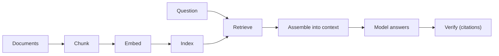

# M5 · Context Engineering II: Retrieval & Grounding

> **Module question:** How does the harness get the *right* facts into context — and how do we know they're right?
> **Cross-cutting threads:** Failure modes · Tradeoff ledger · ADK at a glance
> **Domain spine:** a support agent over a knowledge base

---

## Opening scene — the confidently wrong answer with a bibliography

The support agent was asked whether a customer could cancel a subscription mid-cycle for a pro-rated refund. It answered, fluently: *"Yes — per our billing policy, customers who cancel within 14 days of renewal are eligible for a pro-rated refund."* It even cited a source.

The source was real. The *claim* was not in it. The cited article was about *annual* plan changes, not mid-cycle cancellations — and the refund window it mentioned was 30 days, not 14. The agent had retrieved something *adjacent*, then confidently written what it *expected* the policy to say, and attached the nearest citation it had.

The team's postmortem, if they'd had M2's discipline, would not have said "the model hallucinated." It would have asked: *how did wrong facts get into the window, and why did nothing verify the claim against the source before it reached a user?*

That is this module. M4 budgeted the window. M5 decides what earns a place in it, and — the harder half — **how we know what we placed there is actually right.**

---

## Grounding is the answer to hallucination (but not a magic one)

**Grounding** is connecting the agent's responses to authoritative external data, so its answers come from *sources* rather than from its training parameters. ADK frames it plainly: grounding exists to *reduce hallucination and provide verifiable answers*.

The reframe that matters: **the model's training data is a source of truth that went stale the day training ended.** It's a frozen snapshot, with no notion of *your* policies, *your* prices, *your* customers. Grounding is what you do when the correct answer lives somewhere the model cannot have memorized.

But grounding reduces hallucination — it does not remove it. Three honest caveats up front:

1. **Wrong evidence produces confident wrongness.** If the pipeline retrieves the wrong-but-plausible chunk, the model will answer from it *fluently* — grounding failure *becomes* the hallucination, as in the opening scene.
2. **The model can still override the evidence.** Grounding places facts *near* the model; it does not force the model to *obey* them. The model can ignore a retrieved clause and assert what it "knows." (This is why citation *verification* — below — exists.)
3. **Grounding quality is bounded by retrieval quality.** You cannot ground in what you failed to retrieve. M5's first job is making retrieval good; its second job is making the model *accountable* to it.

> **Failure mode (the module in one line):** treating "we added retrieval" as "we solved grounding." Retrieval is the *input* half. Without answerability and citation verification — the *output* half — you have built a more confident hallucination machine, not a grounded one.

---

## RAG as a discipline, not a feature

"RAG" (retrieval-augmented generation) is a pipeline that predates the acronym and will outlive it:

The difference between "we added a vector DB" and "we designed a grounding pipeline" lives in three places:

### 1. Chunking — the unit of retrieval is a decision

A chunk is the unit you retrieve. Too big, and every hit drags in irrelevant text (diluting attention and budget — M4's problem). Too small, and a chunk loses the context that makes it *mean* something (a sentence without its section header is noise). The right size is a function of your corpus and your questions, not a library default — and it's a decision worth recording, because **every downstream failure (missing, contradictory, out-of-scope) is shaped by it.**

### 2. Retrieval quality — recall vs. precision is the ledger

Retrieval is a classic **recall/precision** tradeoff:

- **High recall** (fetch broadly): you're less likely to *miss* the right fact — but you drag in more irrelevant material, and (M4 again) irrelevant material is a distraction tax.
- **High precision** (fetch narrowly): you get only what's relevant — but you're more likely to *miss* the one chunk that had the answer.

For grounding, **precision usually matters more than recall**, for a counterintuitive reason: a *missed* fact can be made safe (the agent says "I don't have that" — see answerability below), but a *wrong* fact is expensive (the agent answers confidently and wrongly). You can recover from absence; you cannot recover from false confidence. This is the single most important design instinct in the module.

### 3. Agentic RAG — retrieval as a loop, not a single shot

Naive RAG is "embed the question, take the top-k chunks, answer." **Agentic RAG** (ADK's framing) lets the agent *reason about how to search*: construct queries, add metadata filters, refine after seeing results, search again. The agent becomes the *query planner*, and retrieval becomes a tool in its loop rather than a fixed pre-step. It costs more (tokens, latency, and the failure modes of any loop) and buys much better grounding on hard queries — the tradeoff again, and it's exactly the kind that belongs in an ADR.

> **ADK at a glance:** ADK's grounding surface spans *Google Search Grounding* (live web), *Grounding with Search* (your enterprise docs, with source attribution), and *Agentic RAG* patterns (agents that dynamically construct queries and filters). The [Deep Search Agent](https://github.com/google/adk-samples/tree/main/python/agents/deep-search) sample is the reference architecture: a multi-agent workflow that plans, researches, critiques, and composes with citations. The grounding *discipline* in this module is provider-agnostic — LiteLLM/Azure backends change nothing about it.

---

## The four retrieval failure modes

Every grounding failure is one of these four — name them, and you've named the fix:

| Failure | What it is | Signature | Harness response |
|---|---|---|---|
| **Missing** | Nothing relevant retrieved | The model guesses (confabulation) | **Answerability** — refuse when evidence is absent |
| **Stale** | Retrieved fact is outdated | Answers correct for *last year's* policy | Re-index cadence, freshness signals, "as of" stamps |
| **Contradictory** | Two chunks disagree | The model picks one arbitrarily | Conflict detection + escalation; don't let the model referee silently |
| **Out-of-scope** | Retrieved but irrelevant — *looks* adjacent | Confident wrongness with a real citation (the opening scene) | **Citation verification** — claim must *entail* from the chunk |

Note the pairing: **missing → answerability**, **out-of-scope → citation verification**. These two controls are the module's payload, and they map one-to-one onto the two ways grounding fails.

Together with M4's assembly discipline (what crosses, in what form), this is the design of the **`model↔context` seam** (M3's input seam): M4 designs what crosses it, and these two controls are the *validation* that sits on it.

---

## Answerability: make the model say "I don't have that"

The highest-leverage grounding control is not better retrieval — it's **teaching and enforcing refusal when evidence is absent.** A model that says *"I don't have that in the retrieved material"* has failed *safely*; a model that guesses has failed *expensively*.

**Answerability gating** is the mechanism: before the model answers, the harness checks whether the retrieved evidence actually covers the question, and if not, the model is *instructed and enforced* to refuse rather than answer.

Three layers to it:

1. **Instruction** — "Answer only from the retrieved material; if it doesn't contain the answer, say you don't know."
2. **Signal** — give the model a visible boundary: retrieved evidence in a marked block, and the explicit rule that anything outside the block is off-limits.
3. **Enforcement** — an *instruction is a wish; enforcement is engineering.* The instruction alone decays (M2 class 4: instruction drift). The enforcement is citation verification, below: if the answer asserts a fact not entailed by any retrieved chunk, it's flagged *whether or not* the instruction told it to refuse.

Answerability is why recall-vs-precision tilts toward precision: a high-precision pipeline misses more, but its misses become *safe refusals*, while a high-recall pipeline's false positives become *confident errors*.

---

## Citation discipline: make claims traceable

Answerability prevents the *empty* case. Citation discipline handles the *wrong-evidence* case — the opening scene, where something *was* retrieved, and the model claimed it said something it didn't.

The rule: **every factual claim must carry a citation, and every citation must resolve to a retrieved chunk that actually supports the claim.** The second half — "actually supports" — is the hard part, and it is where the discussion-thread material lands.

### "The claim is supported by it" — implementation

From the discussion's §5, the lean sequence:

1. **Split the answer into atomic claims** — ask the model (or parse) for a structured list of claims, not prose. "Cancel within 14 days → pro-rated refund" is one atomic claim; "the article covers annual plan changes" is another.
2. **Fetch each claim's cited chunk(s)** — the chunks the answer pointed at.
3. **Run an entailment check** — a judge receives `(claim, chunk)` and returns `entail | contradict | neutral`. Only `entail` passes.
4. **Gate on the result** — `contradict` → block or flag the claim; `neutral` → escalate or regenerate (don't ship a claim whose support is unknown).
5. **Pre-filter cheaply** — deterministic keyword/entity overlap between claim and chunk first, to skip obviously unsupported claims before spending a judge call.
6. **Remember the caveat** — the judge itself can err (it's a model too); judge failure modes are M12's problem.

This is the **grounding-side sibling of the guardrail provenance check** from the discussion's §2 (Design B). There, the output guardrail asked *"did this policy assertion come from the approved policy store?"* Here, citation verification asks *"did this factual claim come from the cited chunk?"* Same discipline — *trace the claim to its source* — applied at two different seams. We'll reunite them in M14/M15.

### Where the engine architecture lives

The *full* entailment-engine question — surface vs. joint-source vs. layered/routed tiers, and when a single-tier checker suffices — is the discussion's §6, and it's a **verification-infrastructure** decision that belongs with evaluation and judges in **M12**. Here in M5, the takeaway is narrower: citation verification is a *runtime* check on the answer, distinct from the *offline* eval harness, and it is the thing that makes answerability enforceable rather than advisory.

> **Tradeoff (the ledger entry):** citation verification costs money and latency on *every answer* (a judge call per claim, or per answer). You buy it selectively — on the claims that carry consequence. A support agent answering "what's your return policy?" needs it more than a draft-summarizer that a human always reviews. The thickness of this layer is, as ever, a *decision*: verify where wrongness is expensive, not everywhere.

---

## Grounding beyond RAG

Retrieval is the right tool for *unstructured text*. It is the wrong tool for three things, and using it anyway is a classic design smell:

| The data is… | Use instead | Why |
|---|---|---|
| **Tabular / numeric** (prices, inventory, balances) | A **SQL/API query tool** | The answer is a *computed lookup*, not a paragraph to retrieve. Retrieving a 500-row table into context is both expensive and wrong. |
| **Relational / graph** (who reports to whom, what depends on what) | A **graph/relationship query** | Structure is lost in embedding; the relationship is the answer. |
| **Derived** (eligibility, totals, "does this violate clause X") | A **deterministic tool** (M8) | Don't retrieve what should be *computed*. This is the discussion's "stop deriving in the model" — the fact is a function of inputs, not a document. |

The unifying principle: **retrieval is for finding *stated* facts; tools are for *computed* facts; and the model's job is to route between them correctly.** A grounding pipeline that does everything with embeddings is a pipeline that has not noticed where its facts actually live.

---

## Worked example: the support agent, grounded

The domain spine, end to end. A customer asks: *"Can I cancel mid-cycle for a pro-rated refund?"*

1. **Retrieve (precision-first).** The pipeline embeds the question, retrieves the top chunks on *cancellation and refunds*, not the whole billing corpus. It returns the cancellation policy chunk and the refund policy chunk — two chunks, both on-topic.
2. **Answerability check.** Evidence exists and covers the question → the agent proceeds (rather than refusing).
3. **The agent drafts:** *"Yes — per our billing policy, customers who cancel within 14 days are eligible for a pro-rated refund."*
4. **Citation verification.** Atomic claim: "cancel within 14 days → pro-rated refund." Cited chunk: the refund policy. Entailment check: the refund policy says *30 days*, and says nothing about *mid-cycle cancellation*. → `contradict`.
5. **Gate.** The claim is flagged; the answer is not sent. The agent regenerates from the actual chunk: *"Per our refund policy, cancellations within 30 days of renewal are eligible for a full refund; mid-cycle cancellations are not refundable."* — or, if the policy genuinely doesn't cover the case, it says *"I don't have that in our policy."*

The difference between the opening scene's agent and this one is **not** a better model. It is three controls — precision retrieval, answerability, and citation verification — each of which we can now name and place in the harness.

> **Failure mode (the closing one):** building steps 1–3 and skipping step 4. Retrieval + answerability make the agent *sound* grounded; citation verification is what makes it *actually* grounded. Without the entailment gate, you have shipped a confident, well-cited liar.

---

## Design exercise

> *Paper-based. Think, then write.*

**Task.** Design the grounding strategy for a **regulated-domain support agent** (pick one: healthcare benefits, insurance claims, or banking). It answers customer questions from a policy corpus, and wrong answers carry legal and financial consequence.

1. **Chunking decision.** State your chunk unit and size, and one sentence on why — against the *corpus* and the *questions* it will face, not a library default.
2. **Retrieval decision.** Recall or precision? State your answer and defend it in one sentence, using the "absence is safe, false confidence is expensive" argument.
3. **Answerability.** Write the refusal rule you'd give the agent, and the *enforcement* mechanism that backs it (not just the instruction).
4. **Citation verification.** Which claims get the entailment check — every claim, or only a subset? Name the subset by *consequence*, and state what the gate does on `contradict` vs. `neutral`.
5. **List what could go wrong per strategy.** For each of the four failure modes (missing / stale / contradictory / out-of-scope), write the concrete scenario in *your* domain and the control that catches it. If a control is missing, say so explicitly — that's the point of the exercise.
6. **The wrong-tool check.** Is there any fact in your domain that retrieval should *not* be handling (tabular, relational, derived)? Name it and say which tool should own it instead.

**Why this exercise matters.** This is the module where "we have RAG" stops being a sentence and becomes a *design*: named decisions (chunking, precision, answerability, verification) each with a failure mode it exists to catch. In a regulated domain, the difference between "grounded" and "grounded-looking" is the difference between a support channel and a liability.

---

**In DSH:** grounding flows through the `context` package and the tool-schema assembly in `core/tools` — tool results and injected context are what the model is grounded on, and it all derives from the session log.

## Sources (ADK docs)

- [Grounding agents with data](https://adk.dev/grounding/index.md)
- [Deep Search Agent (reference architecture)](https://github.com/google/adk-samples/tree/main/python/agents/deep-search)
- Related from earlier: [Discussion 01 §5–§6](../../discussions/01-failure-attribution-to-derivation.md)

---

**Next module:** [M6 — The Instruction Layer](../06-instruction-layer/README.md) — the standing policy of the agent: how it's encoded, versioned, and tested, and why "the prompt says so" is not a guarantee.
