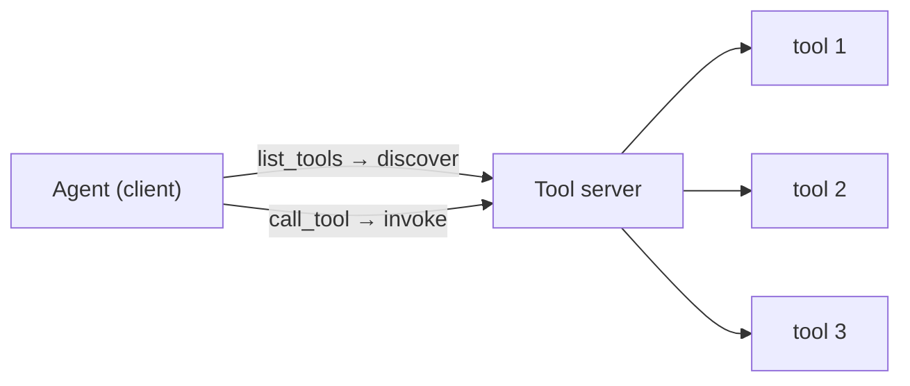

# M9 · Tool Platforms: MCP & Tool Servers

> **Module question:** How do tools become a *platform* — discovered, versioned, shared, and governed?
> **Cross-cutting threads:** Failure modes · Tradeoff ledger · ADK at a glance
> **Domain spine:** a coding agent with a growing MCP tool ecosystem

---

## Opening scene — three tools become forty

The coding agent started with three tools: `read_file`, `write_file`, `run_tests`. Clean. Six months later it had forty — GitHub issues via one MCP server, CI status via another, a Postgres console via an OpenAPI spec, Jira, Slack, a package registry — and the team had lost the plot:

- Two tools were named `search` (from different servers), and the agent kept calling the wrong one.
- One server's `deploy` tool had quietly changed its schema, and nobody knew until a failed deploy.[liu-mcp-poisoning-bench](#liu-mcp-poisoning-bench)
- A "read-only" filesystem server was actually writable, and nobody had checked.
- Nobody could answer: *"who has access to which tools, and what happens when a server is compromised?"*

This is the shift from M8 to M9. M8 was about **one tool's contract** — the name, schema, error semantics, boundary. M9 is about **many tools as a platform** — and the moment you have many tools, the hard problems are no longer per-tool: they're *discovery, namespacing, versioning, access, and attack surface*. The tool *interface* scales; the tool *platform* is a governance problem.[gillespie-agent-routing](#gillespie-agent-routing), [hou-mcp-security](#hou-mcp-security)

> **Failure mode (the module in one line):** treating forty tools as forty independent functions. Forty tools are a *system* with its own naming, versioning, access, and security concerns — and an ungoverned tool platform is how a "helpful" agent quietly becomes a wide-open attack surface.[hou-mcp-security](#hou-mcp-security)

---

## Why a server, not a function

M8's tools were plain functions in your process. M9's tools live in **servers** — separate processes that expose capabilities over a protocol. Why the extra boundary?

- **Separation of concerns.** The GitHub tool's code lives *with* GitHub's SDK, its credentials, its rate limits — not bundled into your agent's runtime. The tool's home is its system.
- **Shared, reusable capability.** One Stripe MCP server serves many agents, in many languages, with one implementation. Write once, consume everywhere.
- **Discovery.** A client can *ask the server what it offers* (`list_tools`) rather than having tools hard-coded. Tools become discoverable, not configured.[mcp-spec-tools](#mcp-spec-tools)
- **The server is the unit of governance.** You can version a server, restrict a server, audit a server, kill a server — a scope you don't have over a pile of loose functions.[saltzer-schroeder-protection](#saltzer-schroeder-protection)

The cost is the boundary itself: a network/process hop adds latency, a new failure mode (the server is down), and — critically, see below — **state**. A function is stateless; a server connection may not be.[ding-mcp-performance](#ding-mcp-performance)

---

## MCP: what it standardizes — and what it leaves to you

**MCP** (Model Context Protocol) is the open standard for exactly this: how an LLM host (your agent) talks to an external tool/data server. It's a **client–server** protocol where a server exposes three things — *resources* (data), *prompts* (reusable templates), and *tools* (functions) — and a client consumes them.[adk-mcp](#adk-mcp), [mcp-spec-server](#mcp-spec-server)

The one-sentence framing that keeps you honest: **MCP standardizes the *socket*; you still own the *policy*.**[hou-mcp-security](#hou-mcp-security)

| MCP standardizes | MCP leaves to you |
|---|---|
| Discovery (`list_tools`)[mcp-spec-tools](#mcp-spec-tools) | **Authority** — what each tool is *allowed* to do[saltzer-schroeder-protection](#saltzer-schroeder-protection) |
| Tool schema (`inputSchema`) | **Credentials** — scoped, per-server |
| Call/response (`call_tool`) | **Versioning & deprecation** of tools[chen-breaking-changes](#chen-breaking-changes) |
| Transport (stdio / SSE / HTTP) | **Access control** — which agent gets which tools |
| Resources & prompts | **Security** — input validation, injection defense[greshake-indirect-injection](#greshake-indirect-injection) |

The point is not that MCP is weak — it's that it's *plumbing*. It solves the boring, valuable problem of "how does an agent find and call a tool across a process boundary," and it deliberately does **not** solve the hard problem of "what is that tool allowed to do." The Tahoe lesson (M8) is *not* standardized away by adopting MCP; it's merely relocated to the server. A quote tool behind MCP can still commit a transaction if its server grants it that authority.[hardys-confused-deputy](#hardys-confused-deputy) **Protocol ≠ governance.**

> **ADK at a glance:** ADK consumes MCP via **`McpToolset`** — pass `connection_params` (stdio for a local process, SSE/streamable-HTTP for a remote server), and it handles connection, discovery (`list_tools`), schema adaptation (MCP tools → ADK `BaseTool`s), and call-proxying (`call_tool`) transparently.[adk-mcp-tools](#adk-mcp-tools) A **`tool_filter`** parameter selects *which* of the server's tools to expose — which, as you'll see, is a security control, not a convenience.[adk-mcp-tools](#adk-mcp-tools)

**The protocol family.** MCP standardizes *tools*; its siblings standardize the other surfaces. **ACP (Agent Client Protocol)** is the agent↔*client* standard — coding agents use it to drive a code editor through a common interface, so any agent plugs into any editor without bespoke glue (its use-case: agent/editor portability).[acp-overview](#acp-overview) **A2A** (agent↔agent) lives in M11.[anbiaee-agent-protocols](#anbiaee-agent-protocols) ACP is a socket at the *edge* of the harness — outside the layers this course designs — so it's a know-it, not a design-it.

---

## ADK's tool surface: native, MCP, OpenAPI

Three ways tools arrive, and the decision between them:

| Surface | What it is | Use it when |
|---|---|---|
| **Native `FunctionTool`** | Your function, in-process (M8) | You own the code; tightest control, first-party |
| **`McpToolset`** | Consume an external MCP server | Interop — someone else's tool, over the standard |
| **`OpenAPIToolset`** | Generate `RestApiTool`s from an OpenAPI spec | You already have a documented REST API |

The elegant one is **`OpenAPIToolset`**: feed it your OpenAPI spec, and it generates one tool per operation — the `operationId` becomes the tool name (snake_cased), the `summary`/`description` becomes the model-facing description, the parameters/body become the schema.[adk-openapi-tools](#adk-openapi-tools) **Your API documentation becomes the tool contract** — discovery from the spec you already maintain.[hsieh-tool-documentation](#hsieh-tool-documentation) That's the "platform" idea in its purest form: the interface is *derived* from an existing artifact, not hand-written per tool.[patil-gorilla](#patil-gorilla)

The decision rule: **native for what you control, MCP for interop, OpenAPI for what's already a REST API** — and in all three, the *authority* decision (M8's capability matrix) remains yours, because none of these surfaces decides authority for you.[radosevich-mcp-safety-audit](#radosevich-mcp-safety-audit)

---

## Discovery, namespacing, versioning, deprecation

Forty tools stop being manageable the moment you treat them as a flat list. The platform disciplines:

1. **Discovery.** Tools are *asked for* (`list_tools`), not hard-coded. This means the tool list is a runtime fact, not a compile-time one — which is powerful (new servers appear without redeploy) and dangerous (new servers *appear*, with new attack surface, without review).[mcp-registry](#mcp-registry), [kraishan-mcp-census](#kraishan-mcp-census)
2. **Namespacing.** Names must not collide across servers. The opening scene's two `search` tools are the classic failure: the model can't distinguish `search` (GitHub) from `search` (docs).[gan-rag-mcp](#gan-rag-mcp) Prefix by server (`github_search`, `docs_search`), or filter per server.[gillespie-agent-routing](#gillespie-agent-routing)
3. **Versioning.** A tool's schema *is* its contract (M8); change the schema and you've changed the contract. Servers and tools need versions, and agents need to know which version they're bound to — otherwise a server upgrade silently breaks every agent that depends on it.[mcp-versioning](#mcp-versioning), [li-golang-semver](#li-golang-semver)
4. **Deprecation.** Retiring a tool without breaking agents requires a deprecation window: mark it deprecated, keep it working, signal its successor, *then* remove it. The same discipline you'd apply to a public API — because to the agent, your tool *is* a public API.[chen-breaking-changes](#chen-breaking-changes)

This is **API governance, applied to model-facing surfaces** — with one twist: your consumer is a model that won't read your deprecation notice. It will keep calling the old tool until the old tool stops existing.[sawant-deprecation-reaction](#sawant-deprecation-reaction) Deprecation must therefore be enforced at the *server* (remove the tool, or return a "deprecated, use X" error), not announced in prose.[mcp-versioning](#mcp-versioning)

---

## Hosting & ops: the tool server is an attack surface

The moment tools live in servers, the server is a *trust boundary* — and M9 is where the security thread from M8 (and ahead to M14) gets its concrete shape:

- **Supply chain.** You are running *someone else's* server code. The catalog's **MCP stdio supply-chain RCE** is the canonical warning: a compromised MCP server is *arbitrary code execution on your host*, because a stdio server is a process you spawn.[ohm-backstabbers-knife](#ohm-backstabbers-knife) Every MCP server is a dependency, with all of M3's supply-chain lessons attached.[kraishan-mcp-census](#kraishan-mcp-census)
- **Least privilege at the surface.** `tool_filter` is a security control: expose only the tools the agent needs. The docs' production checklist says it plainly — *"filter MCP tools to limit exposed functionality," "use read-only tool filters for production."*[adk-mcp-tools](#adk-mcp-tools) A filesystem server should expose `read_file`, not `delete_file`, unless the agent genuinely needs to delete.[saltzer-schroeder-protection](#saltzer-schroeder-protection)
- **Credential handling.** Scoped, per-server credentials — a server gets the least role it needs, never ambient admin. (M8's scoped-credentials rule, at platform scale.)[hardys-confused-deputy](#hardys-confused-deputy)
- **Input validation.** The server must validate tool *inputs* — remember M8's hallucinated args and M14's injection: an MCP tool that passes a model's raw string to a shell is a prompt-injection RCE waiting to happen.[greshake-indirect-injection](#greshake-indirect-injection), [radosevich-mcp-safety-audit](#radosevich-mcp-safety-audit)
- **State & scaling.** MCP connections are **stateful** (persistent client–server sessions), unlike stateless REST.[adk-mcp-tools](#adk-mcp-tools) That complicates scaling: load balancing, session affinity, connection limits. Stdio (a spawned process per connection) is fine for dev and single-tenant; remote SSE/HTTP servers are how you scale — with the auth and infra that entails.[ding-mcp-performance](#ding-mcp-performance)

> **Tradeoff (the ledger entry):**
> - **Native control vs. ecosystem reach.** Native tools are tight and safe but you build every one. MCP/OpenAPI give you a whole ecosystem, and with it a whole attack surface.[qin-toolllm](#qin-toolllm) The balance is a *review* decision, not a default.
> - **Discovery convenience vs. attack surface.** Auto-discovered tools are convenient precisely because they arrive without a human in the loop — which is also the problem. Every discovered tool is a new trust edge.[kraishan-mcp-census](#kraishan-mcp-census)
> - **Centralization vs. distribution.** One governed registry gives you control and a single point of failure; a free-for-all of servers gives you reach and chaos. The registry (the exercise) is the middle path.[own-synthesis](#own-synthesis)

---

## Worked example: the coding agent, at forty tools

The domain spine. The agent grew from 3 native tools to 40, across surfaces:

- **Native (3):** `read_file`, `write_file`, `run_tests` — first-party, tight control, in-process.
- **MCP (a dozen):** GitHub issues, CI status, package registry — each a `McpToolset` to an external server.
- **OpenAPI (the rest):** an internal Postgres console and a docs search, generated from specs via `OpenAPIToolset`. The assumption underneath all of it — that an agent handed a specialized tool will actually use it rather than fall back on general search — is itself the subject of a benchmark, and it does not go without saying.[info-mosaic-bench](#info-mosaic-bench)

The governance layer that keeps forty tools from becoming the opening scene's chaos:

- **A registry** — every tool is registered with its *namespace*, *server*, *version*, and *owner*.[mcp-registry](#mcp-registry)
- **An access policy** — the agent's role gets `read` on most servers, `write` on exactly two, and *no* access to `deploy` unless a human is in the loop.[saltzer-schroeder-protection](#saltzer-schroeder-protection)
- **A filter** — `tool_filter` prunes each server to the agent's needs; the filesystem server exposes reads only.[adk-mcp-tools](#adk-mcp-tools)
- **Version pins** — the agent is bound to server versions, so a schema change is a *planned* migration, not a silent break.[mcp-versioning](#mcp-versioning)

The result: forty tools, one governed surface — discovered but namespaced, shared but access-controlled, versioned but stable. That's what "tool platform" means, and it's the difference between an agent with a big toolbox and an agent with a big *unmanaged* attack surface.[hou-mcp-security](#hou-mcp-security)

---

## Design exercise

> *Paper-based. Think, then write.*

**Task.** Design a tool-server registry for an organization with 40+ tools across servers (or use the coding-agent brief). Produce:

1. **The registry schema.** For a single tool entry, list the fields you'd store — name (namespaced), server, version, owner, authority (read/write/execute), and anything else you think governance requires. Justify each field in a phrase.
2. **The naming convention.** State the rule that prevents the two-`search`-tools collision, and how it handles 40+ tools across 5+ servers.
3. **The access policy.** Define the roles (e.g., read-only agent, write-capable agent, human-in-the-loop) and map each to tool authorities. Which tools are *never* exposed to a model without human confirmation, and why?
4. **The versioning & deprecation rule.** How does a tool get upgraded (schema change) without breaking agents, and how does one get retired? Write the one-line deprecation policy.
5. **The security review.** List three things you'd check before *admitting a new server* into the registry (the supply-chain, credential, and injection checks). For each, name what "pass" looks like.
6. **Write the ADR.** "Tool registry & access policy" — the registry as the single governance surface, the residual risk you're accepting (e.g., "we accept that a compromised server is code execution; we mitigate by least-privilege filters and per-server credentials").

**Why this exercise matters.** M8 taught you to write *one* safe tool. This exercise is about keeping *forty* of them safe as a system — and the registry is the artifact that turns a pile of tools into a governed platform.[own-synthesis](#own-synthesis) The agent's reach is only as safe as the *registry* that manages it.

---

**In DSH:** the protocol surface is the `mcp` package (MCP) and the `acp` package (Agent Client Protocol) — the same two interop standards this module and its ACP note cover.

## Sources (ADK docs)

- [Model Context Protocol (MCP)](https://adk.dev/mcp/index.md)[adk-mcp](#adk-mcp)
- [MCP Tools — McpToolset, connection params, tool_filter, deployment & security checklist](https://adk.dev/tools-custom/mcp-tools/index.md)[adk-mcp-tools](#adk-mcp-tools)
- [OpenAPI tools — OpenAPIToolset, spec-driven discovery](https://adk.dev/tools-custom/openapi-tools/index.md)[adk-openapi-tools](#adk-openapi-tools)

---

## Where the literature disagrees with this module

- The module's structure holds up well: the MCP security literature independently arrives at the same split it draws — the protocol standardizes transport, and the trust decisions stay with the implementer. What follows is where the module is *stronger*, *weaker*, or *differently shaped* than the sources allow.
- Recording them is the same discipline this module teaches — trace the claim to its source, and flag where the source says "maybe."

### 1. Discovery is standardized; *selection* is not — and it degrades with scale

- The module's first platform discipline is discovery: tools are "asked for (`list_tools`), not hard-coded," with the powers and dangers that follow (a runtime fact, new servers appearing without review).
- Discovery itself is a solved protocol primitive — the spec defines tools as "uniquely identified by a name and includes metadata describing its schema," and servers as exposing prompts, resources, and tools.[mcp-spec-tools](#mcp-spec-tools), [mcp-spec-server](#mcp-spec-server)
- **But discovering *that* forty tools exist is not knowing *which* one to call.** The field splits the problem in two — deciding "whether to use tools and which to use" — and the second is where a catalog starts to hurt: MetaTool finds models struggle to select correctly as the toolset grows.[huang-metatool](#huang-metatool) A single-step routing study over a deployed enterprise assistant's 110-agent, 584-tool catalog finds "routing F1 on under-specified requests drops 16–23 percentage points across models," and decomposes the loss into "a *retrieval* gap (the model cannot surface the right tool) and a *confusion* gap (even with perfect retrieval, the oracle ceiling drops 10pp)."[gillespie-agent-routing](#gillespie-agent-routing)
- **The failure the module narrates as naming collision is measured as retrieval collapse — and retrieval is the measured fix.** On the same catalog, "embedding-based shortlisting recovers +10–11pp F1 at full scale."[gillespie-agent-routing](#gillespie-agent-routing) RAG-MCP replaces the full tool list with a retrieved subset and reports that it "significantly cuts prompt tokens (e.g., by over 50%) and more than triples tool selection accuracy (43.13% vs 13.62% baseline)."[gan-rag-mcp](#gan-rag-mcp) Both results say the same thing: the catalog does not belong in the prompt.
- **Consequence.** Keep the namespacing rule — unique names are necessary. But the module should not read as though `list_tools` plus discipline yields correct selection. The honest version: *discovery is a protocol feature, selection is a model capability that degrades with catalog size*, and the mitigation is retrieval over the registry, not more descriptive prose. That also matches the module's own instinct that `tool_filter` is a security control — it is a selection control first.[gillespie-agent-routing](#gillespie-agent-routing), [gan-rag-mcp](#gan-rag-mcp)

### 2. Standardizing the socket *adds* measurable cost; the module lists the cost but not its size

- The module is candid that "a network/process hop adds latency" and that MCP adds state, but presents these as design intuition rather than measurements.
- **There are measurements, and they are larger than "a hop."** A systems characterization of MCP-enabled agents finds that "the inclusion of extensive contextual information, including system prompts, MCP tool definitions, and context histories … dramatically inflates token" usage, and reports associated latency and resource costs across transport modes.[ding-mcp-performance](#ding-mcp-performance)
- **The protocol's own designers document the state problem.** ADK's MCP guide states that MCP "establishes stateful, persistent connections between a client and server instance. This differs from typical stateless REST APIs," that "this statefulness can pose challenges for scaling and deployment, especially for remote servers handling many users," and that "the original MCP design often assumed client and server were co-located," requiring "load balancing, session affinity."[adk-mcp-tools](#adk-mcp-tools)
- **Consequence.** The module's "the cost is the boundary itself" is right but understated. The measured cost is *token volume from tool definitions plus session state*, not hop latency alone — which is why the tool-definition budget is a platform concern, not a per-tool one.[ding-mcp-performance](#ding-mcp-performance)

### 3. Version pins are the right control, but versioning is *not* reliably enforced where the module assumes it

- The module's versioning discipline assumes versions are declared and honored: "Servers and tools need versions, and agents need to know which version they're bound to."
- **The protocol has a real lifecycle — at the protocol level.** MCP versions are date strings, features "may additionally be marked as Deprecated under the feature lifecycle and deprecation policy," deprecated features "remain in the specification for at least twelve months, or at least ninety days under the policy's expedited-removal exception," and every request declares its version so a server can reject it with `UnsupportedProtocolVersionError`.[mcp-versioning](#mcp-versioning)
- **Below the protocol, declaration does not equal compliance.** A large-scale study of the Golang ecosystem finds that "86.3% of library upgrades follow SemVer compliance," and yet "28.6% of non-major upgrades (minor and patch upgrades) introduce breaking changes," with "33.3% of downstream client programs may be affected by breaking changes."[li-golang-semver](#li-golang-semver) A systematic literature review of 97 primary studies across Maven/Java, npm/JavaScript, Python, Web APIs and Linux distributions finds breaking changes are dominated not by new features but by "maintenance and design improvements," and that the 43 detection approaches reviewed "reach high accuracy on syntactic breaks but limited coverage on behavioral ones" — and a tool-schema change is a behavioral break.[chen-breaking-changes](#chen-breaking-changes)
- **The consumer-side evidence is worse than the module's "won't read your deprecation notice."** An empirical study of 25,357 clients of popular Java APIs finds clients reacting to deprecation slowly and selectively — deprecation as an *announcement* is weak leverage.[sawant-deprecation-reaction](#sawant-deprecation-reaction)
- **Consequence.** The module's prescription — enforce at the server — is the defensible one, and the sources support it. But the module's framing of versioning as something you *do* should be reframed as something you *verify*: the pin is only as good as the server's honesty about its own schema, and the evidence says servers drift.[kraishan-mcp-census](#kraishan-mcp-census), [li-golang-semver](#li-golang-semver)

### 4. The attack surface is the *description*, not only the compromised server

- The module's security model is a compromised server: "a compromised MCP server is *arbitrary code execution on your host*," and every server is "a dependency, with all of M3's supply-chain lessons attached."
- **That is true and well-supported.** The supply-chain literature establishes the mechanism — "a software supply chain attack is characterized by the injection of malicious code into a software package in order to compromise dependent systems further down the chain."[ohm-backstabbers-knife](#ohm-backstabbers-knife)
- **But the *cheaper* attack needs no compromise at all.** Tool Poisoning Attacks embed "malicious instructions … within MCP tool descriptions that are invisible to users but visible to" the model; the researchers report "a malicious server can not only exfiltrate sensitive data from the user but also hijack the agent's behavior and override instructions provided by other, trusted servers."[invariant-tool-poisoning](#invariant-tool-poisoning) A 2026 benchmark for MCP poisoning attacks names the class "Tool Description Poisoning," locating it in "the agent's cognitive planning layer."[liu-mcp-poisoning-bench](#liu-mcp-poisoning-bench)
- **A server can also go bad *after* review.** The task description is attacker-controlled text that reaches the model before any tool is invoked, and the same description can change after approval — which is exactly the module's silent-schema-change scene, weaponized.[liu-mcp-poisoning-bench](#liu-mcp-poisoning-bench), [hou-mcp-security](#hou-mcp-security) The ecosystem census measures the drift: among servers with multiple released versions, "40.6% did so silently," and "4.2% redirected their remote endpoint to a different host while keeping their registry identity, a change the protocol never surfaces to installed clients," with silent drift carrying "nearly threefold higher odds of a high-severity finding."[kraishan-mcp-census](#kraishan-mcp-census)
- **The benchmark line agrees that tool exposure is the surface.** MCP-SafetyBench builds on real-world MCP servers precisely because "MCP's openness and multi-server workflows introduce new safety risks that existing benchmarks fail to capture, as they focus on isolated attacks or lack real-world" coverage.[zong-mcp-safetybench](#zong-mcp-safetybench)
- **Consequence.** The module's supply-chain frame should be widened to *description-level* trust. `tool_filter` limits which descriptions reach the model, which is why it is a security control — but it is not an injection defense, because a filtered-in tool's description is still attacker-controlled text.[adk-mcp-tools](#adk-mcp-tools), [invariant-tool-poisoning](#invariant-tool-poisoning)

### 5. A tool's declared authority is not the authority it has — so least privilege cannot be read off the tool list

- The module builds its access policy on the tool list: expose only the tools the agent needs, and prefer reads over writes — "a filesystem server should expose `read_file`, not `delete_file`."
- **The audit evidence undercuts the read/write proxy.** Auditing default MCP servers with an LLM enabled on them, researchers report that the exposed tools suffice for end-to-end compromise: "industry-leading LLMs may be coerced to use tools from default MCP servers and directly compromise user systems," specifically "1) malicious code execution, (2) remote access control, and (3) credential theft."[radosevich-mcp-safety-audit](#radosevich-mcp-safety-audit) In the same work, the filesystem server's `read_file`-family tools are what makes credential theft reachable — the read tools are not the safe half of the surface.
- **The protocol asks for a human in the loop; it does not enforce one.** The spec's normative language is a *SHOULD* — "there **SHOULD** always be a human in the loop with the ability to deny tool invocations" — and it leaves the interaction model open: "the protocol itself does not mandate any specific user interaction model."[mcp-spec-tools](#mcp-spec-tools) A harness that treats `tool_filter` as the safety mechanism is relying on a convention the protocol does not back.
- **Consequence.** Keep `tool_filter` and the read-only default — they reduce *reachable* surface, which is real. But stop treating read-only as an authority boundary, and stop letting the tool list stand in for the capability analysis: the authority a call expresses is a property of what the server *does* with it, not of the verb in its name.[saltzer-schroeder-protection](#saltzer-schroeder-protection), [radosevich-mcp-safety-audit](#radosevich-mcp-safety-audit)

### 6. The registry is the module's own construct — and it is now an industry artifact with a measured failure mode

- The module's answer to forty tools is a registry it frames as "the middle path" and hands to the exercise as a design prompt.
- **The concept is not in the literature under that name.** "Tool registry" as a governance surface is the module's synthesis; the field's own name for the underlying control is least privilege, which is where the citation belongs.[saltzer-schroeder-protection](#saltzer-schroeder-protection), [own-synthesis](#own-synthesis)
- **A public MCP registry now exists and has been censused.** One study harvests "the full public MCP registry (21,643 servers, 72,606 version records, August 2026 snapshot)," fetches source for 14,353 servers, and reports "silent drift" — the phenomenon its title names as "Same Name, Different Server."[kraishan-mcp-census](#kraishan-mcp-census)
- **Consequence.** The exercise is well-aimed, and the census is the empirical brief for it: the registry does not remove the versioning problem, it *relocates* it to whoever maintains the registry. The registry schema should therefore carry a *pin* field, not just a version field.

### 7. The "Tahoe lesson" is sourced to M8, but the course records it in M2

- The module writes that "The Tahoe lesson (M8) is *not* standardized away by adopting MCP; it's merely relocated to the server."
- **The Chevrolet Tahoe case is M2's.** It appears in [M2's failure catalog](../02-model-failure-science/README.md) as a 2023 incident, and M4's disagreement section refers back to it as "M2's Tahoe case." M8 does not carry it.
- **Consequence.** A cross-reference fix, not a claim fix: read "(M2)" — or better, "(M2, via M8's capability boundary)," since M8 *is* where the capability-boundary remedy is taught. Flagged here rather than cited, because no literature source owns this and this section's rule is that every attribution is checkable.[own-synthesis](#own-synthesis)

---

## Bibliography

- *Literature behind the module's claims, with the framework documentation the module itself cites.*
    - **Citations use stable identifier keys, not position numbers.** Every inline citation is written `[key](#key)` and resolves to the bullet carrying that key, so entries can be added, removed, or reordered without rewriting a single citation — the BibTeX model, minus a backend to assign numbers.
    - The bibliography is therefore an unordered bullet list, not a ranked one: the order of entries carries no meaning. Every entry hyperlinks to the paper's PDF.
    - Items tagged (industry doc) are vendor documentation, (preprint) are not yet peer-reviewed, and (own synthesis) are the module's inferences rather than sourced claims.
    - `cf.` marks a source that qualifies or contradicts the sentence it follows.
    - `unsupported` is the module's unsupported-claims bucket and `own-synthesis` collects the course's own un-sourced synthesis.

### Framework documentation (industry docs)

- [adk-mcp](#adk-mcp) · [**Model Context Protocol (MCP)** — Google ADK documentation](https://adk.dev/mcp/index.md) (industry doc) — owns the client–server framing: resources, prompts, and tools exposed by a server and consumed by an MCP client.
- [adk-mcp-tools](#adk-mcp-tools) · [**MCP Tools — McpToolset, connection params, tool_filter, deployment & security checklist** — Google ADK documentation](https://adk.dev/tools-custom/mcp-tools/index.md) (industry doc) — owns `McpToolset`, `connection_params`, `tool_filter`, the statefulness/scaling caveat ("stateful, persistent connections … differs from typical stateless REST APIs"), and the production checklist lines "filter MCP tools using `tool_filter` to limit exposed functionality" and "consider read-only tool filters for production environments."
- [adk-openapi-tools](#adk-openapi-tools) · [**Integrate REST APIs with OpenAPI** — Google ADK documentation](https://adk.dev/tools-custom/openapi-tools/index.md) (industry doc) — owns `OpenAPIToolset` generation rules: tool name from `operationId` (snake_case), description from `summary`/`description`, schema from parameters and request body.
- [acp-overview](#acp-overview) · [**Protocol Overview** — Agent Client Protocol](https://agentclientprotocol.com/protocol/overview) (industry doc) — owns ACP as the agent↔client standard: one agent interface across editors, the "agent/editor portability" use-case this module assigns it.
- [mcp-spec-server](#mcp-spec-server) · [**Server Features** — Model Context Protocol specification](https://modelcontextprotocol.io/specification/2025-06-18/server/index.md) (industry doc) — owns the three-primitive server surface and its control hierarchy: prompts (user-controlled), resources (application-controlled), tools (model-controlled).
- [mcp-spec-tools](#mcp-spec-tools) · [**Tools** — Model Context Protocol specification](https://modelcontextprotocol.io/specification/2025-06-18/server/tools.md) (industry doc) — owns the discovery surface: each tool "uniquely identified by a name and includes metadata describing its schema," tools "model-controlled," and the requirement that "there **SHOULD** always be a human in the loop with the ability to deny tool invocations."
- [mcp-versioning](#mcp-versioning) · [**Versioning** — Model Context Protocol documentation](https://modelcontextprotocol.io/docs/2026-07-28/learn/versioning) (industry doc) — owns the protocol's own lifecycle: date-string versions, Draft/Current/Final revisions, the feature deprecation policy ("at least twelve months, or at least ninety days under the policy's expedited-removal exception"), and per-request version negotiation via `UnsupportedProtocolVersionError`.
- [mcp-registry](#mcp-registry) · [**The MCP Registry** — Model Context Protocol documentation](https://modelcontextprotocol.io/registry) (industry doc) — the working precedent for the module's registry exercise: a public index of servers, with server/version identity as the registration unit.
- [invariant-tool-poisoning](#invariant-tool-poisoning) · [**MCP Security Notification: Tool Poisoning Attacks** — Luca Beurer-Kellner, Marc Fischer (Invariant Labs)](https://invariantlabs.ai/blog/mcp-security-notification-tool-poisoning-attacks) (industry doc) — owns **Tool Poisoning Attacks** (TPAs): malicious instructions "embedded within MCP tool descriptions that are invisible to users but visible to" the model, "a specialized form of indirect prompt injections," able to "hijack the agent's behavior and override instructions provided by other, trusted servers." A vendor research note, not peer-reviewed.

### Tool selection, discovery, and platform scale

- [patil-gorilla](#patil-gorilla) · [**Gorilla: Large Language Model Connected with Massive APIs** — Shishir G. Patil, Tianjun Zhang, Xin Wang, Joseph E. Gonzalez](https://arxiv.org/pdf/2305.15334) — *NeurIPS*, 2024. — owns the diagnosis that puts documentation at the center of the tool contract: using tools via API calls fails "largely due to their inability to generate accurate input arguments and their tendency to hallucinate the wrong usage of an API call," and Gorilla closes it with documentation-aware retrieval over a large API set.
- [qin-toolllm](#qin-toolllm) · [**ToolLLM: Facilitating Large Language Models to Master 16000+ Real-world APIs** — Yujia Qin, Shihao Liang, Yining Ye, Kunlun Zhu, Lan Yan, Yaxi Lu, Yankai Lin, Xin Cong, Xiangru Tang, Bill Qian, Sihan Zhao, Lauren Hong, Runchu Tian, Ruobing Xie, Jie Zhou, Mark Gerstein, Dahai Li, Zhiyuan Liu, Maosong Sun](https://arxiv.org/pdf/2307.16789) — arXiv:2307.16789, 2023 (preprint). — owns the scale of the platform problem: 16,000+ real APIs, and tool-use ability as a trainable skill rather than a prompt-time property.
- [hsieh-tool-documentation](#hsieh-tool-documentation) · [**Tool Documentation Enables Zero-Shot Tool-Usage with Large Language Models** — Cheng-Yu Hsieh, Si-An Chen, Chun-Liang Li, Yasuhisa Fujii, Alexander Ratner, Chen-Yu Lee, Ranjay Krishna, Tomas Pfister](https://arxiv.org/pdf/2308.00675) — arXiv:2308.00675, 2023 (preprint). — owns the claim that *documentation* alone (not demonstrations) carries tool semantics to the model — the mechanism behind spec-derived tool contracts.
- [gan-rag-mcp](#gan-rag-mcp) · [**RAG-MCP: Mitigating Prompt Bloat in LLM Tool Selection via Retrieval-Augmented Generation** — Tiantian Gan, Qiyao Sun](https://arxiv.org/pdf/2505.03275) — arXiv:2505.03275, 2025 (preprint). — owns retrieval-augmented tool selection as the answer to prompt bloat: "LLMs struggle to effectively utilize a growing number of external tools … due to prompt bloat and selection complexity," and offloading discovery to an external index "significantly cuts prompt tokens (e.g., by over 50%) and more than triples tool selection accuracy (43.13% vs 13.62% baseline)."
- [ding-mcp-performance](#ding-mcp-performance) · [**Network and Systems Performance Characterization of MCP-Enabled LLM Agents** — Zihao Ding, Mufeng Zhu, Yao Liu](https://arxiv.org/pdf/2511.07426) — arXiv:2511.07426, 2025 (preprint). — owns the measured cost of the MCP boundary: tool definitions and context histories "dramatically inflate" token usage, with transport-dependent latency and resource cost.
- [gillespie-agent-routing](#gillespie-agent-routing) · [**Scaling Enterprise Agent Routing: Degradation, Diagnosis, and Recovery** — Kellen Gillespie, Robyn Perry](https://arxiv.org/pdf/2606.17519) — arXiv:2606.17519, 2026 (preprint). *cf.* — the module treats collision as a naming problem; this study measures it as a retrieval-and-confusion problem, with routing F1 down 16–23 percentage points on under-specified requests across a 584-tool catalog.
- [info-mosaic-bench](#info-mosaic-bench) · [**InfoMosaic-Bench: Evaluating Multi-Source Information Seeking in Tool-Augmented Agents** — Yaxin Du, Yuanshuo Zhang, Xiyuan Yang, Yifan Zhou, Cheng Wang, Gongyi Zou, Xianghe Pang, Wenhao Wang, Menglan Chen, Shuo Tang, Zhiyu Li, Feiyu Xiong, Siheng Chen](https://arxiv.org/pdf/2510.02271) — arXiv:2510.02271, 2025 (preprint). — owns the benchmark for the claim that MCP's thousands of specialized tools do not by themselves make agents able to use them: "it remains unclear whether agents can effectively leverage such tools," and whether they can combine them with general search.
- [huang-metatool](#huang-metatool) · [**MetaTool Benchmark for Large Language Models: Deciding Whether to Use Tools and Which to Use** — Yue Huang, Jiawen Shi, Yuan Li, Chenrui Fan, Siyuan Wu, Qihui Zhang, Yixin Liu, Pan Zhou, Yao Wan, Neil Zhenqiang Gong, Lichao Sun](https://arxiv.org/pdf/2310.03128) — *ICLR*, 2024. — owns the two-question framing the platform inherits: *whether* to call a tool, and *which* — with tool-selection as the measured weak point once a catalog exists.

### Protocol security, trust, and the MCP ecosystem

- [hou-mcp-security](#hou-mcp-security) · [**Model Context Protocol (MCP): Landscape, Security Threats, and Future Research Directions** — Xinyi Hou, Yanjie Zhao, Shenao Wang, Haoyu Wang](https://arxiv.org/pdf/2503.23278) — arXiv:2503.23278, 2025 (preprint). — owns the first systematic MCP threat taxonomy: a four-phase server lifecycle ("creation, deployment, operation, and maintenance") across 16 key activities, and 16 threat scenarios across four attacker archetypes (malicious developers, external attackers, malicious users, security flaws), including tool poisoning and installer spoofing.
- [radosevich-mcp-safety-audit](#radosevich-mcp-safety-audit) · [**MCP Safety Audit: LLMs with the Model Context Protocol Allow Major Security Exploits** — Brandon Radosevich, John T. Halloran](https://arxiv.org/pdf/2504.03767) — arXiv:2504.03767, 2025 (preprint). — owns the audit finding behind §5: default MCP servers carry enough authority for "malicious code execution, remote access control, and credential theft," and introduces **Retrieval-Agent Deception (RADE)** — corrupting publicly available data so the agent loads the attacker's commands at query time, without direct access to the victim's system.
- [zong-mcp-safetybench](#zong-mcp-safetybench) · [**MCP-SafetyBench: A Benchmark for Safety Evaluation of Large Language Models with Real-World MCP Servers** — Xuanjun Zong, Zhiqi Shen, Lei Wang, Yunshi Lan, Chao Yang](https://arxiv.org/pdf/2512.15163) — arXiv:2512.15163, 2026 (preprint). — owns the multi-server, real-server evaluation setting and a 20-attack taxonomy, on the grounds that prior benchmarks test "isolated attacks" and "lack real-world coverage."
- [liu-mcp-poisoning-bench](#liu-mcp-poisoning-bench) · [**When the Manual Lies: A Realistic Benchmark to Evaluate MCP Poisoning Attacks for LLM Agents** — Shi Liu, Xuehai Tang, Xikang Yang, Liang Lin, Biyu Zhou, Wenjie Xiao, Wantao Liu](https://arxiv.org/pdf/2605.24069) — arXiv:2605.24069, 2026 (preprint). — owns **Tool Description Poisoning (TDP)** as a named class and locates the attack in "the agent's cognitive planning layer" — the benchmark for description-level trust.
- [kraishan-mcp-census](#kraishan-mcp-census) · [**Same Name, Different Server: A Security Census of Silent Drift in the Model Context Protocol Ecosystem** — Obada Kraishan](https://arxiv.org/pdf/2609.14119) — arXiv:2609.14119, 2026 (preprint). — owns the ecosystem census (21,643 servers, 72,606 version records from the August 2026 registry snapshot; 14,353 servers' source scanned) and the **silent drift** finding: "40.6%" of multi-version servers changed without an identifier changing, "4.2% redirected their remote endpoint to a different host while keeping their registry identity," and silent drift is "associated with nearly threefold higher odds of a high-severity finding (OR = 2.96)."
- [anbiaee-agent-protocols](#anbiaee-agent-protocols) · [**Security Threat Modeling for Emerging AI-Agent Protocols: A Comparative Analysis of MCP, A2A, Agora, and ANP** — Zeynab Anbiaee, Mahdi Rabbani, Mansur Mirani, Gunjan Piya, Igor Opushnyev, Ali Ghorbani, Sajjad Dadkhah](https://arxiv.org/pdf/2602.11327) — arXiv:2602.11327, 2026 (preprint). — owns the comparative protocol threat model, and the specific gap the module's "protocol ≠ governance" line rests on: MCP "does not standardize a protocol-level mechanism that uniquely and cryptographically binds a tool's identity to its provider."
- [greshake-indirect-injection](#greshake-indirect-injection) · [**Not what you've signed up for: Compromising Real-World LLM-Integrated Applications with Indirect Prompt Injection** — Kai Greshake, Sahar Abdelnabi, Shailesh Mishra, Christoph Endres, Thorsten Holz, Mario Fritz](https://arxiv.org/pdf/2302.12173) — *AISec @ CCS*, 2023. — owns **indirect prompt injection**: the attack arrives through retrieved content rather than the user's prompt, which is the mechanism a poisoned tool description uses.

### Versioning, deprecation, and supply chain (software-engineering evidence)

- [chen-breaking-changes](#chen-breaking-changes) · [**Breaking Changes in Software Ecosystems: A Systematic Literature Review** — Juntao Chen, Tingting Bi, Yanlin Wang, Patanamon Thongtanunam](https://arxiv.org/pdf/2605.24397) — arXiv:2605.24397, 2026 (preprint). — owns the synthesis across 97 primary studies and five ecosystems: a four-dimensional taxonomy (Nature, Detectability, Scope, Visibility), breaking changes driven more by "maintenance and design improvements" than by new features, and 43 detection approaches that "reach high accuracy on syntactic breaks but limited coverage on behavioral ones."
- [li-golang-semver](#li-golang-semver) · [**A Large-Scale Empirical Study on Semantic Versioning in Golang Ecosystem** — Wenke Li, Feng Wu, Cai Fu, Fan Zhou](https://arxiv.org/pdf/2309.02894) — *ASE*, 2023. *cf.* — declaration is not compliance: "86.3% of library upgrades follow SemVer compliance," but "28.6% of non-major upgrades (minor and patch upgrades) introduce breaking changes," and "33.3% of downstream client programs may be affected by breaking changes."
- [sawant-deprecation-reaction](#sawant-deprecation-reaction) · [**On the reaction to deprecation of clients of 4 + 1 popular Java APIs and the JDK** — Anand Sawant, Romain Robbes, Alberto Bacchelli](https://link.springer.com/content/pdf/10.1007%2Fs10664-017-9554-9.pdf) — *Empirical Software Engineering*, 2018. *cf.* — the module's "your consumer won't read your deprecation notice" is the human version of a measured effect: clients migrate off deprecated APIs slowly and selectively.
- [ohm-backstabbers-knife](#ohm-backstabbers-knife) · [**Backstabber's Knife Collection: A Review of Open Source Software Supply Chain Attacks** — Marc Ohm, Henrik Plate, Arnold Sykosch, Michael Meier](https://arxiv.org/pdf/2005.09535) — *DIMVA*, 2020. — owns the supply-chain mechanism the module attaches to MCP servers: "injection of malicious code into a software package in order to compromise dependent systems further down the chain."

### Foundational security principles

- [saltzer-schroeder-protection](#saltzer-schroeder-protection) · [**The Protection of Information in Computer Systems** — Jerome H. Saltzer, Michael D. Schroeder](https://web.mit.edu/Saltzer/www/publications/protection/) — *Proceedings of the IEEE*, 1975. — owns **least privilege** and **fail-safe defaults**, the named principles behind the module's "authority," access-policy, and registry fields. *(The module's word "authority" is its own; the field's established name for the control is least privilege, and that is what is cited here.)*
- [hardys-confused-deputy](#hardys-confused-deputy) · [**The Confused Deputy (or why capabilities might have been invented)** — Norm Hardy](https://css.csail.mit.edu/6.5660/2022/readings/confused-deputy.html) — *ACM SIGOPS Operating Systems Review*, 1988. — owns the mechanism behind "relocated to the server": a program with authority over a resource writes to the wrong file because the *name* it was handed was attacker-chosen. The prototype of a tool server acting on authority it should not have exercised.

### Unsupported claims and own synthesis

- [unsupported](#unsupported) · **Unsupported.** Claims made in this module that no located source supports. Cited inline as [unsupported](#unsupported) rather than to an invented reference. Currently: the specific topological claim that *more* tools mechanically produce *more* exploitable paths (the security literature documents per-server attack classes and ecosystem-wide drift, but no study measures compromise rate as a function of catalog size); and the "forty tools" figure itself, which is this module's domain-spine device rather than a measured threshold.
- [own-synthesis](#own-synthesis) · **Own synthesis (not sourced).** Claims this module makes that are the course's framing rather than literature findings, flagged so they are not mistaken for citations: **"tool registry" as a governance artifact** (the field's own name for the underlying control is least privilege — the registry is this course's packaging of it); the **centralization-vs-distribution ledger entry**; the claim that **the registry is what turns a pile of tools into a governed platform** — a design argument, not a measured result; and the **"Tahoe lesson (M8)" cross-reference**, which this run records as a misattribution ([the case is M2's](../02-model-failure-science/README.md)).

---

- **Next module:** [M10 — Orchestration I: Control Flow](../10-orchestration-1/README.md) — how much autonomy to grant, and how that's encoded in the loop.
