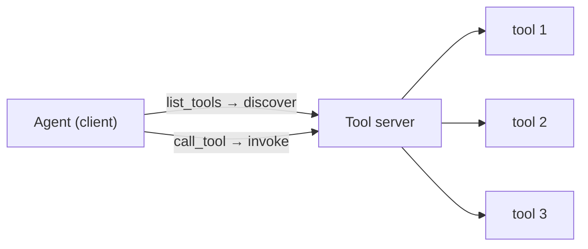

# M9 · Tool Platforms: MCP & Tool Servers

> **Module question:** How do tools become a *platform* — discovered, versioned, shared, and governed?
> **Cross-cutting threads:** Failure modes · Tradeoff ledger · ADK at a glance
> **Domain spine:** a coding agent with a growing MCP tool ecosystem

---

## Opening scene — three tools become forty

The coding agent started with three tools: `read_file`, `write_file`, `run_tests`. Clean. Six months later it had forty — GitHub issues via one MCP server, CI status via another, a Postgres console via an OpenAPI spec, Jira, Slack, a package registry — and the team had lost the plot:

- Two tools were named `search` (from different servers), and the agent kept calling the wrong one.
- One server's `deploy` tool had quietly changed its schema, and nobody knew until a failed deploy.
- A "read-only" filesystem server was actually writable, and nobody had checked.
- Nobody could answer: *"who has access to which tools, and what happens when a server is compromised?"*

This is the shift from M8 to M9. M8 was about **one tool's contract** — the name, schema, error semantics, boundary. M9 is about **many tools as a platform** — and the moment you have many tools, the hard problems are no longer per-tool: they're *discovery, namespacing, versioning, access, and attack surface*. The tool *interface* scales; the tool *platform* is a governance problem.

> **Failure mode (the module in one line):** treating forty tools as forty independent functions. Forty tools are a *system* with its own naming, versioning, access, and security concerns — and an ungoverned tool platform is how a "helpful" agent quietly becomes a wide-open attack surface.

---

## Why a server, not a function

M8's tools were plain functions in your process. M9's tools live in **servers** — separate processes that expose capabilities over a protocol. Why the extra boundary?

- **Separation of concerns.** The GitHub tool's code lives *with* GitHub's SDK, its credentials, its rate limits — not bundled into your agent's runtime. The tool's home is its system.
- **Shared, reusable capability.** One Stripe MCP server serves many agents, in many languages, with one implementation. Write once, consume everywhere.
- **Discovery.** A client can *ask the server what it offers* (`list_tools`) rather than having tools hard-coded. Tools become discoverable, not configured.
- **The server is the unit of governance.** You can version a server, restrict a server, audit a server, kill a server — a scope you don't have over a pile of loose functions.

The cost is the boundary itself: a network/process hop adds latency, a new failure mode (the server is down), and — critically, see below — **state**. A function is stateless; a server connection may not be.

---

## MCP: what it standardizes — and what it leaves to you

**MCP** (Model Context Protocol) is the open standard for exactly this: how an LLM host (your agent) talks to an external tool/data server. It's a **client–server** protocol where a server exposes three things — *resources* (data), *prompts* (reusable templates), and *tools* (functions) — and a client consumes them.

The one-sentence framing that keeps you honest: **MCP standardizes the *socket*; you still own the *policy*.**

| MCP standardizes | MCP leaves to you |
|---|---|
| Discovery (`list_tools`) | **Authority** — what each tool is *allowed* to do |
| Tool schema (`inputSchema`) | **Credentials** — scoped, per-server |
| Call/response (`call_tool`) | **Versioning & deprecation** of tools |
| Transport (stdio / SSE / HTTP) | **Access control** — which agent gets which tools |
| Resources & prompts | **Security** — input validation, injection defense |

The point is not that MCP is weak — it's that it's *plumbing*. It solves the boring, valuable problem of "how does an agent find and call a tool across a process boundary," and it deliberately does **not** solve the hard problem of "what is that tool allowed to do." The Tahoe lesson (M8) is *not* standardized away by adopting MCP; it's merely relocated to the server. A quote tool behind MCP can still commit a transaction if its server grants it that authority. **Protocol ≠ governance.**

> **ADK at a glance:** ADK consumes MCP via **`McpToolset`** — pass `connection_params` (stdio for a local process, SSE/streamable-HTTP for a remote server), and it handles connection, discovery (`list_tools`), schema adaptation (MCP tools → ADK `BaseTool`s), and call-proxying (`call_tool`) transparently. A **`tool_filter`** parameter selects *which* of the server's tools to expose — which, as you'll see, is a security control, not a convenience.

**The protocol family.** MCP standardizes *tools*; its siblings standardize the other surfaces. **ACP (Agent Client Protocol)** is the agent↔*client* standard — coding agents use it to drive a code editor through a common interface, so any agent plugs into any editor without bespoke glue (its use-case: agent/editor portability). **A2A** (agent↔agent) lives in M11. ACP is a socket at the *edge* of the harness — outside the layers this course designs — so it's a know-it, not a design-it.

---

## ADK's tool surface: native, MCP, OpenAPI

Three ways tools arrive, and the decision between them:

| Surface | What it is | Use it when |
|---|---|---|
| **Native `FunctionTool`** | Your function, in-process (M8) | You own the code; tightest control, first-party |
| **`McpToolset`** | Consume an external MCP server | Interop — someone else's tool, over the standard |
| **`OpenAPIToolset`** | Generate `RestApiTool`s from an OpenAPI spec | You already have a documented REST API |

The elegant one is **`OpenAPIToolset`**: feed it your OpenAPI spec, and it generates one tool per operation — the `operationId` becomes the tool name (snake_cased), the `summary`/`description` becomes the model-facing description, the parameters/body become the schema. **Your API documentation becomes the tool contract** — discovery from the spec you already maintain. That's the "platform" idea in its purest form: the interface is *derived* from an existing artifact, not hand-written per tool.

The decision rule: **native for what you control, MCP for interop, OpenAPI for what's already a REST API** — and in all three, the *authority* decision (M8's capability matrix) remains yours, because none of these surfaces decides authority for you.

---

## Discovery, namespacing, versioning, deprecation

Forty tools stop being manageable the moment you treat them as a flat list. The platform disciplines:

1. **Discovery.** Tools are *asked for* (`list_tools`), not hard-coded. This means the tool list is a runtime fact, not a compile-time one — which is powerful (new servers appear without redeploy) and dangerous (new servers *appear*, with new attack surface, without review).
2. **Namespacing.** Names must not collide across servers. The opening scene's two `search` tools are the classic failure: the model can't distinguish `search` (GitHub) from `search` (docs). Prefix by server (`github_search`, `docs_search`), or filter per server.
3. **Versioning.** A tool's schema *is* its contract (M8); change the schema and you've changed the contract. Servers and tools need versions, and agents need to know which version they're bound to — otherwise a server upgrade silently breaks every agent that depends on it.
4. **Deprecation.** Retiring a tool without breaking agents requires a deprecation window: mark it deprecated, keep it working, signal its successor, *then* remove it. The same discipline you'd apply to a public API — because to the agent, your tool *is* a public API.

This is **API governance, applied to model-facing surfaces** — with one twist: your consumer is a model that won't read your deprecation notice. It will keep calling the old tool until the old tool stops existing. Deprecation must therefore be enforced at the *server* (remove the tool, or return a "deprecated, use X" error), not announced in prose.

---

## Hosting & ops: the tool server is an attack surface

The moment tools live in servers, the server is a *trust boundary* — and M9 is where the security thread from M8 (and ahead to M14) gets its concrete shape:

- **Supply chain.** You are running *someone else's* server code. The catalog's **MCP stdio supply-chain RCE** is the canonical warning: a compromised MCP server is *arbitrary code execution on your host*, because a stdio server is a process you spawn. Every MCP server is a dependency, with all of M3's supply-chain lessons attached.
- **Least privilege at the surface.** `tool_filter` is a security control: expose only the tools the agent needs. The docs' production checklist says it plainly — *"filter MCP tools to limit exposed functionality," "use read-only tool filters for production."* A filesystem server should expose `read_file`, not `delete_file`, unless the agent genuinely needs to delete.
- **Credential handling.** Scoped, per-server credentials — a server gets the least role it needs, never ambient admin. (M8's scoped-credentials rule, at platform scale.)
- **Input validation.** The server must validate tool *inputs* — remember M8's hallucinated args and M14's injection: an MCP tool that passes a model's raw string to a shell is a prompt-injection RCE waiting to happen.
- **State & scaling.** MCP connections are **stateful** (persistent client–server sessions), unlike stateless REST. That complicates scaling: load balancing, session affinity, connection limits. Stdio (a spawned process per connection) is fine for dev and single-tenant; remote SSE/HTTP servers are how you scale — with the auth and infra that entails.

> **Tradeoff (the ledger entry):**
> - **Native control vs. ecosystem reach.** Native tools are tight and safe but you build every one. MCP/OpenAPI give you a whole ecosystem, and with it a whole attack surface. The balance is a *review* decision, not a default.
> - **Discovery convenience vs. attack surface.** Auto-discovered tools are convenient precisely because they arrive without a human in the loop — which is also the problem. Every discovered tool is a new trust edge.
> - **Centralization vs. distribution.** One governed registry gives you control and a single point of failure; a free-for-all of servers gives you reach and chaos. The registry (the exercise) is the middle path.

---

## Worked example: the coding agent, at forty tools

The domain spine. The agent grew from 3 native tools to 40, across surfaces:

- **Native (3):** `read_file`, `write_file`, `run_tests` — first-party, tight control, in-process.
- **MCP (a dozen):** GitHub issues, CI status, package registry — each a `McpToolset` to an external server.
- **OpenAPI (the rest):** an internal Postgres console and a docs search, generated from specs via `OpenAPIToolset`.

The governance layer that keeps forty tools from becoming the opening scene's chaos:

- **A registry** — every tool is registered with its *namespace*, *server*, *version*, and *owner*.
- **An access policy** — the agent's role gets `read` on most servers, `write` on exactly two, and *no* access to `deploy` unless a human is in the loop.
- **A filter** — `tool_filter` prunes each server to the agent's needs; the filesystem server exposes reads only.
- **Version pins** — the agent is bound to server versions, so a schema change is a *planned* migration, not a silent break.

The result: forty tools, one governed surface — discovered but namespaced, shared but access-controlled, versioned but stable. That's what "tool platform" means, and it's the difference between an agent with a big toolbox and an agent with a big *unmanaged* attack surface.

---

## Design exercise

> *Paper-based. Think, then write.*

**Task.** Design a tool-server registry for an organization with 40+ tools across servers (or use the coding-agent brief). Produce:

1. **The registry schema.** For a single tool entry, list the fields you'd store — name (namespaced), server, version, owner, authority (read/write/execute), and anything else you think governance requires. Justify each field in a phrase.
2. **The naming convention.** State the rule that prevents the two-`search`-tools collision, and how it handles 40+ tools across 5+ servers.
3. **The access policy.** Define the roles (e.g., read-only agent, write-capable agent, human-in-the-loop) and map each to tool authorities. Which tools are *never* exposed to a model without human confirmation, and why?
4. **The versioning & deprecation rule.** How does a tool get upgraded (schema change) without breaking agents, and how does one get retired? Write the one-line deprecation policy.
5. **The security review.** List three things you'd check before *admitting a new server* into the registry (the supply-chain, credential, and injection checks). For each, name what "pass" looks like.
6. **Write the ADR.** "Tool registry & access policy" — the registry as the single governance surface, the residual risk you're accepting (e.g., "we accept that a compromised server is code execution; we mitigate by least-privilege filters and per-server credentials").

**Why this exercise matters.** M8 taught you to write *one* safe tool. This exercise is about keeping *forty* of them safe as a system — and the registry is the artifact that turns a pile of tools into a governed platform. The agent's reach is only as safe as the *registry* that manages it.

---

**In DSH:** the protocol surface is the `mcp` package (MCP) and the `acp` package (Agent Client Protocol) — the same two interop standards this module and its ACP note cover.

## Sources (ADK docs)

- [Model Context Protocol (MCP)](https://adk.dev/mcp/index.md)
- [MCP Tools — McpToolset, connection params, tool_filter, deployment & security checklist](https://adk.dev/tools-custom/mcp-tools/index.md)
- [OpenAPI tools — OpenAPIToolset, spec-driven discovery](https://adk.dev/tools-custom/openapi-tools/index.md)

---

**Next module:** [M10 — Orchestration I: Control Flow](../10-orchestration-1/README.md) — how much autonomy to grant, and how that's encoded in the loop.
