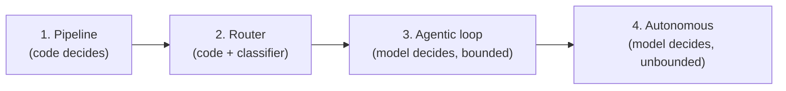

# M10 · Orchestration I: Control Flow

> **Module question:** How much autonomy should this agent have, and how is that encoded?
> **Cross-cutting threads:** Failure modes · Tradeoff ledger · ADK at a glance
> **Domain spine:** e-commerce order-handling, from scripted to agentic

---

## Opening scene — everything became an agent

The team, flush from a successful agent pilot, made *everything* an agent. Refund processing: an agent. Order cancellation: an agent. "What's my order status?": an agent. Within a month the cost and latency graphs went vertical, and the reliability graph went the other way.

The postmortem was a single question nobody had asked up front: *"why is this step an agent?"* For most of those steps, there was no answer — it was an agent because it was *cool* to be an agent. A deterministic, six-line function had been replaced with a non-deterministic, token-burning, retry-prone loop, for no reason.

This module is about that question. **Autonomy is a decision, not a default** — and the orchestration layer is where you encode *how much* autonomy each task gets. The failure this layer owns (M2 class 6/8: reasoning degradation, tool loops) is almost always the result of granting *too much* autonomy to a task that didn't need it.

> **Failure mode (the module in one line):** treating "agent" as the default answer. The correct amount of autonomy for a task is a *function of its requirements* — reliability, cost, latency, complexity, reversibility — not a badge of technical sophistication.

---

## The autonomy spectrum

Four points on the spectrum, each with a different *decision-maker*:



1. **Pipeline** — deterministic, pre-written steps; the same path every run. No model autonomy. *(ADK: `SequentialAgent` / graph of deterministic nodes.)*
2. **Router** — deterministic flow, but a model *classifies* which branch to take. Autonomy is confined to one decision. *(ADK: routing with an LLM classifier at the top.)*
3. **Agentic loop** — the model decides actions, observes results, repeats — *within bounds* (budgets, stop conditions). *(ADK: an `LlmAgent` with tools.)*
4. **Autonomous** — the model decides actions and *its own stopping* — the unbounded version. This is where the AutoGPT-era loops (M2's catalog) lived.

The spectrum is a *spectrum of control*, and every step to the right buys capability and sells predictability. The discipline is choosing the point per task — not per project.

---

## Choosing the pattern: five inputs

The autonomy decision has five inputs, and you can write them as a checklist:

| Input | Pushes toward pipeline | Pushes toward agentic |
|---|---|---|
| **Reliability** | Must succeed deterministically | Can tolerate retries/re-planning |
| **Cost/latency** | Tight budget | Budget is elastic |
| **Task complexity** | Known, enumerable steps | Steps emerge as you go |
| **Reversibility** | Actions are reversible | Actions are irreversible |
| **Variety of inputs** | Fixed, predictable | Unseen task shapes |

The most underrated input is **reversibility**. An irreversible action (a refund, a delete, a deploy) should be as *un*-autonomous as possible — pipeline or router, with human confirmation at the boundary (M8's `require_confirmation`). A reversible action (a search, a draft) can afford a loop. The Chevrolet Tahoe (M2) was, at root, a *reversibility* error: an irreversible action (committing a sale) wrapped in far too much autonomy.

---

## The agentic loop, in detail

When a task *does* warrant a loop, here is its anatomy:

```
plan → act → observe → (repeat until done)
```

- **Plan** — the model decides the next action (a tool call, or an answer).
- **Act** — the tool executes (M8's contract and boundary apply).
- **Observe** — the result re-enters context (M4's budget applies).

And, critically, the loop must have **three constraints** that the model does not get to vote on:

1. **A stop condition** — "done" must be *defined*, not felt. (ADK's `LoopAgent` makes this literal: you *must* implement the termination mechanism — a max-iteration cap, or a sub-agent that signals "STOP.")
2. **A budget cap** — a ceiling on iterations/tokens/cost per run. The loop is a protocol, not a promise (M2's AutoGPT lesson).
3. **A progress check** — is each iteration actually advancing, or just rephrasing the same failed attempt?

**The two loop pathologies** (both from M2 class 6/8):
- **Looping** — the same call, slightly rephrased, forever. Fix: budget cap + loop detection (dedupe near-identical calls).
- **Thrashing** — oscillating between two actions without converging. Fix: progress check + a "stop if no improvement" condition.

The loop is the *engine* of capability; the constraints are the *governor*. An unbounded loop is not "more capable" — it's a cost runaway waiting to happen.

> **ADK at a glance:** ADK's template workflow agents are **deterministic orchestration** — `SequentialAgent` (run sub-agents one after another), `ParallelAgent` (run them concurrently), and `LoopAgent` (repeat until `max_iterations` or a termination signal). Crucially, *none of these consult a model to decide the flow* — the orchestration is code, not reasoning. That is the "workflow vs. agent" distinction from M1 made concrete: you reach for these when the *flow* is known and only the *steps* need intelligence. (In ADK 2.0 these templates are superseded by graph-based workflows — the same principle, more flexibility.)

---

## Hybrid designs: the workflow shell

The spectrum is not a single choice for the whole product — it's *per task*, and the best architectures mix them: **a deterministic shell around an agentic core.**

- The **shell** (pipeline/router) owns the *flow*: validate input, route, budget, handoff — all deterministic.
- The **core** (agentic loop) owns only the *hard step*: the one place where steps genuinely emerge.
- **Human handoff points** live in the shell: before and after irreversible actions.

The e-commerce example below is exactly this shape. The principle: **give the model autonomy where the task is *open*, and take it away everywhere the task is *closed*.** Most of a production system is closed.

---

## Worked example: e-commerce order handling

The domain spine. Order handling has several task classes, each at a different point on the spectrum:

| Task | Autonomy | Why |
|---|---|---|
| "Where is my order?" | **Pipeline** — one `lookup_order` tool, fixed path | Deterministic, cheap, high-volume |
| "Refund this item" | **Router + human confirm** — classify reason, then `require_confirmation` | Irreversible; autonomy confined to classification, not the action |
| "Why was I charged twice?" | **Agentic loop, bounded** — investigate across order/billing tools | Steps emerge; capped at N iterations |
| "Handle this escalated complaint" | **Agentic loop with human handoff** — draft a response, human approves | Open-ended, but the *send* is gated |

The shell: validate → route to the right task class → budget each loop → hand off irreversible actions to a human. The core: the two agentic cells, bounded. Nothing in this design is "an agent" as a blanket; every step's autonomy is *justified by its task class*.

> **Tradeoff (the ledger entry):**
> - **Capability vs. predictability.** Every step right on the spectrum buys adaptability and sells determinism. The correct point is where the *marginal* capability is worth the *marginal* unpredictability — and for most tasks, that point is far left.
> - **Autonomy vs. reversibility.** Autonomy is cheap on reversible actions and expensive on irreversible ones. Gate the irreversible, not the reasoning.

---

## Design exercise

> *Paper-based. Think, then write.*

**Task.** For a product of your choice (or use the order-handling brief), write the autonomy decision per task class.

1. **List the task classes.** Enumerate the 4–6 distinct things the system does (lookup, classify, act, investigate, escalate…).
2. **Assign each a point on the spectrum** — pipeline, router, agentic loop (bounded), or autonomous — and justify it in one sentence using the five inputs (reliability, cost/latency, complexity, reversibility, variety).
3. **Flag the irreversible actions.** For each, name the *boundary* where autonomy ends and human confirmation begins (the specific `require_confirmation` point).
4. **Write the loop constraints.** For the one task that genuinely warrants an agentic loop, specify its stop condition, budget cap, and progress check — as concrete values, not vibes.
5. **Write the ADR.** "Autonomy assignment per task class" — the spectrum choices, the irreversible-action gates, and the residual risk you're accepting (e.g., "we accept N bounded iterations on escalation, capped at a cost ceiling").

**Why this exercise matters.** Orchestration is where autonomy is *bought and sold*. If you can justify, task by task, *why* each step is at its point on the spectrum, you've already prevented the class of failure that makes agent products expensive, slow, and unreliable — the one that starts with "we made it an agent because we could."

---

**In DSH:** the loop is `core/agent-loop` (the default driver), with the explicit turn/step hierarchy — *"a step is one model request plus its tool calls; a turn is zero or more steps"* — and a `plan` package for plan-mode.

## Sources (ADK docs)

- [Template workflow agents — Sequential / Parallel / Loop](https://adk.dev/agents/workflow-agents/index.md)
- [Loop workflow — max_iterations, termination, exit signal](https://adk.dev/agents/workflow-agents/loop-agents/index.md)

---

**Next module:** [M11 — Orchestration II: Multi-Agent Patterns](../11-orchestration-2/README.md) — when one agent isn't enough, and when "more agents" is just more failure modes.
