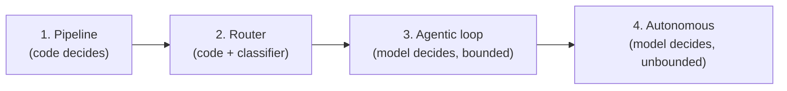

# M10 · Orchestration I: Control Flow

> **Module question:** How much autonomy should this agent have, and how is that encoded?
> **Cross-cutting threads:** Failure modes · Tradeoff ledger · ADK at a glance
> **Domain spine:** e-commerce order-handling, from scripted to agentic

---

## Opening scene — everything became an agent

The team, flush from a successful agent pilot, made *everything* an agent. Refund processing: an agent. Order cancellation: an agent. "What's my order status?": an agent. Within a month the cost and latency graphs went vertical, and the reliability graph went the other way.

The postmortem was a single question nobody had asked up front: *"why is this step an agent?"* For most of those steps, there was no answer — it was an agent because it was *cool* to be an agent. A deterministic, six-line function had been replaced with a non-deterministic, token-burning, retry-prone loop, for no reason.

This module is about that question. **Autonomy is a decision, not a default**[feng-levels-of-autonomy](#feng-levels-of-autonomy) — and the orchestration layer is where you encode *how much* autonomy each task gets. The failure this layer owns (M2 class 6/8: reasoning degradation, tool loops) is almost always the result of granting *too much* autonomy to a task that didn't need it.[unsupported](#unsupported), [cemri-mast](#cemri-mast)

> **Failure mode (the module in one line):** treating "agent" as the default answer. The correct amount of autonomy for a task is a *function of its requirements* — reliability, cost, latency, complexity, reversibility — not a badge of technical sophistication.[horvitz-mixed-initiative](#horvitz-mixed-initiative), [feng-levels-of-autonomy](#feng-levels-of-autonomy), [own-synthesis](#own-synthesis)

---

## The autonomy spectrum

Four points on the spectrum, each with a different *decision-maker*:[own-synthesis](#own-synthesis)



1. **Pipeline** — deterministic, pre-written steps; the same path every run. No model autonomy. *(ADK: `SequentialAgent` / graph of deterministic nodes.)*[adk-workflow-agents](#adk-workflow-agents), [anthropic-building-effective-agents](#anthropic-building-effective-agents)
2. **Router** — deterministic flow, but a model *classifies* which branch to take. Autonomy is confined to one decision. *(ADK: routing with an LLM classifier at the top.)*[adk-agent-routing](#adk-agent-routing), [ong-routellm](#ong-routellm), [chen-frugalgpt](#chen-frugalgpt), [ding-hybrid-llm](#ding-hybrid-llm), [hu-routerbench](#hu-routerbench)
3. **Agentic loop** — the model decides actions, observes results, repeats — *within bounds* (budgets, stop conditions). *(ADK: an `LlmAgent` with tools.)*[yao-react](#yao-react), [sumers-coala](#sumers-coala)
4. **Autonomous** — the model decides actions and *its own stopping* — the unbounded version. This is where the AutoGPT-era loops (M2's catalog) lived.[feng-levels-of-autonomy](#feng-levels-of-autonomy), [hou-agents-do-not-stop](#hou-agents-do-not-stop)

The spectrum is a *spectrum of control*, and every step to the right buys capability and sells predictability.[yao-tau-bench](#yao-tau-bench), [kim-cost-dynamic-reasoning](#kim-cost-dynamic-reasoning), [lu-early-exit](#lu-early-exit) The discipline is choosing the point per task — not per project.[sheridan-verplank-loa](#sheridan-verplank-loa), [feng-levels-of-autonomy](#feng-levels-of-autonomy)

---

## Choosing the pattern: five inputs

The autonomy decision has five inputs, and you can write them as a checklist:[horvitz-mixed-initiative](#horvitz-mixed-initiative), [parasuraman-types-levels](#parasuraman-types-levels), [own-synthesis](#own-synthesis)

| Input | Pushes toward pipeline | Pushes toward agentic |
|---|---|---|
| **Reliability** | Must succeed deterministically | Can tolerate retries/re-planning |
| **Cost/latency** | Tight budget | Budget is elastic |
| **Task complexity** | Known, enumerable steps | Steps emerge as you go |
| **Reversibility** | Actions are reversible | Actions are irreversible |
| **Variety of inputs** | Fixed, predictable | Unseen task shapes |

The most underrated input is **reversibility**.[own-synthesis](#own-synthesis) An irreversible action (a refund, a delete, a deploy) should be as *un*-autonomous as possible — pipeline or router, with human confirmation at the boundary (M8's `require_confirmation`).[adk-confirmation](#adk-confirmation), [alshiekh-shielding](#alshiekh-shielding), [hadfield-menell-off-switch](#hadfield-menell-off-switch), [santoni-de-sio-meaningful-control](#santoni-de-sio-meaningful-control), [parasuraman-manzey-complacency](#parasuraman-manzey-complacency) A reversible action (a search, a draft) can afford a loop. The Chevrolet Tahoe (M2) was, at root, a *reversibility* error: an irreversible action (committing a sale) wrapped in far too much autonomy.

---

## The agentic loop, in detail

When a task *does* warrant a loop, here is its anatomy:

```
plan → act → observe → (repeat until done)
```

- **Plan** — the model decides the next action (a tool call, or an answer).[yao-react](#yao-react), [sumers-coala](#sumers-coala), [wang-agent-survey](#wang-agent-survey)
- **Act** — the tool executes (M8's contract and boundary apply).[qin-tool-learning](#qin-tool-learning)
- **Observe** — the result re-enters context (M4's budget applies).[yao-react](#yao-react), [sumers-coala](#sumers-coala)

And, critically, the loop must have **three constraints** that the model does not get to vote on:

1. **A stop condition** — "done" must be *defined*, not felt. (ADK's `LoopAgent` makes this literal: you *must* implement the termination mechanism — a max-iteration cap, or a sub-agent that signals "STOP.")[adk-loop-agents](#adk-loop-agents)
2. **A budget cap** — a ceiling on iterations/tokens/cost per run. The loop is a protocol, not a promise (M2's AutoGPT lesson).[khan-token-budgets](#khan-token-budgets), [hou-agents-do-not-stop](#hou-agents-do-not-stop)
3. **A progress check** — is each iteration actually advancing, or just rephrasing the same failed attempt?[huang-self-correct](#huang-self-correct), [kamoi-self-correction](#kamoi-self-correction)

**The two loop pathologies** (both from M2 class 6/8):
- **Looping** — the same call, slightly rephrased, forever. Fix: budget cap + loop detection (dedupe near-identical calls).[hou-agents-do-not-stop](#hou-agents-do-not-stop), [cemri-mast](#cemri-mast)
- **Thrashing** — oscillating between two actions without converging. Fix: progress check + a "stop if no improvement" condition.[lu-early-exit](#lu-early-exit), [cemri-mast](#cemri-mast)

The loop is the *engine* of capability; the constraints are the *governor*. An unbounded loop is not "more capable" — it's a cost runaway waiting to happen.[kim-cost-dynamic-reasoning](#kim-cost-dynamic-reasoning), [khan-token-budgets](#khan-token-budgets), [xu-rewoo](#xu-rewoo)

> **ADK at a glance:** ADK's template workflow agents are **deterministic orchestration** — `SequentialAgent` (run sub-agents one after another), `ParallelAgent` (run them concurrently), and `LoopAgent` (repeat until `max_iterations` or a termination signal). Crucially, *none of these consult a model to decide the flow* — the orchestration is code, not reasoning. That is the "workflow vs. agent" distinction from M1 made concrete: you reach for these when the *flow* is known and only the *steps* need intelligence. (In ADK 2.0 these templates are superseded by graph-based workflows — the same principle, more flexibility.)[adk-workflow-agents](#adk-workflow-agents), [adk-loop-agents](#adk-loop-agents), [adk-2.0](#adk-2.0), [anthropic-building-effective-agents](#anthropic-building-effective-agents)

---

## Hybrid designs: the workflow shell

The spectrum is not a single choice for the whole product — it's *per task*, and the best architectures mix them: **a deterministic shell around an agentic core.**[zaharia-compound-ai](#zaharia-compound-ai), [anthropic-building-effective-agents](#anthropic-building-effective-agents)

- The **shell** (pipeline/router) owns the *flow*: validate input, route, budget, handoff — all deterministic.
- The **core** (agentic loop) owns only the *hard step*: the one place where steps genuinely emerge.
- **Human handoff points** live in the shell: before and after irreversible actions.[adk-confirmation](#adk-confirmation), [amershi-guidelines-hai](#amershi-guidelines-hai)

The e-commerce example below is exactly this shape. The principle: **give the model autonomy where the task is *open*, and take it away everywhere the task is *closed*.** Most of a production system is closed.[own-synthesis](#own-synthesis)

---

## Worked example: e-commerce order handling

The domain spine. Order handling has several task classes, each at a different point on the spectrum:

| Task | Autonomy | Why |
|---|---|---|
| "Where is my order?" | **Pipeline** — one `lookup_order` tool, fixed path | Deterministic, cheap, high-volume |
| "Refund this item" | **Router + human confirm** — classify reason, then `require_confirmation`[adk-confirmation](#adk-confirmation) | Irreversible; autonomy confined to classification, not the action |
| "Why was I charged twice?" | **Agentic loop, bounded** — investigate across order/billing tools | Steps emerge; capped at N iterations |
| "Handle this escalated complaint" | **Agentic loop with human handoff** — draft a response, human approves | Open-ended, but the *send* is gated |

The shell: validate → route to the right task class → budget each loop → hand off irreversible actions to a human. The core: the two agentic cells, bounded. Nothing in this design is "an agent" as a blanket; every step's autonomy is *justified by its task class*.[own-synthesis](#own-synthesis)

> **Tradeoff (the ledger entry):**
> - **Capability vs. predictability.** Every step right on the spectrum buys adaptability and sells determinism. The correct point is where the *marginal* capability is worth the *marginal* unpredictability — and for most tasks, that point is far left.[yao-tau-bench](#yao-tau-bench), [kim-cost-dynamic-reasoning](#kim-cost-dynamic-reasoning), [own-synthesis](#own-synthesis)
> - **Autonomy vs. reversibility.** Autonomy is cheap on reversible actions and expensive on irreversible ones. Gate the irreversible, not the reasoning.[alshiekh-shielding](#alshiekh-shielding), [horvitz-mixed-initiative](#horvitz-mixed-initiative), [own-synthesis](#own-synthesis)

---

## Design exercise

> *Paper-based. Think, then write.*

**Task.** For a product of your choice (or use the order-handling brief), write the autonomy decision per task class.

1. **List the task classes.** Enumerate the 4–6 distinct things the system does (lookup, classify, act, investigate, escalate…).
2. **Assign each a point on the spectrum** — pipeline, router, agentic loop (bounded), or autonomous — and justify it in one sentence using the five inputs (reliability, cost/latency, complexity, reversibility, variety).
3. **Flag the irreversible actions.** For each, name the *boundary* where autonomy ends and human confirmation begins (the specific `require_confirmation` point).
4. **Write the loop constraints.** For the one task that genuinely warrants an agentic loop, specify its stop condition, budget cap, and progress check — as concrete values, not vibes.
5. **Write the ADR.** "Autonomy assignment per task class" — the spectrum choices, the irreversible-action gates, and the residual risk you're accepting (e.g., "we accept N bounded iterations on escalation, capped at a cost ceiling").

**Why this exercise matters.** Orchestration is where autonomy is *bought and sold*. If you can justify, task by task, *why* each step is at its point on the spectrum, you've already prevented the class of failure that makes agent products expensive, slow, and unreliable — the one that starts with "we made it an agent because we could."[kim-cost-dynamic-reasoning](#kim-cost-dynamic-reasoning), [yao-tau-bench](#yao-tau-bench)

---

**In DSH:** the loop is `core/agent-loop` (the default driver), with the explicit turn/step hierarchy — *"a step is one model request plus its tool calls; a turn is zero or more steps"* — and a `plan` package for plan-mode.

## Sources (ADK docs)

- [Template workflow agents — Sequential / Parallel / Loop](https://adk.dev/agents/workflow-agents/index.md)[adk-workflow-agents](#adk-workflow-agents)
- [Loop workflow — max_iterations, termination, exit signal](https://adk.dev/agents/workflow-agents/loop-agents/index.md)[adk-loop-agents](#adk-loop-agents)
- [Route between agents — classifier routing, RoutedAgent](https://adk.dev/agents/routing/index.md)[adk-agent-routing](#adk-agent-routing)
- [Get action confirmation — require_confirmation, threshold, human approval](https://adk.dev/tools-custom/confirmation/index.md)[adk-confirmation](#adk-confirmation)
- [Welcome to ADK 2.0 (graph runtime)](https://adk.dev/2.0/index.md)[adk-2.0](#adk-2.0)

---

## Where the literature disagrees with this module

- The five inputs, the three loop constraints, and the deterministic-shell prescription are good design advice, and the parts the module checks against the framework docs hold up. But the module's *central* framing — that autonomy is **how much** control to hand over, chosen on a per-task dial — is the part the older literature pushes back on hardest.
- Recording it is the same discipline this module teaches: name the decision, then show what the evidence actually supports.

### 1. Autonomy is not one dial — the human-factors literature models it as a per-stage vector

- The module draws a single line from pipeline to autonomous and says "the discipline is choosing the point per task."
- The classic model refuses the single line: automation applies to four *separable* classes of function, and the level can differ at each.[parasuraman-types-levels](#parasuraman-types-levels)
    - "We propose that automation can be applied to four broad classes of functions: 1) information acquisition; 2) information analysis; 3) decision and action selection; and 4) action implementation."
    - And the levels are independent per stage: "A particular system can involve automation of all four dimensions at different levels."
- Even the *continuum* the module's spectrum descends from was a continuum of *degree of automation*, not a single axis of agency.[sheridan-verplank-loa](#sheridan-verplank-loa)
    - "It is interesting to consider a continuum along which the "degree of automation" can vary from none (direct manual control by person) to complete (hypothetical intelligent robot with no intervention by person)."
- And the levels the AI literature now proposes are keyed to **the user's role** — operator, collaborator, consultant, approver, observer — with autonomy treated as a deliberate design decision separable from capability.[feng-levels-of-autonomy](#feng-levels-of-autonomy)
- **Consequence.** Keep the five-point spectrum as the *teaching* device; stop presenting it as the design object. The real artifact is an allocation across stages. The worked example already implies this: "router + human confirm" is two different levels on two different functions (decision selection automated, action implementation gated), which the one-line spectrum cannot express.

### 2. The "progress check" assumes the model can tell whether it is advancing — the evidence says it cannot, unaided

- The module's third loop constraint asks: "is each iteration actually advancing, or just rephrasing the same failed attempt?"
- That is a self-diagnosis requirement, and it is the weakest link in the loop:
    - "In the context of reasoning, our research indicates that LLMs struggle to self-correct their responses without external feedback, and at times, their performance even degrades after self-correction."[huang-self-correct](#huang-self-correct)
    - A critical survey of the whole line is blunter: "no prior work demonstrates successful self-correction with feedback from prompted LLMs, except for studies in tasks that are exceptionally suited for self-correction," while "self-correction works well in tasks that can use reliable external feedback."[kamoi-self-correction](#kamoi-self-correction)
- The positive results do not rescue a model-side check — they are the external-feedback case.[madaan-self-refine](#madaan-self-refine), [shinn-reflexion](#shinn-reflexion)
- **Consequence.** The progress check must be an *external verifier* — a test that passes, a state assertion, a schema validation — not a question you ask the loop. The module's own wording ("constraints that the model does not get to vote on") is right; make it explicit that a prompted model asked "are you making progress?" is precisely the judge the literature finds unreliable.

### 3. "An unbounded loop is not 'more capable'" is one-sided — runaway steps do real work

- The module's closing line: "An unbounded loop is not 'more capable' — it's a cost runaway waiting to happen."
- The measured picture is a tradeoff, not a one-way verdict. Agents do get trapped — they are "frequently trapped in repetitive loops or issuing ineffective commands, leading to redundant computational overhead" — but the same work measures the cost of cutting the loop short, and its title is the finding: runaway is "ashamed, but helpful."[lu-early-exit](#lu-early-exit)
    - Early-exit methods give "significant efficiency improvements, with only minor drops in agent performance," and the authors introduce a metric for the negative effect ("progress degradation") *and* recover it by having "a stronger agent assist after an early-exit agent."
- The mirror-image pathology is named in the failure taxonomy: **FM-3.1 Premature termination** sits beside **FM-1.5 Unaware of stopping conditions** and **FM-1.3 Step repetition**.[cemri-mast](#cemri-mast)
- The cost half of the module's claim does hold, and is measured: tool-augmented agentic systems require "significantly more LLM calls, averaging 9.2 times more than CoT." It is the *capability* half that needs hedging.[kim-cost-dynamic-reasoning](#kim-cost-dynamic-reasoning)
- Even the loop's *shape* is not settled: decoupling reasoning from observation is argued to cut the redundancy of tight interleaving, reporting "5x token efficiency and 4% accuracy improvement on HotpotQA."[xu-rewoo](#xu-rewoo)
- **Consequence.** Teach the budget as choosing *which* failure you prefer — never stopping, or stopping early — rather than as a one-way improvement. The vocabulary for both already exists in the literature.

### 4. The router is not a free confinement of autonomy — it is another learned component with its own error and drift

- The module's router point: "deterministic flow, but a model *classifies* which branch to take. Autonomy is confined to one decision."
- Confining autonomy to a classifier does not remove the classifier's error; it relocates it, and the routing literature measures exactly that:
    - "while some previous routing mechanisms have difficulty generalizing to complex tasks and up-to-date models, there are several promising fields on which even simple routing demonstrated outstanding performance."[hu-routerbench](#hu-routerbench)
    - Routers are trained to trade quality against cost — "dynamically select between a stronger and a weaker LLM during inference, aiming to optimize the balance between cost and response quality"[ong-routellm](#ong-routellm) — "based on the predicted query difficulty and the desired quality level"[ding-hybrid-llm](#ding-hybrid-llm) — and cascades recover cost aggressively: "match the performance of the best individual LLM (e.g. GPT-4) with up to 98% cost reduction."[chen-frugalgpt](#chen-frugalgpt)
- **Consequence.** The router is the right pattern, but it belongs in the capability matrix (M8) as a component with an error rate and a drift risk, not as "the safe place to put the model." Whatever the router misclassifies falls through to the wrong branch — a blast-radius question, and for an irreversible branch it is the same question as §5.

### 5. A confirmation gate is not a control unless the human's attention is designed for

- The module's rule: irreversible actions get "human confirmation at the boundary," with `require_confirmation` as the mechanism.[adk-confirmation](#adk-confirmation)
- The oversight literature says the gate is necessary but not sufficient, for two separate reasons.
- **Humans under-detect automation error, and training does not fix it.** "Automation bias results in making both omission and commission errors when decision aids are imperfect," and it "occurs in both naive and expert participants, cannot be prevented by training or instructions, and can affect decision making in individuals as well as in teams."[parasuraman-manzey-complacency](#parasuraman-manzey-complacency)
- **"In the loop" is not the same as "in control."** "simple human presence or "being in the loop" is not a sufficient condition for being in control"; meaningful control instead requires a *tracing* condition, under which the outcome can be traced "back … to at least one human along the chain of design and operation."[santoni-de-sio-meaningful-control](#santoni-de-sio-meaningful-control)
- The interaction guidance that survives is about giving the human evidence and an exit, not a yes/no button: "Make clear why the system did what it did," "Support efficient dismissal," "Support efficient correction."[amershi-guidelines-hai](#amershi-guidelines-hai) (Note: the 18 printed guidelines contain *no* rule requiring confirmation before a consequential action; the nearest is "G10 Scope services when in doubt.")
- **Consequence.** A confirmation gate must specify *what the human sees* (the diff, the amount, the reason), *what happens on timeout*, and *how the approval is logged*. M8's threshold function already implies this; the module should say it out loud. `require_confirmation=True` on everything is a known anti-pattern — approval fatigue converts the gate into a rubber stamp.

### 6. "The most underrated input is reversibility" is the module's own synthesis — and reversibility alone under-protects

- The module names reversibility as the most underrated input and derives the rule "gate the irreversible, not the reasoning."[own-synthesis](#own-synthesis)
- The decision-theoretic form of that rule is older, and it is *not* indexed on reversibility: "Autonomous actions should be taken only when an agent believes that they will have greater expected value than inaction for the user, taking into consideration the costs, benefits, and uncertainties in the user's goals."[horvitz-mixed-initiative](#horvitz-mixed-initiative)
- Reversibility is one term in that expected value, not the whole of it. The human-factors literature locates the boundary elsewhere too: the problem with automation is "not the presence of automation, but rather its inappropriate design … inadequate feedback and interaction with the humans who must control the overall conduct of the task."[norman-problem-with-automation](#norman-problem-with-automation)
- Where the module does want a hard stop, the safety literature does not rely on the model's choice at all — it filters the action before execution: a shield "acts each time the learning agent is about to make a decision and provides a list of safe actions."[alshiekh-shielding](#alshiekh-shielding) The same instinct underlies the formal result that an agent has "an incentive to disable the off switch," which makes preserving human interruption an engineering requirement rather than a default.[hadfield-menell-off-switch](#hadfield-menell-off-switch)
- **Consequence.** Keep reversibility as a first-class input, but record it as *one* term — reversibility, blast radius, and feedback quality together. A reversible action that is unattributable, or whose result the human never sees, is not "cheap autonomy"; it is the Norman failure.

### 7. Framework claims: verified against the ADK docs, with three corrections

Checked against the live ADK documentation rather than against the module's prose:

- **Confirmed exactly.** The template workflows "determine the execution sequence according to their type … without consulting an AI model for assistance with the orchestration. This approach results in deterministic and predictable execution patterns."[adk-workflow-agents](#adk-workflow-agents) The loop constraint is the docs' own language: "Crucially, the `LoopAgent` itself does *not* inherently decide when to stop looping. You *must* implement a termination mechanism to prevent infinite loops."[adk-loop-agents](#adk-loop-agents) And the confirmation mechanism is real: the tool "pause[s] its execution and interact[s] with a user or other system for confirmation … before proceeding."[adk-confirmation](#adk-confirmation)
- **Correction 1 — the supersession is Python and Go; TypeScript deprecates.** The module says "In ADK 2.0 these templates are superseded by graph-based workflows." That wording is the docs': "Starting in ADK 2.0 for Python and Go, template workflows have been superseded by more flexible workflow structures, including graph-based workflows and dynamic workflows."[adk-workflow-agents](#adk-workflow-agents) The 2.0 page frames the change as the Workflow Runtime "transitioning ADK from a hierarchical agent executor to a graph-based execution engine," and for TypeScript the three template classes log a deprecation warning rather than disappearing.[adk-2.0](#adk-2.0)
- **Correction 2 — `max_iterations` is one strategy, and no default is published.** The module's gloss ("a max-iteration cap, or a sub-agent that signals 'STOP'") matches the two named strategies, but the doc states **no default** for `max_iterations`; the `5` on that page is a sample value. Do not teach a default number.
- **Correction 3 — the router page the module relies on is TypeScript-only and Experimental.** "(ADK: routing with an LLM classifier at the top)" is documented as "The router function can call a lightweight classifier model to categorize input and route to different agents accordingly," on a page marked *Supported in ADK TypeScript v1.0.0 Experimental*.[adk-agent-routing](#adk-agent-routing) Cite the pattern; do not present it as a stable Python API.
- **The workflow/agent distinction the module leans on is owned by the post it cites.** Anthropic's guidance is to "find the simplest solution possible, and only increasing complexity when needed," reserving agents for problems where "it's difficult or impossible to predict the required number of steps, and where you can't hardcode a fixed path" — and it draws the line as "Workflows are systems where LLMs and tools are orchestrated through predefined code paths," against agents that "dynamically direct their own processes and tool usage."[anthropic-building-effective-agents](#anthropic-building-effective-agents) The post now carries an editor's note that the tooling landscape it surveys has changed since December 2024.

---

## Bibliography

*Literature behind the module's claims, with the framework documentation the module itself cites. **Citations use stable identifier keys, not position numbers.** Every inline citation is written `[key](#key)` and resolves to the bullet carrying that key, so entries can be added, removed, or reordered without rewriting a single citation — the BibTeX model, minus a backend to assign numbers. The bibliography is therefore an unordered bullet list, not a ranked one: the order of entries carries no meaning, and no entry's identity changes if you move it. Every entry hyperlinks to the paper itself or to its open PDF. Items tagged (industry doc) are vendor documentation, (preprint) are not yet peer-reviewed, and (own synthesis) are the module's inferences rather than sourced claims. `cf.` marks a source that qualifies or contradicts the sentence it follows. `unsupported` is the module's unsupported-claims bucket and `own-synthesis` collects the course's own un-sourced synthesis: anything asserted above that no located source supports is cited there rather than to an invented reference.*

### Framework documentation (industry docs)

- <a id="adk-workflow-agents"></a>[adk-workflow-agents](#adk-workflow-agents) · [**Template agent workflows** — Google ADK documentation](https://adk.dev/agents/workflow-agents/index.md) (industry doc) — owns the determinism claim the module's "ADK at a glance" rests on: the templates "determine the execution sequence according to their type … without consulting an AI model for assistance with the orchestration," and their execution patterns are "deterministic and predictable." Also the source of the Python/Go supersession wording quoted in the disagreement section §7.
- <a id="adk-loop-agents"></a>[adk-loop-agents](#adk-loop-agents) · [**Loop template workflow agent** — Google ADK documentation](https://adk.dev/agents/workflow-agents/loop-agents/index.md) (industry doc) — owns the loop's stop-condition requirement: "Crucially, the `LoopAgent` itself does *not* inherently decide when to stop looping. You *must* implement a termination mechanism to prevent infinite loops." Names two strategies — a maximum iteration count, and a sub-agent signalling termination — and publishes no default for `max_iterations`.
- <a id="adk-agent-routing"></a>[adk-agent-routing](#adk-agent-routing) · [**Route between agents** — Google ADK documentation](https://adk.dev/agents/routing/index.md) (industry doc) — owns the classifier-router pattern: "The router function can call a lightweight classifier model to categorize input and route to different agents accordingly." Page is marked *Supported in ADK TypeScript v1.0.0 Experimental*.
- <a id="adk-confirmation"></a>[adk-confirmation](#adk-confirmation) · [**Get action confirmation for ADK Tools** — Google ADK documentation](https://adk.dev/tools-custom/confirmation/index.md) (industry doc) — owns the human-gate mechanism: the tool "pause[s] its execution and interact[s] with a user or other system for confirmation or to gather structured data before proceeding," including the conditional threshold function M8 describes.
- <a id="adk-2.0"></a>[adk-2.0](#adk-2.0) · [**Welcome to ADK 2.0** — Google ADK documentation](https://adk.dev/2.0/index.md) (industry doc) — owns the graph-runtime claim: "The ADK 2.0 release introduces the Workflow Runtime, transitioning ADK from a hierarchical agent executor to a graph-based execution engine." Python GA May 19, 2026; Go June 30, 2026; TypeScript August 21, 2026.
- <a id="anthropic-building-effective-agents"></a>[anthropic-building-effective-agents](#anthropic-building-effective-agents) · [**Building effective agents** — Erik S., Barry Zhang](https://www.anthropic.com/engineering/building-effective-agents) (industry doc — published Dec 19, 2024; the post now carries an editor's note that the tooling landscape it surveys has changed) — owns the workflow-versus-agent distinction: "Workflows are systems where LLMs and tools are orchestrated through predefined code paths," against agents that "dynamically direct their own processes and tool usage." Also the "find the simplest solution possible" guidance and the predicate for when an agent is warranted.
- <a id="zaharia-compound-ai"></a>[zaharia-compound-ai](#zaharia-compound-ai) · [**The Shift from Models to Compound AI Systems** — Matei Zaharia, Omar Khattab, Lingjiao Chen, Jared Quincy Davis, Heather Miller, Chris Potts, James Zou, Michael Carbin, Jonathan Frankle, Naveen Rao, Ali Ghodsi](https://bair.berkeley.edu/blog/2024/02/18/compound-ai-systems/) (industry doc) — owns the compound-system argument behind the shell/core split: "state-of-the-art AI results are increasingly obtained by compound systems with multiple components, not just monolithic models."

### Autonomy, control, and handing back to a human

- <a id="sheridan-verplank-loa"></a>[sheridan-verplank-loa](#sheridan-verplank-loa) · [**Human and Computer Control of Undersea Teleoperators** — Thomas B. Sheridan, William L. Verplank](https://www.sfte.org/docs/SheridanVerplank_Human_Computer_Control_Undersea_Teleoperators.pdf) — MIT Man-Machine Systems Laboratory technical report prepared for the Office of Naval Research, 1978. — owns the original continuum of the "degree of automation": "It is interesting to consider a continuum along which the "degree of automation" can vary from none (direct manual control by person) to complete (hypothetical intelligent robot with no intervention by person)." *(Its ten-level table, Table 8.2, lies beyond the portion of this scan verified for this survey, so no claim here rests on the level list itself.)*
- <a id="parasuraman-types-levels"></a>[parasuraman-types-levels](#parasuraman-types-levels) · [**A Model for Types and Levels of Human Interaction with Automation** — Raja Parasuraman, Thomas B. Sheridan, Christopher D. Wickens](https://www.cs.uml.edu/~holly/91.550/papers/sheridan-autonomy.pdf) — *IEEE Transactions on Systems, Man, and Cybernetics—Part A: Systems and Humans* 30(3), 2000, pp. 286–297. *cf.* — owns the four-class decomposition (information acquisition; information analysis; decision and action selection; action implementation) and the independence result that "A particular system can involve automation of all four dimensions at different levels" — the counter-model to a single autonomy dial.
- <a id="horvitz-mixed-initiative"></a>[horvitz-mixed-initiative](#horvitz-mixed-initiative) · [**Principles of Mixed-Initiative User Interfaces** — Eric Horvitz](https://erichorvitz.com/chi99horvitz.pdf) — *CHI '99*, 1999, pp. 159–166. — owns the decision-theoretic rule for autonomy: "Autonomous actions should be taken only when an agent believes that they will have greater expected value than inaction for the user, taking into consideration the costs, benefits, and uncertainties in the user's goals." Also owns the cost-of-interruption half (Principle 3) and the act/dialog/do-nothing threshold (Principle 7).
- <a id="norman-problem-with-automation"></a>[norman-problem-with-automation](#norman-problem-with-automation) · [**The 'problem' with automation: inappropriate feedback and interaction, not 'over-automation'** — Donald A. Norman](https://doi.org/10.1098/rstb.1990.0101) — *Philosophical Transactions of the Royal Society of London. Series B* 327(1241), 1990, pp. 585–593 (publisher page; article is paywalled). *cf.* — locates the failure in feedback and interaction design rather than in the *amount* of automation: "The problem is not the presence of automation, but rather its inappropriate design."
- <a id="santoni-de-sio-meaningful-control"></a>[santoni-de-sio-meaningful-control](#santoni-de-sio-meaningful-control) · [**Meaningful Human Control over Autonomous Systems: A Philosophical Account** — Filippo Santoni de Sio, Jeroen van den Hoven](https://www.frontiersin.org/articles/10.3389/frobt.2018.00015/full) — *Frontiers in Robotics and AI* 5(15), 2018. — owns the tracking and tracing conditions of meaningful human control, and the claim that human *presence* is not control: "simple human presence or "being in the loop" is not a sufficient condition for being in control."
- <a id="parasuraman-manzey-complacency"></a>[parasuraman-manzey-complacency](#parasuraman-manzey-complacency) · [**Complacency and Bias in Human Use of Automation: An Attentional Integration** — Raja Parasuraman, Dietrich H. Manzey](https://doi.org/10.1177/0018720810376055) — *Human Factors* 52(3), 2010, pp. 381–410. — owns the measured automation-bias result: "Automation bias results in making both omission and commission errors when decision aids are imperfect," and it "occurs in both naive and expert participants, cannot be prevented by training or instructions, and can affect decision making in individuals as well as in teams."
- <a id="amershi-guidelines-hai"></a>[amershi-guidelines-hai](#amershi-guidelines-hai) · [**Guidelines for Human-AI Interaction** — Saleema Amershi, Dan Weld, Mihaela Vorvoreanu, Adam Fourney, Besmira Nushi, Penny Collisson, Jina Suh, Shamsi Iqbal, Paul N. Bennett, Kori Inkpen, Jaime Teevan, Ruth Kikin-Gil, Eric Horvitz](https://www.microsoft.com/en-us/research/uploads/prod/2019/01/Guidelines-for-Human-AI-Interaction-camera-ready.pdf) — *CHI 2019*. — owns the interaction guidelines cited here: "G8 Support efficient dismissal," "G9 Support efficient correction," "G10 Scope services when in doubt," "G11 Make clear why the system did what it did." *(It contains no guideline requiring confirmation before a consequential action; the module should not attribute one to it.)*
- <a id="alshiekh-shielding"></a>[alshiekh-shielding](#alshiekh-shielding) · [**Safe Reinforcement Learning via Shielding** — Mohammed Alshiekh, Roderick Bloem, Ruediger Ehlers, Bettina Könighofer, Scott Niekum, Ufuk Topcu](https://arxiv.org/pdf/1708.08611) — arXiv:1708.08611, 2017. — owns the pre-execution shield: an unsafe action is filtered *before* it can be taken ("the shield acts each time the learning agent is about to make a decision and provides a list of safe actions"), rather than left to the agent's choice.
- <a id="hadfield-menell-off-switch"></a>[hadfield-menell-off-switch](#hadfield-menell-off-switch) · [**The Off-Switch Game** — Dylan Hadfield-Menell, Anca Dragan, Pieter Abbeel, Stuart Russell](https://arxiv.org/pdf/1611.08219) — arXiv:1611.08219, 2016. — owns the formal result that a traditional agent "ha[s] an incentive to disable the off switch," which makes preserved human interruption an engineering requirement rather than a default.
- <a id="feng-levels-of-autonomy"></a>[feng-levels-of-autonomy](#feng-levels-of-autonomy) · [**Levels of Autonomy for AI Agents** — K. J. Kevin Feng, David W. McDonald, Amy X. Zhang](https://arxiv.org/pdf/2506.12469) — arXiv:2506.12469, 2025; published in the Knight First Amendment Institute's *AI and Democratic Freedoms* essay series. — owns the closest thing to the module's thesis: "an agent's level of autonomy can be treated as a deliberate design decision, separate from its capability and operational environment." Its five levels are keyed to the *user's role* (operator, collaborator, consultant, approver, observer) — **not** to the module's code-versus-model test, so the four-point spectrum above is the course's own synthesis.

### The agentic loop: reason, act, observe

- <a id="yao-react"></a>[yao-react](#yao-react) · [**ReAct: Synergizing Reasoning and Acting in Language Models** — Shunyu Yao, Jeffrey Zhao, Dian Yu, Nan Du, Izhak Shafran, Karthik Narasimhan, Yuan Cao](https://arxiv.org/pdf/2210.03629) — *ICLR*, 2023. — owns the interleaved reason–act–observe loop the module's anatomy restates, and the finding that interleaving "overcomes issues of hallucination and error propagation prevalent in chain-of-thought reasoning."
- <a id="sumers-coala"></a>[sumers-coala](#sumers-coala) · [**Cognitive Architectures for Language Agents** — Theodore R. Sumers, Shunyu Yao, Karthik Narasimhan, Thomas L. Griffiths](https://arxiv.org/pdf/2309.02427) — *TMLR*, 2024. — owns the decomposition the loop's vocabulary comes from: modular memory, a structured action space, and "a generalized decision-making process to choose actions."
- <a id="wang-agent-survey"></a>[wang-agent-survey](#wang-agent-survey) · [**A Survey on Large Language Model based Autonomous Agents** — Lei Wang, Chen Ma, Xueyang Feng, Zeyu Zhang, Hao Yang, Jingsen Zhang, Zhiyuan Chen, Jiakai Tang, Xu Chen, Yankai Lin, Wayne Xin Zhao, Zhewei Wei, Ji-Rong Wen](https://arxiv.org/pdf/2308.11432) — arXiv:2308.11432, 2023. — owns the standard planning / memory / action decomposition of an LLM agent, and records the triplet form of the loop: "ReAct [60] proposes constructing prompts using thought-act-observation triplets."
- <a id="qin-tool-learning"></a>[qin-tool-learning](#qin-tool-learning) · [**Tool Learning with Foundation Models** — Yujia Qin, Shengding Hu, Yankai Lin, Weize Chen, Ning Ding, Ganqu Cui, Zheni Zeng, Yufei Huang, Chaojun Xiao, Chi Han, Yi Ren Fung, Yusheng Su, Huadong Wang, Cheng Qian, Runchu Tian, Kunlun Zhu, Shihao Liang, Xingyu Shen, Bokai Xu, Zhen Zhang, Yining Ye, Bowen Li, Ziwei Tang, Jing Yi, Yuzhang Zhu, Zhenning Dai, Lan Yan, Xin Cong, Yaxi Lu, Weilin Zhao, Yuxiang Huang, Junxi Yan, Xu Han, Xian Sun, Dahai Li, Jason Phang, Cheng Yang, Tongshuang Wu, Heng Ji, Zhiyuan Liu, Maosong Sun](https://arxiv.org/pdf/2304.08354) — arXiv:2304.08354, 2023. — owns the act step as a *framework*: the model should "decompose a complex task into several subtasks, dynamically adjust their plan through reasoning, and effectively conquer each sub-task by selecting appropriate tools." *(Note: the paper's own title page prints two further authors, Xuanhe Zhou and Guoliang Li, that the arXiv listing omits.)*
- <a id="xu-rewoo"></a>[xu-rewoo](#xu-rewoo) · [**ReWOO: Decoupling Reasoning from Observations for Efficient Augmented Language Models** — Binfeng Xu, Zhiyuan Peng, Bowen Lei, Subhabrata Mukherjee, Yuchen Liu, Dongkuan Xu](https://arxiv.org/pdf/2305.18323) — arXiv:2305.18323, 2023. *cf.* — disputes that tight interleaving is the efficient loop: "Such a paradigm, though straightforward and easy to implement, often leads to huge computation complexity from redundant prompts and repeated execution," against a reported "5x token efficiency and 4% accuracy improvement on HotpotQA."

### Loop pathologies, budgets, and cost

- <a id="hou-agents-do-not-stop"></a>[hou-agents-do-not-stop](#hou-agents-do-not-stop) · [**When Agents Do Not Stop: Uncovering Infinite Agentic Loops in LLM Agents** — Xinyi Hou, Shenao Wang, Yanjie Zhao, Haoyu Wang](https://arxiv.org/pdf/2607.01641) — arXiv:2607.01641, 2026. — owns the infinite-agentic-loop failure class, with a reported measurement: "manual review confirms 68 IAL failures across 47 projects, achieving 91.9% precision."
- <a id="khan-token-budgets"></a>[khan-token-budgets](#khan-token-budgets) · [**Token Budgets: An Empirical Catalog of 63 LLM-Agent Budget-Overrun Incidents, with an Affine-Typed Rust Mitigation as a Case Study** — Sajjad Khan](https://arxiv.org/pdf/2606.04056) — arXiv:2606.04056, 2026. — owns the budget-overrun incident catalogue: "a single retry loop can spend thousands of dollars before an operator notices," with the preventing properties "enforced, if at all, by ad-hoc wrappers rather than by the type system."
- <a id="lu-early-exit"></a>[lu-early-exit](#lu-early-exit) · [**Runaway is Ashamed, But Helpful: On the Early-Exit Behavior of Large Language Model-based Agents in Embodied Environments** — Qingyu Lu, Liang Ding, Siyi Cao, Xuebo Liu, Kanjian Zhang, Jinxia Zhang, Dacheng Tao](https://aclanthology.org/2025.findings-emnlp.1304.pdf) — *Findings of EMNLP*, 2025. *cf.* — measures both sides of the loop budget: agents are "frequently trapped in repetitive loops or issuing ineffective commands," yet early exit introduces a measurable "progress degradation" — the extra steps are doing work.
- <a id="cemri-mast"></a>[cemri-mast](#cemri-mast) · [**Why Do Multi-Agent LLM Systems Fail?** — Mert Cemri, Melissa Z. Pan, Shuyi Yang, Lakshya A. Agrawal, Bhavya Chopra, Rishabh Tiwari, Kurt Keutzer, Aditya Parameswaran, Dan Klein, Kannan Ramchandran, Matei Zaharia, Joseph E. Gonzalez, Ion Stoica](https://arxiv.org/pdf/2503.13657) — arXiv:2503.13657, 2025. *cf.* — owns the MAST failure taxonomy used here, including **FM-1.3 Step repetition**, **FM-1.5 Unaware of stopping conditions**, **FM-2.3 Task derailment**, and **FM-3.1 Premature termination**. Its subject is *multi-agent* systems, so it supplies the failure-mode vocabulary rather than evidence about the single-agent spectrum.
- <a id="kim-cost-dynamic-reasoning"></a>[kim-cost-dynamic-reasoning](#kim-cost-dynamic-reasoning) · [**The Cost of Dynamic Reasoning: Demystifying AI Agents and Test-Time Scaling from an AI Infrastructure Perspective** — Jiin Kim, Byeongjun Shin, Jinha Chung, Minsoo Rhu](https://arxiv.org/pdf/2506.04301) — *HPCA*, 2026. — owns the measured infrastructure cost of agentic control flow: "While CoT performs only a single LLM inference per request, tool-augmented agentic systems require significantly more LLM calls, averaging 9.2 times more than CoT."
- <a id="yao-tau-bench"></a>[yao-tau-bench](#yao-tau-bench) · [**τ-bench: A Benchmark for Tool-Agent-User Interaction in Real-World Domains** — Shunyu Yao, Noah Shinn, Pedram Razavi, Karthik Narasimhan](https://arxiv.org/pdf/2406.12045) — arXiv:2406.12045, 2024. — owns the reliability side of "buys capability and sells predictability": it contributes the `pass^k` metric and finds "even state-of-the-art function calling agents (like gpt-4o) succeed on &lt;50% of the tasks, and are quite inconsistent (pass^8 &lt;25% in retail)."

### Does iteration advance? The self-correction evidence

- <a id="huang-self-correct"></a>[huang-self-correct](#huang-self-correct) · [**Large Language Models Cannot Self-Correct Reasoning Yet** — Jie Huang, Xinyun Chen, Swaroop Mishra, Huaixiu Steven Zheng, Adams Wei Yu, Xinying Song, Denny Zhou](https://arxiv.org/pdf/2310.01798) — *ICLR*, 2024. *cf.* — contradicts any model-side progress check: "LLMs struggle to self-correct their responses without external feedback, and at times, their performance even degrades after self-correction."
- <a id="kamoi-self-correction"></a>[kamoi-self-correction](#kamoi-self-correction) · [**When Can LLMs Actually Correct Their Own Mistakes? A Critical Survey of Self-Correction of LLMs** — Ryo Kamoi, Yusen Zhang, Nan Zhang, Jiawei Han, Rui Zhang](https://arxiv.org/pdf/2406.01297) — *TACL*, 2024. *cf.* — owns the conditions: "no prior work demonstrates successful self-correction with feedback from prompted LLMs, except for studies in tasks that are exceptionally suited for self-correction," while "self-correction works well in tasks that can use reliable external feedback."
- <a id="madaan-self-refine"></a>[madaan-self-refine](#madaan-self-refine) · [**Self-Refine: Iterative Refinement with Self-Feedback** — Aman Madaan, Niket Tandon, Prakhar Gupta, Skyler Hallinan, Luyu Gao, Sarah Wiegreffe, Uri Alon, Nouha Dziri, Shrimai Prabhumoye, Yiming Yang, Shashank Gupta, Bodhisattwa Prasad Majumder, Katherine Hermann, Sean Welleck, Amir Yazdanbakhsh, Peter Clark](https://arxiv.org/pdf/2303.17651) — arXiv:2303.17651, 2023. — owns the positive case for iteration: outputs "are preferred by humans and automatic metrics over those generated with the same LLM using conventional one-step generation, improving by ~20% absolute on average."
- <a id="shinn-reflexion"></a>[shinn-reflexion](#shinn-reflexion) · [**Reflexion: Language Agents with Verbal Reinforcement Learning** — Noah Shinn, Federico Cassano, Edward Berman, Ashwin Gopinath, Karthik Narasimhan, Shunyu Yao](https://arxiv.org/pdf/2303.11366) — arXiv:2303.11366, 2023. — owns bounded iterative self-reflection across trials: agents "verbally reflect on task feedback signals, then maintain their own reflective text in an episodic memory buffer to induce better decision-making in subsequent trials."

### Routing and cascades: confining autonomy to one decision

- <a id="ong-routellm"></a>[ong-routellm](#ong-routellm) · [**RouteLLM: Learning to Route LLMs with Preference Data** — Isaac Ong, Amjad Almahairi, Vincent Wu, Wei-Lin Chiang, Tianhao Wu, Joseph E. Gonzalez, M Waleed Kadous, Ion Stoica](https://arxiv.org/pdf/2406.18665) — arXiv:2406.18665, 2024. — owns the learned classifier-router: "several efficient router models that dynamically select between a stronger and a weaker LLM during inference, aiming to optimize the balance between cost and response quality."
- <a id="chen-frugalgpt"></a>[chen-frugalgpt](#chen-frugalgpt) · [**FrugalGPT: How to Use Large Language Models While Reducing Cost and Improving Performance** — Lingjiao Chen, Matei Zaharia, James Zou](https://arxiv.org/pdf/2305.05176) — arXiv:2305.05176, 2023. — owns the deterministic cascade with a learned stop decision, and its cost result: "match the performance of the best individual LLM (e.g. GPT-4) with up to 98% cost reduction or improve the accuracy over GPT-4 by 4% with the same cost."
- <a id="ding-hybrid-llm"></a>[ding-hybrid-llm](#ding-hybrid-llm) · [**Hybrid LLM: Cost-Efficient and Quality-Aware Query Routing** — Dujian Ding, Ankur Mallick, Chi Wang, Robert Sim, Subhabrata Mukherjee, Victor Ruhle, Laks V.S. Lakshmanan, Ahmed Hassan Awadallah](https://arxiv.org/pdf/2404.14618) — *ICLR*, 2024. — owns quality-targeted routing: "a router that assigns queries to the small or large model based on the predicted query difficulty and the desired quality level."
- <a id="hu-routerbench"></a>[hu-routerbench](#hu-routerbench) · [**RouterBench: A Benchmark for Multi-LLM Routing System** — Qitian Jason Hu, Jacob Bieker, Xiuyu Li, Nan Jiang, Benjamin Keigwin, Gaurav Ranganath, Kurt Keutzer, Shriyash Kaustubh Upadhyay](https://arxiv.org/pdf/2403.12031) — arXiv:2403.12031, 2024. *cf.* — owns the router's failure mode, i.e. that it is a learned component and not a free confinement of autonomy: "while some previous routing mechanisms have difficulty generalizing to complex tasks and up-to-date models, there are several promising fields on which even simple routing demonstrated outstanding performance."

### Unsupported claims and own synthesis

- <a id="unsupported"></a>[unsupported](#unsupported) · **Unsupported.** Claims made in this module that no located source supports. Cited inline as [unsupported](#unsupported) rather than to an invented reference. Currently:
    - the quantifier in "the failure this layer owns is *almost always* the result of granting too much autonomy" — the located taxonomies are qualitative, and the one catalogue cited here covers multi-agent systems rather than the single-agent spectrum.[cemri-mast](#cemri-mast)
    - that the correct point on the spectrum is "far left" for most tasks, and specifically that marginal capability is not worth marginal unpredictability there — a design judgement, not a measured curve.
    - "Most of a production system is closed" — no located source quantifies the open-versus-closed split of a production agent system.
- <a id="own-synthesis"></a>[own-synthesis](#own-synthesis) · **Own synthesis (not sourced).** Claims this module makes that are the course's framing rather than literature findings, flagged so they are not mistaken for citations:
    - the four-point spectrum itself (pipeline / router / agentic loop / autonomous), keyed to *who decides* — the literature's levels are keyed to the automated function [parasuraman-types-levels](#parasuraman-types-levels) or to the user's role [feng-levels-of-autonomy](#feng-levels-of-autonomy).
    - the five-input checklist (reliability, cost/latency, complexity, reversibility, variety), and the claim that reversibility is the most underrated of the five.
    - the instruction to choose the point *per task* rather than per project.
    - the three loop constraints as a set (stop condition, budget cap, progress check), and the coined names "looping" and "thrashing" — the closest literature terms are step repetition and repetitive/ineffective commands.[cemri-mast](#cemri-mast), [lu-early-exit](#lu-early-exit)
    - the "deterministic shell around an agentic core" prescription as a general architecture, and the rule "give the model autonomy where the task is open, take it away where the task is closed."

---

**Next module:** [M11 — Orchestration II: Multi-Agent Patterns](../11-orchestration-2/README.md) — when one agent isn't enough, and when "more agents" is just more failure modes.
