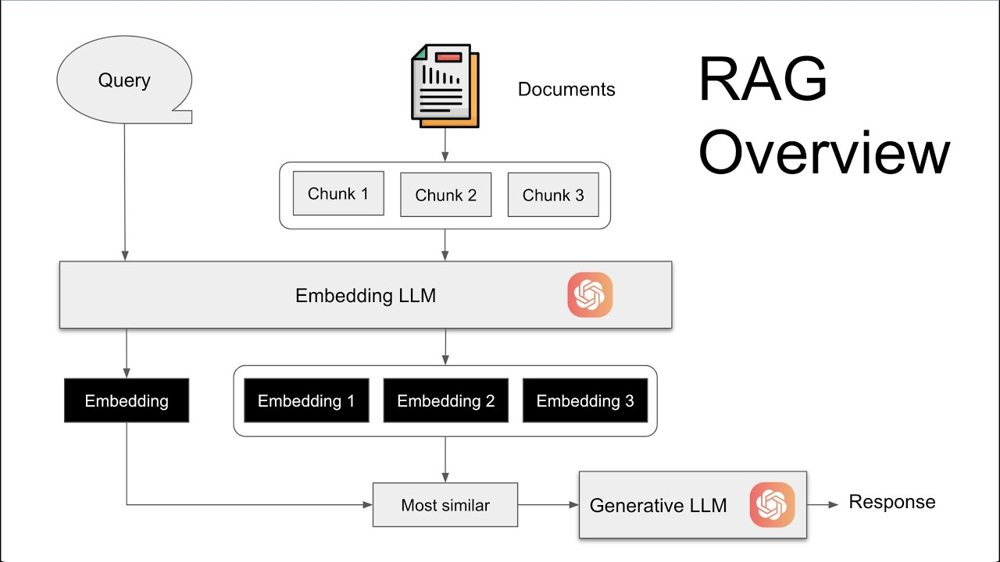

The Generated response is Augmented by the data a user wants to Retrieve.
- given a document, answer a question after *reading* it.

- context provision important
- prompt to fetch LLM response given the context and the question: important.

# [Important Quickstart Tutorial](https://python.langchain.com/docs/use_cases/question_answering/quickstart/)
- overlap chunks: The overlap helps mitigate the possibility of separating a statement from important context related to it. 

# Breaking points

## `DocumentLoader`
- whatif unable to load document?
- whatif unable to read certain parts? utf encoding error, document contains drawing(ED), images, charts etc.
- Eager loading, i.e. using `load()` or `` can be helpful in an interactive environment such as a jupyter notebook.
    - Avoid using it for production code since eager loading assumes that all the content can fit into memory, which is not always the case, especially for enterprise data.

# BPE Encoding
- used as a preliminary step to embedding
- tiktoken is the main module used to import these encodings
- [Improvement-1: implementation in C++](https://community.openai.com/t/my-simple-implementation-is-10x-faster-than-tiktoken-anything-wrong/248601)
- [Discussion on Tiktoken: OpenAI's tokenizer](https://news.ycombinator.com/item?id=34008839)

# Agentic RAG
- modifying user question into a more friendly, clarified question that would yield the best vector-search results from the knowledge-base.
- this technique is called **Step-back Prompting**, presented in [this paper](https://arxiv.org/pdf/2310.06117) by DeepMind: .
