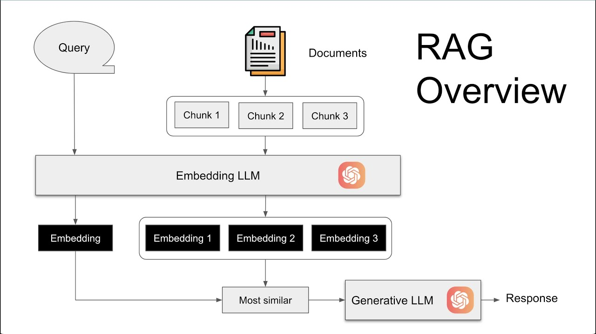

# RAG — Retrieval Augmented Generation

The Generated response is Augmented by the data a user wants to Retrieve.

- Given a document, answer a question after *reading* it.
- The model's weights are frozen; the corpus is not. RAG is how you inject knowledge the model
  never trained on, without retraining.



> **Related:** [`InsideAnAgent/`](../InsideAnAgent/README.md) — retrieval as a *tool* the agent calls
> (§3, §6). [`OutsideAnAgent/`](../OutsideAnAgent/README.md) — retrieved text is **untrusted input**;
> see the prompt-injection section (§3).

<details>
<summary><strong>§1–§7 and resources (click to expand)</strong></summary>

---

## 1. The basic flow

Two phases. The first runs offline and rarely; the second runs per query.

### Phase A — Indexing (offline, batch)

```
Documents → Load → Split (chunk) → Embed → Store in vector DB
```

| Step | What happens | Main decision |
|---|---|---|
| **Load** | Raw source → text + metadata | Which loader per format; what to do with images/tables |
| **Split** | Long text → chunks | Chunk size, overlap, split boundary (token / sentence / semantic / structural) |
| **Embed** | Chunk → dense vector | Which embedding model; dimensionality |
| **Store** | Vector + text + metadata → index | Which vector store; which metadata to keep |

### Phase B — Retrieval + Generation (online, per query)

```
Question → Embed → Similarity search → (Rerank) → Assemble prompt → Generate → Answer
```

| Step | What happens | Main decision |
|---|---|---|
| **Embed query** | Question → vector | **Must be the same model used at index time** |
| **Search** | Nearest-neighbour over the index | `k`, similarity metric, metadata filters |
| **Rerank** *(optional)* | Re-score top-`k` with a cross-encoder | Whether the accuracy gain is worth the latency |
| **Assemble** | Chunks + question → prompt | Template; ordering; how to mark context vs. question |
| **Generate** | LLM produces the answer | Grounding instructions; citation format |

- **Context provision is the whole game.** Retrieval quality caps answer quality — a perfect model
  cannot answer from chunks that were never retrieved.
- **The prompt that fetches the response given context + question matters as much as the retrieval.**

---

## 2. Requirements — what you must have before RAG works

| Requirement | Why it's non-negotiable |
|---|---|
| **A corpus worth retrieving from** | RAG doesn't create knowledge. If the answer isn't in the documents, it can't be retrieved |
| **A chunking strategy** | Chunks are the unit of retrieval. Too large → noise and wasted context; too small → statements severed from their context |
| **Chunk overlap** | Mitigates separating a statement from important context related to it |
| **One embedding model, used twice** | Index-time and query-time embeddings **must** come from the same model. Different models = incomparable vector spaces = garbage results |
| **A vector store** | Plus a similarity metric (cosine / dot / L2) that matches how the embedding model was trained |
| **Metadata on every chunk** | Source, page, section, timestamp. Needed for filtering, citation, and staleness handling |
| **A re-index path** | Corpora change. You need a story for updates, deletes, and embedding-model upgrades (the last one forces a full re-index) |
| **A prompt template that separates context from question** | See the injection warning in §5 |
| **Evaluation** | Retrieval metrics (recall@k, MRR) *and* answer metrics, measured separately — otherwise you can't tell whether a bad answer was a retrieval failure or a generation failure |

---

## 3. Where it breaks

### `DocumentLoader`

- What if the document fails to load at all?
- What if parts are unreadable — UTF encoding errors, embedded drawings (ED), images, charts?
- **Eager loading** (`load()`) is fine in an interactive environment such as a Jupyter notebook.
  - Avoid it in production: eager loading assumes all content fits in memory, which fails on
    enterprise-scale data. Prefer lazy/streaming loaders.

### Chunking

- Fixed-size splits cut mid-sentence and mid-table.
- Overlap costs storage and retrieves duplicate content.

### Retrieval

- Semantic search misses exact-match needs (IDs, error codes, names) — hence **hybrid search**
  (dense + BM25/keyword).
- `k` too low → missing evidence; `k` too high → context dilution and cost.

### Generation

- The model answers from parametric memory instead of the provided context.
- No citations → unverifiable output.

---

## 4. BPE encoding

- Used as a preliminary step to embedding.
- `tiktoken` is the main module used to import these encodings.
- [Improvement: implementation in C++](https://community.openai.com/t/my-simple-implementation-is-10x-faster-than-tiktoken-anything-wrong/248601)
- [Discussion on Tiktoken: OpenAI's tokenizer](https://news.ycombinator.com/item?id=34008839)

---

## 5. Retrieved content is untrusted

Retrieval is an **injection vector**. Anything that reaches the context window competes with your
instructions for the model's attention — there is no privileged channel
([InsideAnAgent §2](../InsideAnAgent/README.md)).

- A document in your corpus can contain instructions aimed at the model.
- This matters most when RAG feeds an agent that holds tools — the classic exfiltration path.
- Defenses are architectural, not promptable. See
  [OutsideAnAgent §3](../OutsideAnAgent/README.md).

---

## 6. Agentic RAG

Retrieval as a **tool the model chooses to call**, rather than a fixed preprocessing step.

- Lets the model decide *whether* to retrieve, *what* to search for, and whether to search again
  after seeing results.
- **Step-back prompting** — rewrite the user's question into a clearer, more general form that
  yields better vector-search results from the knowledge base. Presented in
  [this DeepMind paper](https://arxiv.org/pdf/2310.06117).
- Trade-off: extra LLM calls per answer. Costs more, and the
  [non-monotonic cost curve](../InsideAnAgent/README.md) applies.

---

## 7. Open questions to work through

- **RAG vs. long context vs. fine-tuning** — when is each correct? Measure, don't assume.
- Chunk size sweep against a fixed eval set.
- Hybrid search: how much does BM25 add over dense-only for this corpus?
- Reranking: latency cost vs. recall gain.

---

## Resources

- [LangChain Q&A Quickstart](https://python.langchain.com/docs/use_cases/question_answering/quickstart/)
- [Step-Back Prompting (DeepMind)](https://arxiv.org/pdf/2310.06117)

</details>

# Course Plan — RAG

Build-driven path through §1–§7. **Read one day, build four.**

**Where this fits:** after [Inside modules 1–2](../InsideAnAgent/README.md) — module 3 below wires
retrieval in as a *tool*, which needs a working agent to wire it into. Modules 1–3 then feed
[Outside module 1](../OutsideAnAgent/README.md), which needs two systems to measure.

### Module 1 — The indexing pipeline (1 week) → §1A, §2

- **Read:** §1 phase A, §2 (requirements), §3 (`DocumentLoader`, chunking).
- **Build:** load → chunk → embed → store, on a real corpus with messy documents.
  - Use a **lazy/streaming** loader, not `load()`. Hit the memory ceiling on purpose first so the
    reason is felt rather than accepted.
  - Attach metadata to every chunk: source, page, section, timestamp.
- **Then:** sweep chunk size and overlap. Record results — don't eyeball them.
- **Done when:** she can state this corpus's chunk size and overlap *with the measurement that
  justifies it*, and has a working re-index path for updates and deletes.

### Module 2 — Retrieval quality (1 week) → §1B, §3

- **Read:** §1 phase B, §3 (retrieval and generation failure modes).
- **Build:**
  - Dense retrieval, then add keyword/BM25 → **hybrid**. Measure the delta specifically on
    exact-match queries: IDs, error codes, proper nouns.
  - Sweep `k`. Find where added context starts diluting rather than helping.
  - Add a reranker. Measure the latency cost against the recall gain, then decide.
- **Done when:** she can separate a **retrieval failure** from a **generation failure** for any bad
  answer, and say which one she's looking at before touching the prompt.

### Module 3 — Retrieval as a tool (1 week) → §6

- **Read:** §6 (agentic RAG), plus [Inside §3](../InsideAnAgent/README.md) for tool anatomy.
- **Build** — wire retrieval **two ways** against the same corpus and eval set:
  1. As **preprocessing** — always retrieve, then generate
  2. As a **tool** the agent chooses to call
- **Then:** add step-back prompting to the query path and measure whether it helps *this* corpus.
- **Done when:** she can argue retrieval-as-tool vs. retrieval-as-preprocessing with numbers from her
  own runs, including the extra-LLM-call cost from
  [Inside §10](../InsideAnAgent/README.md)'s non-monotonic cost curve.

### Module 4 — Untrusted input (half week) → §5

- **Read:** §5, then [Outside §3](../OutsideAnAgent/README.md).
- **Build:** plant an injected instruction inside a corpus document. Retrieve it. Watch it reach the
  context window with the same standing as the system prompt.
- **Done when:** she can explain why this is a consequence of
  [Inside §2](../InsideAnAgent/README.md) rather than a bug in the retriever. Defense work continues
  in [Outside module 3](../OutsideAnAgent/README.md).

### Module 5 — The standing question (ongoing) → §7

**RAG vs. long context vs. fine-tuning** — when is each correct?

- Take one real task. Solve it all three ways. Measure cost, latency, and accuracy for each.
- Re-run the comparison after the next model release; the answer moves.
- **Done when:** she has a recommendation backed by her own numbers — and knows its expiry date.

### Level markers

| Signal | Level |
|---|---|
| Justifies chunk size with a measurement rather than a default | Junior → Mid |
| Distinguishes retrieval failure from generation failure unprompted | Mid |
| Says "this comparison expires at the next model release" | Senior-track |
